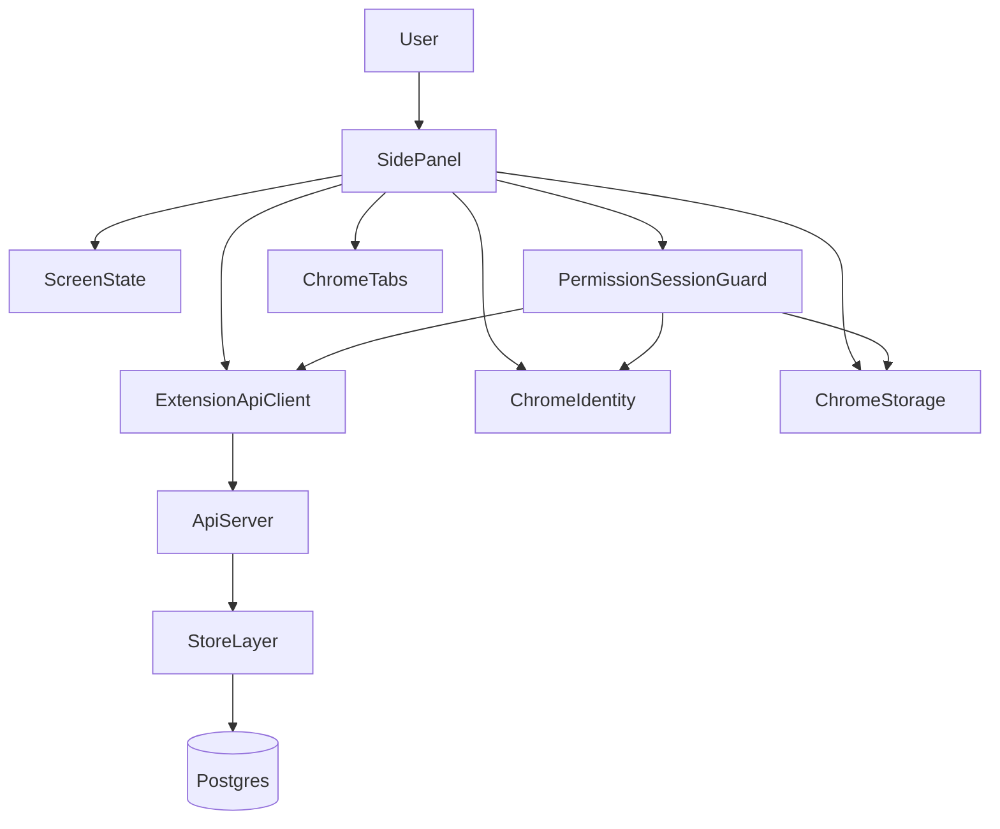
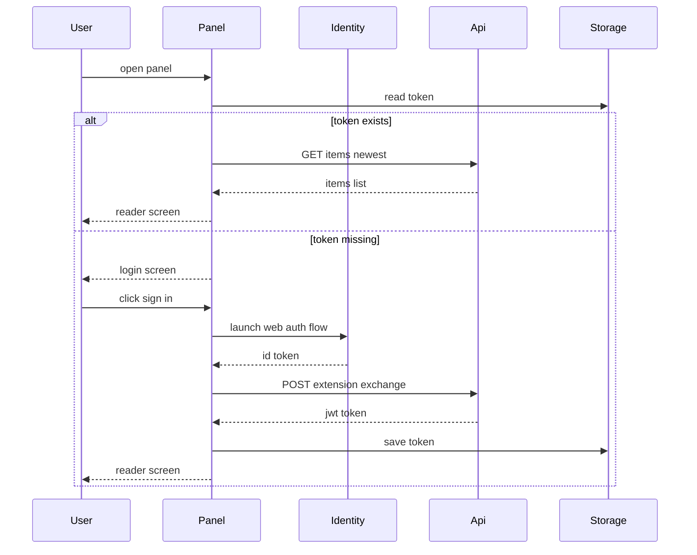
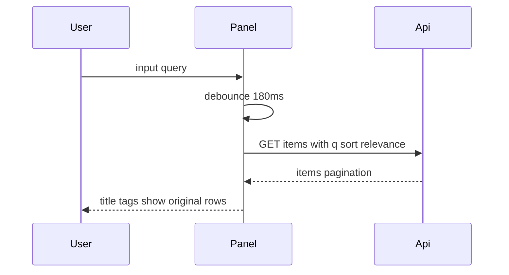
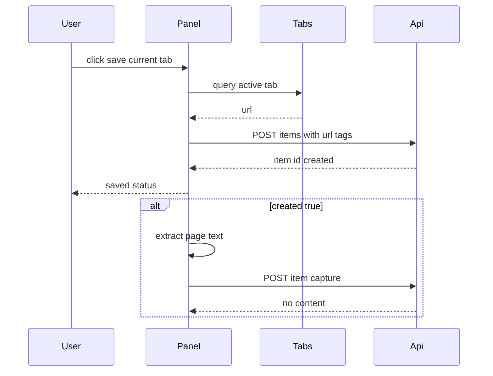
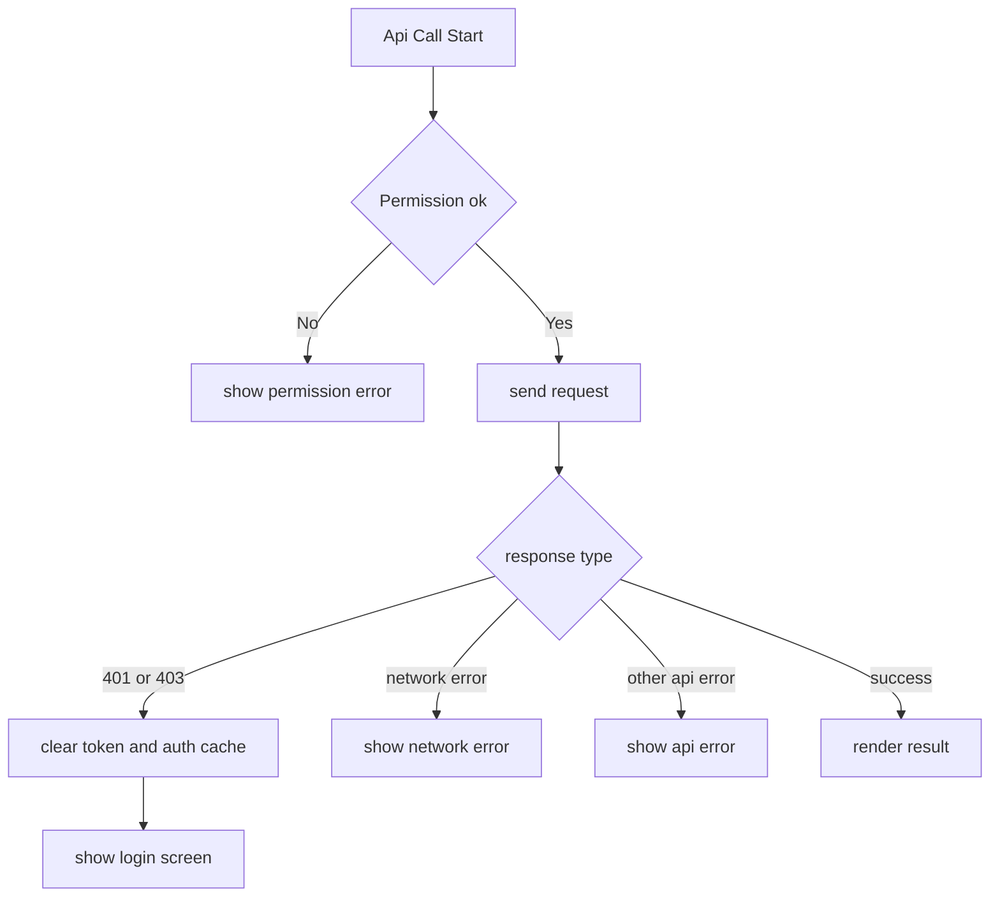
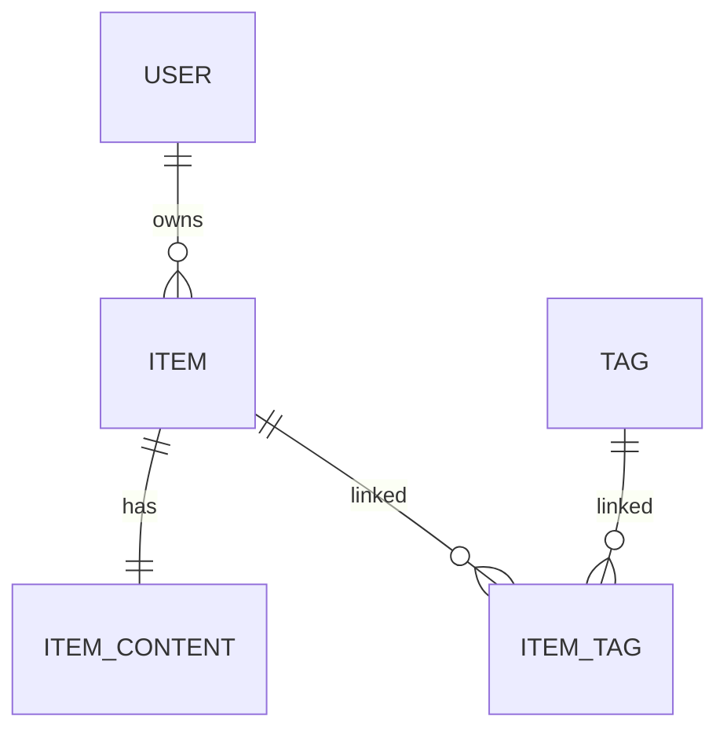

# Design Document: extension-article-reader

## Overview
本機能は、Chrome Extension Side Panel 上で「認証」「保存」「検索」「閲覧」を一貫して実行できる記事リーダー体験を提供する。ユーザーは未認証時にログインへ直接進み、認証後はスクロールせず主要導線（Web 遷移、ログアウト、保存）へアクセスできる。

対象ユーザーは、altpocket に記事を蓄積して後で読む利用者であり、拡張機能内では閲覧と軽量操作に責務を限定する。編集・削除・再フェッチ等の運用操作は Web UI 側へ明確に委譲する。

既存システムへの影響は「新規アーキテクチャ導入」ではなく「既存 Side Panel の責務境界固定」である。具体的には、Option C（Hybrid）として画面状態管理・API 呼び出し・UI オーケストレーションの契約を明確化し、今後の段階分離に耐える設計へ更新する。

### Goals
- 認証状態に応じた画面遷移と API 実行条件を明確にし、誤動作を防ぐ。
- 保存セクションと一覧セクションを視覚分離し、情報密度を保ったまま閲覧性を維持する。
- 既存 API（`/v1/auth/extension/exchange`, `/v1/items`, `/v1/items/{id}/capture`, `/v1/tags`）を再利用し、互換性を維持する。
- 要件 `1.1`〜`5.5` をトレース可能な契約として設計化する。

### Non-Goals
- 拡張機能内での記事編集、削除、再フェッチ要求 UI の提供。
- 新規検索 API の追加や DB スキーマ変更。
- Side Panel を超える新規クライアント（PWA/ネイティブ）設計。

## Architecture

### Existing Architecture Analysis
- 現行は MV3 Side Panel 構成（`manifest.side_panel.default_path`）で、`sidepanel.js` が認証・保存・検索・描画を担う。
- Backend は `internal/server` が API 契約を公開し、`internal/store` が検索・保存・タグ処理を集約するレイヤード構造。
- 検索 relevance は `pg_trgm` + `similarity` を利用し、`sort=relevance` で順序制御。
- 既存の技術的負債は「機能未実装」より「責務境界の曖昧さ」と「失敗系テストの追加余地」。

### Architecture Pattern & Boundary Map



**Architecture Integration**:
- Selected pattern: Hybrid（既存構造維持 + 境界の段階分離）。
- Domain boundaries:
  - Side Panel UI: 画面状態、ユーザー操作、通知。
  - Client Service: API 呼び出し、認証失効ハンドリング。
  - Backend API: 認証、保存、検索契約の提供。
  - Store: 検索/タグ/保存の永続化責務。
- Existing patterns preserved:
  - Handler を薄く保ち `internal/store` に集約。
  - Side Panel 単一 UI 面での状態切替。
- New components rationale:
  - `ScreenState` と `ExtensionApiClient` を明示境界として定義し、回帰耐性を高める。
- Steering compliance:
  - 既存レイヤーを崩さず追加する方針を維持。

### Technology Stack

| Layer | Choice / Version | Role in Feature | Notes |
|-------|------------------|-----------------|-------|
| Frontend / CLI | Chrome Extension MV3, Side Panel API (Chrome 114+), ES2022 | Side Panel UI、認証導線、保存/検索操作 | `identity`, `storage`, `scripting`, `permissions` を利用 |
| Backend / Services | Go 1.22, chi v5 | 認証交換、記事一覧、保存、capture API | 既存エンドポイントを維持 |
| Data / Storage | PostgreSQL 16, `pg_trgm` | relevance 検索、タグ正規化、記事永続化 | `items`, `item_contents`, `tags`, `item_tags` |
| Messaging / Events | なし（HTTP request-response + client 非同期送信） | 保存後 capture の非同期連携 | キュー基盤は導入しない |
| Infrastructure / Runtime | Docker Compose, env-based config | API 実行、CORS 運用、構成管理 | `CORS_ALLOW_ORIGINS` の運用が重要 |

## System Flows

### Flow F1: ログインと初期表示



### Flow F2: 検索と一覧表示



### Flow F3: 保存と非同期 capture



### Flow F4: 認証失効と権限不足



## Requirements Traceability

| Requirement | Summary | Components | Interfaces | Flows |
|-------------|---------|------------|------------|-------|
| 1.1 | 未認証時ログインボタンのみ表示 | ScreenStateController | IF1 State Contract | F1 |
| 1.2 | 未認証時に一覧/検索/運用リンクを非表示 | ScreenStateController | IF1 State Contract | F1 |
| 1.3 | ログイン成功で閲覧画面へ遷移 | AuthCoordinator | IF3 API Client, IF1 State | F1 |
| 1.4 | ログイン失敗で遷移しない | AuthCoordinator | IF3 API Client | F1 |
| 1.5 | 未認証時に認証必須 API を呼ばない | PermissionSessionGuard | IF2 Guard Contract | F1 |
| 2.1 | 認証後画面上部に altpocket 表示 | UtilityBarPresenter | IF5 UI Contract | F2 |
| 2.2 | Go to website と Log out を表示 | UtilityBarPresenter | IF5 UI Contract | F2 |
| 2.3 | Go to website で Web 一覧を開く | UtilityActionService | IF5 UI Contract | F2 |
| 2.4 | Log out で token 破棄し未認証画面へ | PermissionSessionGuard | IF2 Guard Contract, IF1 State | F4 |
| 2.5 | ユーティリティをスクロール領域外へ配置 | SidePanelLayout | IF5 UI Contract | F2 |
| 3.1 | ユーティリティ下に保存セクション表示 | SidePanelLayout | IF5 UI Contract | F3 |
| 3.2 | Save current tab 操作を提供 | SaveCaptureCoordinator | IF5 UI Contract | F3 |
| 3.3 | タグ入力/候補/選択タグ表示 | TagInputPresenter | IF3 API Client, IF5 UI Contract | F2 |
| 3.4 | 保存時に URL とタグを送信 | SaveCaptureCoordinator | IF3 API Client, IF4 API Contract | F3 |
| 3.5 | 新規保存時のみ capture 非同期送信 | SaveCaptureCoordinator | IF3 API Client, IF4 API Contract | F3 |
| 4.1 | 保存セクション下に区切り線表示 | SidePanelLayout | IF5 UI Contract | F2 |
| 4.2 | 区切り線下に検索入力と一覧表示 | ReaderListPresenter | IF5 UI Contract | F2 |
| 4.3 | 件名/本文検索用テキスト/タグを検索対象 | ItemsEndpoint + ItemSearchRepository | IF4 API Contract | F2 |
| 4.4 | 各行に件名/タグ/Show original 表示 | ReaderListPresenter | IF5 UI Contract | F2 |
| 4.5 | 本文/ステータスを一覧に表示しない | ReaderListPresenter | IF5 UI Contract | F2 |
| 5.1 | 編集/削除/再フェッチ機能を提供しない | FeatureScopePolicy | IF5 UI Contract | F2 |
| 5.2 | 追加操作は Web 導線へ委譲 | UtilityActionService | IF5 UI Contract | F2 |
| 5.3 | 認証エラー時に未認証画面へ遷移 | AuthFailureHandler | IF3 API Client, IF1 State | F4 |
| 5.4 | API 権限不足時に通知して中断 | PermissionSessionGuard | IF2 Guard Contract | F4 |
| 5.5 | ネットワーク障害時に識別可能通知 | ExtensionApiClient + ReaderActionService | IF3 API Client | F4 |

## Components and Interfaces

| Component | Domain/Layer | Intent | Req Coverage | Key Dependencies (P0/P1) | Contracts |
|-----------|--------------|--------|--------------|--------------------------|-----------|
| ScreenStateController | Extension UI | ログイン画面と閲覧画面の遷移管理 | 1.1, 1.2, 1.3, 2.4 | DOM Elements (P0) | State |
| PermissionSessionGuard | Extension Service | API 権限判定、トークン破棄、認証失効復帰 | 1.5, 2.4, 5.3, 5.4 | Chrome permissions storage identity (P0) | Service, State |
| ExtensionApiClient | Extension Service | API 通信とエラー分類の共通化 | 1.3, 3.4, 3.5, 4.3, 5.3, 5.5 | Fetch API (P0), AuthFailureHandler (P0) | Service, API |
| ReaderActionService | Extension Orchestration | ログイン、検索、保存、capture の実行順序制御 | 1.3, 3.2, 3.4, 3.5, 4.2, 5.5 | ExtensionApiClient (P0), ScreenStateController (P0), Chrome tabs scripting (P1) | Service, State |
| ExtensionAuthItemsEndpoints | Backend API | extension からの認証交換と item API 提供 | 1.3, 3.4, 3.5, 4.3, 5.3 | auth middleware (P0), store layer (P0) | API, Service |
| ItemSearchRepository | Data | relevance 検索とタグ結合の実行 | 4.3 | PostgreSQL pg_trgm (P0) | Service |

### Extension UI Layer

#### ScreenStateController

| Field | Detail |
|-------|--------|
| Intent | 未認証/認証後画面の表示状態を単一責務で管理する |
| Requirements | 1.1, 1.2, 1.3, 2.4 |
| Owner / Reviewers | Extension 実装担当 |

**Responsibilities & Constraints**
- `login` と `reader` の二状態のみを扱う。
- ログアウト時は入力値、候補、一覧表示、状態表示を初期化する。
- 画面状態遷移は他コンポーネントから副作用なく呼べる。

**Dependencies**
- Inbound: ReaderActionService — 認証成功/失敗時の状態更新 (P0)
- Outbound: DOM Elements — `hidden` 属性と `data-screen` 制御 (P0)

**Contracts**: Service [ ] / API [ ] / Event [ ] / Batch [ ] / State [x]

##### State Management
- State model: `mode: 'login' | 'reader'`
- Persistence & consistency: 画面状態はメモリ保持、永続化しない。
- Concurrency strategy: 最後の遷移操作を優先し、途中状態を残さない。

**Implementation Notes**
- Integration: `showLogin` 実行時に UI 入力状態の初期化を同時実行。
- Validation: 遷移後に `aria-hidden` と `hidden` の整合を保つ。
- Risks: 状態遷移が散在すると再び重複ロジック化するため、単一窓口を維持。

#### PermissionSessionGuard

| Field | Detail |
|-------|--------|
| Intent | API 実行前のアクセス権限確認とセッション破棄を統一管理する |
| Requirements | 1.5, 2.4, 5.3, 5.4 |
| Owner / Reviewers | Extension 実装担当 |

**Responsibilities & Constraints**
- API オリジンへの host permission を `contains/request` で確認する。
- 認証失効時に token 系キーを一括破棄する。
- ログアウト時は `chrome.identity.clearAllCachedAuthTokens` を呼び出す。

**Dependencies**
- Inbound: ExtensionApiClient — 401/403 失敗通知 (P0)
- Outbound: Chrome permissions storage identity — 権限/セッション制御 (P0)
- External: API Base configuration — オリジンパターン生成 (P1)

**Contracts**: Service [x] / API [ ] / Event [ ] / Batch [ ] / State [x]

##### Service Interface
```typescript
type PermissionRequestMode = 'interactive' | 'silent';

type PermissionErrorCode =
  | 'invalid_api_base'
  | 'permission_denied'
  | 'permission_api_unavailable';

type Result<T, E> = { ok: true; value: T } | { ok: false; error: E };

interface PermissionSessionGuardService {
  ensureApiAccess(apiBase: string, mode: PermissionRequestMode): Promise<Result<boolean, PermissionErrorCode>>;
  clearSessionTokens(): Promise<void>;
  handleAuthFailure(): Promise<void>;
}
```
- Preconditions: `apiBase` は `http` または `https` origin。
- Postconditions: auth failure 後はログイン画面へ復帰可能な状態。
- Invariants: token 系キーは logout で残存しない。

**Implementation Notes**
- Integration: UI 通知は guard の返却結果に応じて呼び出し側が表示。
- Validation: permission 未許可時は API 呼び出しを実行しない。
- Risks: 開発/本番で extension id が変わる場合の CORS 設定漏れ。

#### ExtensionApiClient

| Field | Detail |
|-------|--------|
| Intent | extension API 通信、JSON 応答解析、エラー分類を共通化する |
| Requirements | 1.3, 3.4, 3.5, 4.3, 5.3, 5.5 |
| Owner / Reviewers | Extension 実装担当、API 担当 |

**Responsibilities & Constraints**
- 全 API 呼び出しで認証ヘッダー注入と JSON 解析を統一。
- 401/403 は `onAuthFailure` を必ず実行する。
- network error と API error を区別して返す。

**Dependencies**
- Inbound: ReaderActionService — 各ユースケース実行 (P0)
- Outbound: Fetch API — HTTP リクエスト (P0)
- Outbound: PermissionSessionGuard — 認証失効時処理 (P0)

**Contracts**: Service [x] / API [x] / Event [ ] / Batch [ ] / State [ ]

##### Service Interface
```typescript
type ApiErrorCode =
  | 'invalid_request'
  | 'invalid_token'
  | 'user_not_registered'
  | 'unauthorized'
  | 'db_error'
  | 'network_error'
  | 'unknown_error';

type ApiResult<T> =
  | { ok: true; status: number; data: T }
  | { ok: false; status: number; error: ApiErrorCode; message: string };

interface ExtensionApiClientService {
  exchangeToken(apiBase: string, idToken: string): Promise<ApiResult<{ token: string; expires_in: number }>>;
  listItems(apiBase: string, query: { q?: string; page: number; per_page: 10 | 20 | 30 | 40 | 50; sort: 'newest' | 'relevance' }): Promise<ApiResult<ItemListResponse>>;
  createItem(apiBase: string, payload: { url: string; tags: string[] }): Promise<ApiResult<{ item_id: string; created: boolean }>>;
  captureItem(apiBase: string, itemID: string, payload: { title: string; content_full: string }): Promise<ApiResult<null>>;
  suggestTags(apiBase: string, q: string): Promise<ApiResult<TagSuggestion[]>>;
}

interface TagSuggestion {
  id: string;
  name: string;
  normalized_name: string;
}

interface ItemTag {
  id: string;
  name: string;
  normalized_name: string;
}

interface ItemSummary {
  id: string;
  title: string;
  url: string;
  tags: ItemTag[];
}

interface ItemListResponse {
  items: ItemSummary[];
  pagination: { page: number; per_page: number; total: number };
}
```
- Preconditions: API base が設定済みで permission 許可済み。
- Postconditions: 401/403 は auth failure 処理が完了している。
- Invariants: UI へ返すエラーは network と API を判別可能。

##### API Contract
| Method | Endpoint | Request | Response | Errors |
|--------|----------|---------|----------|--------|
| POST | `/v1/auth/extension/exchange` | `{ id_token: string }` | `{ token: string, expires_in: number }` | 400, 401, 403, 500 |
| GET | `/v1/items` | `q, page, per_page, sort` | `{ items: ItemSummary[], pagination }` | 401, 500 |
| POST | `/v1/items` | `{ url: string, tags: string[] }` | `{ item_id: string, created: boolean }` | 400, 401, 429, 500 |
| POST | `/v1/items/{id}/capture` | `{ title: string, content_full: string }` | `204 No Content` | 400, 401, 404, 500 |
| GET | `/v1/tags` | `q` | `TagSuggestion[]` | 401, 500 |

**Implementation Notes**
- Integration: API エラーの文言変換は client 層に保持し UI は表示のみ担当。
- Validation: `id_token`, `url`, `content_full` を境界で必須検証。
- Risks: `Login error` の粒度が粗く、運用分析しづらい。

#### ReaderActionService

| Field | Detail |
|-------|--------|
| Intent | ログイン、検索、保存、一覧更新の実行順序を統制する |
| Requirements | 1.3, 3.2, 3.4, 3.5, 4.2, 5.5 |
| Owner / Reviewers | Extension 実装担当 |

**Responsibilities & Constraints**
- 検索入力は debounce で API 呼び出し頻度を抑制する。
- 保存成功時は一覧再取得、`created=true` の場合のみ capture 送信。
- UI 表示は「件名、タグ、Show original」のみを維持する。

**Dependencies**
- Inbound: UI Events — click/input/keydown (P0)
- Outbound: ExtensionApiClient — API 実行 (P0)
- Outbound: ScreenStateController — 画面遷移 (P0)
- External: Chrome tabs scripting — 現在タブ URL 取得と本文抽出 (P1)

**Contracts**: Service [x] / API [ ] / Event [ ] / Batch [ ] / State [x]

##### Service Interface
```typescript
type UiErrorCode = 'permission' | 'network' | 'api' | 'auth' | 'invalid_state';

interface ReaderActionService {
  initialize(): Promise<void>;
  login(): Promise<Result<void, UiErrorCode>>;
  logout(): Promise<Result<void, UiErrorCode>>;
  fetchItems(query: string): Promise<Result<ItemListResponse, UiErrorCode>>;
  saveCurrentTab(selectedTags: string[]): Promise<Result<{ item_id: string; created: boolean }, UiErrorCode>>;
}
```
- Preconditions: 初期化時に DOM 要素参照が有効。
- Postconditions: 保存成功後は一覧表示が最新化される。
- Invariants: 一覧表示項目は件名、タグ、外部リンクのみ。

**Implementation Notes**
- Integration: `resultMeta` と `utilityStatus` で状態を表示。
- Validation: 空 query は `sort=newest`、非空 query は `sort=relevance`。
- Risks: `per_page=50` 固定のため大量データ時に初回表示コストが増える。

### Backend API Layer

#### ExtensionAuthItemsEndpoints

| Field | Detail |
|-------|--------|
| Intent | extension 用認証交換と item API 契約を安定提供する |
| Requirements | 1.3, 3.4, 3.5, 4.3, 5.3 |
| Owner / Reviewers | Backend 実装担当 |

**Responsibilities & Constraints**
- `/v1/auth/extension/exchange` は `id_token` を検証し JWT を発行する。
- `/v1/items` と `/v1/items/{id}/capture` は認証済みユーザーのみ許可する。
- 失敗時は `error` フィールドを持つ JSON を返却する。

**Dependencies**
- Inbound: ExtensionApiClient — API consumer (P0)
- Outbound: auth package — JWT 発行/検証 (P0)
- Outbound: store layer — item と tag の永続化 (P0)
- External: Google ID token validation — subject/email claims (P1)

**Contracts**: Service [x] / API [x] / Event [ ] / Batch [ ] / State [ ]

##### API Contract
| Method | Endpoint | Request | Response | Errors |
|--------|----------|---------|----------|--------|
| POST | `/v1/auth/extension/exchange` | `id_token` | `token, expires_in` | `invalid_request`, `invalid_token`, `user_not_registered`, `db_error`, `token_error` |
| GET | `/v1/items` | `q,page,per_page,sort,tag` | `items,pagination` | `unauthorized`, `db_error` |
| POST | `/v1/items` | `url,tags` | `item_id,created` | `invalid_request`, `invalid_url`, `rate_limited`, `db_error` |
| POST | `/v1/items/{id}/capture` | `title,content_full` | `204` | `invalid_request`, `unauthorized`, `not_found`, `db_error` |

**Implementation Notes**
- Integration: CORS は allowlist + same-host で判定。
- Validation: `per_page` は許可値のみ受理、`sort` は `newest/relevance` のみ。
- Risks: extension id 変更時に CORS 設定漏れが起きる。

### Data Layer

#### ItemSearchRepository

| Field | Detail |
|-------|--------|
| Intent | タグ結合を含む一覧検索と relevance 順序を提供する |
| Requirements | 4.3 |
| Owner / Reviewers | Backend 実装担当 |

**Responsibilities & Constraints**
- `ListItems` で検索条件、タグフィルタ、並び順を評価する。
- relevance は `similarity` 合算スコアで算出する。
- レスポンスはタグ付き `ItemListRow` を返却する。

**Dependencies**
- Inbound: server handlers — list request (P0)
- Outbound: PostgreSQL — `items`, `item_contents`, `tags`, `item_tags` (P0)
- External: `pg_trgm` extension — similarity 算出 (P0)

**Contracts**: Service [x] / API [ ] / Event [ ] / Batch [ ] / State [ ]

##### Service Interface
```go
type ItemSearchRepository interface {
    ListItems(ctx context.Context, userID string, page int, perPage int, q string, tags []string, sort string) ([]ItemListRow, Pagination, error)
}
```
- Preconditions: `userID` は認証済みユーザー。
- Postconditions: `Pagination.Total` はフィルタ後件数。
- Invariants: `sort=relevance` は `q != ''` の時のみ score 順序を適用。

**Implementation Notes**
- Integration: trigram index 前提で検索応答を維持。
- Validation: `per_page` 許可値以外は fallback。
- Risks: 大量データ時に score 計算コストが増加。

## Data Models

### Domain Model
- **UserSession**: extension の JWT と Chrome identity cache 状態。
- **ReaderItemSummary**: 一覧表示に必要な最小情報（title, url, tags）。
- **SaveRequest**: `url + tags` の保存要求。
- **CapturePayload**: `title + content_full` の補完本文。
- **SearchQuery**: `q, sort, page, per_page` の検索意図。



### Logical Data Model

**Structure Definition**:
- `items` は `user_id + canonical_hash` で一意。
- `item_contents` は `item_id` 1:1 で本文検索用テキストを保持。
- `tags` は `normalized_name` を一意キーとする。
- `item_tags` は多対多の連結テーブル。

**Consistency & Integrity**:
- 保存時は URL 正規化後に重複判定し idempotent に処理。
- タグは normalize 後に重複排除。
- capture は `created=true` の新規保存時のみ追送し、一覧更新と分離。

### Physical Data Model

**For Relational Databases**:
- 既存テーブルを再利用し、今回の設計で新規 migration は不要。
- 検索系 index:
  - `items_title_trgm_idx`
  - `items_excerpt_trgm_idx`
  - `item_contents_search_trgm_idx`
  - `tags_normalized_trgm_idx`
- 並び順は `items_user_created_idx` と relevance score を併用。

### Data Contracts & Integration

**API Data Transfer**:
- ExchangeRequest: `{ id_token: string }`
- CreateItemRequest: `{ url: string, tags: string[] }`
- CaptureRequest: `{ title: string, content_full: string }`
- ListItemsResponse: `{ items: ItemSummary[], pagination: Pagination }`

**Event Schemas**:
- イベントバスは導入しない（HTTP 同期 + client 非同期送信）。

**Cross-Service Data Management**:
- 分散トランザクションは不要。
- consistency は API request 単位で完結。

## Error Handling

### Error Strategy
- 認証失効（401/403）は UI 層で個別処理せず `AuthFailureHandler` に集約する。
- 権限不足は「通知して中断」、ネットワーク障害は「再試行可能エラー」として扱う。
- API エラーは `error` コードを保持し、表示文言はクライアントで変換する。

### Error Categories and Responses
| Category | Trigger | User Response | System Response |
|----------|---------|---------------|-----------------|
| User Error | permission denied | 権限付与を促す短文を表示 | API 呼び出し中断 |
| User Error | user not registered | 登録未完了メッセージを表示 | セッション確立しない |
| System Error | network unreachable | 通信失敗メッセージを表示 | retry 可能状態を維持 |
| System Error | db error | 汎用失敗メッセージを表示 | request_id とエラーを記録 |
| Business Error | invalid url/request | 入力エラーを表示 | 保存処理を中断 |

### Monitoring
- Backend: `request_id` と `error` を構造化ログで出力。
- Extension: `utilityStatus` と alert で失敗分類をユーザーに通知。
- 観測強化候補: login failure の原因コード収集（ネットワーク/CORS/未登録）。

## Testing Strategy

### Unit Tests
- `ScreenStateController` の login/reader 遷移とリセット検証。
- `PermissionSessionGuard` の permission 拒否時通知と API 中断検証。
- `ExtensionApiClient` の 401/403 時 `onAuthFailure` 実行検証。
- `ReaderActionService` の検索 debounce と sort 切替検証。
- `SaveCaptureCoordinator` の `created=true` 時 capture 送信条件検証。

### Integration Tests
- `POST /v1/auth/extension/exchange` の token 発行と未登録拒否。
- `GET /v1/items` の `sort=relevance` と pagination 検証。
- `POST /v1/items` + `POST /v1/items/{id}/capture` の一連成功/失敗ケース。
- CORS allowlist 設定の preflight 許可/拒否検証。

### E2E/UI Tests (if applicable)
- 未認証起動からログイン成功後一覧表示まで。
- 保存実行後のステータス表示と一覧再読み込み。
- 検索入力時の relevance 並び表示。
- ログアウト実行後の token 全消去と未認証画面復帰。

### Performance/Load (if applicable)
- `q` あり一覧検索の P95 応答時間計測。
- `per_page=50` 固定時の初期描画時間計測。
- タグ候補 API 連打時の debounce と backend 負荷確認。

## Security Considerations
- `id_token` は exchange の入力境界で検証し、未登録ユーザーへ JWT を発行しない。
- extension token は `chrome.storage.local` で管理し、logout 時に token 系キーを全削除する。
- CORS は allowlist + same-host 判定で制御し、未許可 origin を拒否する。
- 画面/ログ上で token や OAuth 生レスポンスを出力しない。

## Performance & Scalability
- 検索入力は 180ms debounce で API 呼び出し数を抑制する。
- relevance 検索は `pg_trgm` index 前提で運用し、件数増加時は段階読み込みを検討する。
- capture は非同期送信として保存体験の応答性を維持する。

## Supporting References
- [research.md](/Users/hitoshi/Documents/GitHub/altpocket-server/.kiro/specs/extension-article-reader/research.md)
- [Chrome sidePanel API](https://developer.chrome.com/docs/extensions/reference/api/sidePanel)
- [Chrome identity API](https://developer.chrome.com/docs/extensions/reference/api/identity)
- [Chrome permissions API](https://developer.chrome.com/docs/extensions/reference/api/permissions)
- [PostgreSQL pg_trgm](https://www.postgresql.org/docs/current/static/pgtrgm.html)
