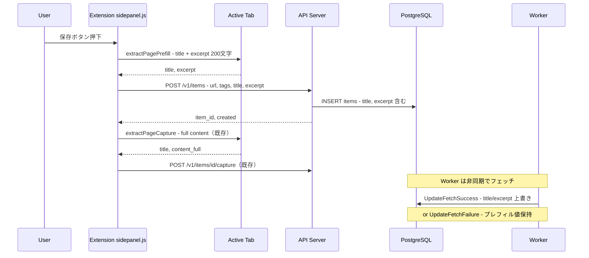

# 技術設計: extension-content-prefetch

## Overview

**Purpose**: 拡張機能からのURL登録時に、ページのtitleと本文プレビュー（最大200文字）をクライアントサイドで事前取得し、登録APIリクエストに含める。サーバー側workerがページを取得できない場合でも、アイテムにtitleとexcerptが設定され、一覧・検索の利便性を維持する。

**Users**: Chrome拡張機能ユーザーが、認証壁やJS描画で取得不能なページを含むあらゆるURLの保存時に恩恵を受ける。

**Impact**: 既存の `POST /v1/items` リクエスト構造体、`store.CreateItem` シグネチャ、および拡張機能の `saveCurrentTab` フローを拡張する。既存のキャプチャフロー（full content 用）は変更しない。

### Goals

- 拡張機能が保存前にtitle/excerptを抽出し、登録APIに同梱する
- サーバーが受け取ったtitle/excerptをアイテム作成時にDBに保存する
- 既存のworkerフェッチ・キャプチャフローとの後方互換性を維持する

### Non-Goals

- workerの取得ロジックの変更
- 既存の `POST /v1/items/{id}/capture` エンドポイントの変更
- Web UI（quick-add）からのプレフィル対応（将来検討）
- DBスキーマの変更（既存カラムを使用）

## Architecture

### Existing Architecture Analysis

- **保存フロー**: Extension `saveCurrentTab()` → `POST /v1/items { url, tags }` → `store.CreateItem` (title/excerpt 空) → Worker が非同期フェッチ
- **キャプチャフロー**: 保存後に `extractPageCapture()` → `POST /v1/items/{id}/capture { title, content_full }` → `store.SeedCapturedContent`
- **Worker共存**: `UpdateFetchSuccess` は成功時にtitle/excerpt を無条件上書き。`UpdateFetchFailure` はtitle/excerptに触れず保持

### Architecture Pattern & Boundary Map



**Architecture Integration**:
- **Selected pattern**: 既存レイヤード構成の拡張。新しいコンポーネントの追加なし
- **Existing patterns preserved**: Handler → createItem → store.CreateItem のデータフロー、fire-and-forget キャプチャ
- **New components**: `extractPagePrefill` 関数（Extension内、軽量抽出専用）
- **Steering compliance**: 「既存レイヤーを崩さず追加」の原則を維持

### Technology Stack

| Layer | Choice / Version | Role in Feature | Notes |
|-------|------------------|-----------------|-------|
| Extension | Chrome Extension MV3 / chrome.scripting API | ページからtitle/excerpt を抽出 | 既存パーミッション `scripting` を使用 |
| Backend | Go 1.22 / chi v5 | リクエスト受け入れ・バリデーション | `handleCreateItem` 拡張 |
| Data | PostgreSQL 16 | title/excerpt の永続化 | 既存 `items.title`, `items.excerpt` カラム使用 |

## Requirements Traceability

| Requirement | Summary | Components | Interfaces | Flows |
|-------------|---------|------------|------------|-------|
| 1.1 | title 事前取得 | extractPagePrefill | — | 保存フロー |
| 1.2 | excerpt 事前取得（200文字） | extractPagePrefill | — | 保存フロー |
| 1.3 | 抽出失敗時のフォールバック | extractPagePrefill | — | 保存フロー |
| 1.4 | テキスト正規化 | extractPagePrefill | — | — |
| 2.1 | API title 受け入れ | handleCreateItem | API Contract | 保存フロー |
| 2.2 | API excerpt 受け入れ | handleCreateItem | API Contract | 保存フロー |
| 2.3 | 後方互換性 | handleCreateItem, CreateItem | API Contract | — |
| 2.4 | サーバー側文字数制限 | handleCreateItem | API Contract | — |
| 3.1 | Worker成功時の上書き | — | — | — |
| 3.2 | Worker成功時のexcerpt上書き | — | — | — |
| 3.3 | Worker失敗時のプレフィル保持 | — | — | — |
| 3.4 | fetch_status=failed 時の表示 | — | — | — |
| 4.1 | 除外セレクタ | extractPagePrefill | — | — |
| 4.2 | 文字数制限200文字 | extractPagePrefill | — | — |
| 4.3 | 対象外URL スキップ | extractPagePrefill | — | — |

> 3.1〜3.4: 既存の `UpdateFetchSuccess`/`UpdateFetchFailure`/UI表示で要件を満たす。新規コンポーネント不要。

## Components and Interfaces

| Component | Domain/Layer | Intent | Req Coverage | Key Dependencies | Contracts |
|-----------|-------------|--------|--------------|-----------------|-----------|
| extractPagePrefill | Extension | 保存前にtitle+excerpt 200文字を軽量抽出 | 1.1, 1.2, 1.3, 1.4, 4.1, 4.2, 4.3 | chrome.scripting (P0) | — |
| saveCurrentTab（変更） | Extension | 保存前にprefillを取得しペイロードに含める | 1.1, 1.2, 1.3 | extractPagePrefill (P0), apiClient (P0) | — |
| handleCreateItem（変更） | API/Server | title/excerpt を受け取りバリデーション・切り詰め | 2.1, 2.2, 2.3, 2.4 | createItem (P0) | API |
| createItem（変更） | API/Server | title/excerpt を store に渡す | 2.1, 2.2, 2.3 | store.CreateItem (P0) | Service |
| CreateItem（変更） | Store/Data | INSERT に title/excerpt を含める | 2.1, 2.2, 2.3 | PostgreSQL (P0) | Service |

### Extension Layer

#### extractPagePrefill

| Field | Detail |
|-------|--------|
| Intent | 保存前にアクティブタブからtitleと本文プレビュー（最大200文字）を軽量抽出する |
| Requirements | 1.1, 1.2, 1.3, 1.4, 4.1, 4.2, 4.3 |

**Responsibilities & Constraints**
- `chrome.scripting.executeScript` でアクティブタブのDOMからtitleとexcerptを抽出する
- 抽出対象: `article` → `main` → `[role="main"]` → `body` の優先順
- テキスト正規化: 連続空白を単一スペースに、前後空白を除去
- 文字数制限: excerpt は最大200文字
- 失敗時は `{ title: '', excerpt: '' }` を返す（保存フローを中断しない）

**Dependencies**
- External: `chrome.scripting.executeScript` — DOM アクセス (P0)

**Contracts**: Service [x]

##### Service Interface

```javascript
/**
 * @param {number} tabID - アクティブタブのID
 * @returns {Promise<{title: string, excerpt: string}>}
 *          抽出失敗時は { title: '', excerpt: '' }
 */
async function extractPagePrefill(tabID)
```

- Preconditions: `chrome.scripting` API が利用可能、`tabID` が有効な数値
- Postconditions: title は `document.title` を正規化した値、excerpt は本文先頭200文字を正規化した値
- Invariants: 抽出失敗でも必ず `{ title, excerpt }` を返す（例外を投げない）

**Implementation Notes**
- 既存 `extractPageCapture` と同じ除外セレクタ・正規化パターンを踏襲するが、content_full ではなく excerpt（200文字）を返す
- `chrome://`, `chrome-extension://`, `about:` URLの場合は抽出をスキップ
- 既存の `extractPageCapture`（full content 用）は変更しない。両者は独立して動作する

#### saveCurrentTab（変更）

| Field | Detail |
|-------|--------|
| Intent | 保存前にprefillを取得し、createItem ペイロードに title/excerpt を含める |
| Requirements | 1.1, 1.2, 1.3 |

**変更内容**
- 保存ボタン押下後、`createItem` API 呼び出し前に `extractPagePrefill(tab.id)` を呼ぶ
- 取得した `{ title, excerpt }` を `createItem` ペイロードに追加: `{ url, tags, title, excerpt }`
- 抽出が失敗しても（`{ title: '', excerpt: '' }`）保存は続行する

### API/Server Layer

#### handleCreateItem（変更）

| Field | Detail |
|-------|--------|
| Intent | リクエストボディから title/excerpt を受け取り、バリデーション・切り詰めを行う |
| Requirements | 2.1, 2.2, 2.3, 2.4 |

**Contracts**: API [x] / Service [x]

##### API Contract

| Method | Endpoint | Request | Response | Errors |
|--------|----------|---------|----------|--------|
| POST | /v1/items | CreateItemRequest | CreateItemResponse | 400, 401, 429, 500 |

**CreateItemRequest** (変更後):

```go
struct {
    URL     string   `json:"url"`
    Tags    []string `json:"tags"`
    Title   string   `json:"title"`    // 新規: オプション、最大500文字
    Excerpt string   `json:"excerpt"`  // 新規: オプション、最大200文字
}
```

**CreateItemResponse** (変更なし):

```go
map[string]interface{}{
    "item_id": string,
    "created": bool,
}
```

- title は `strings.TrimSpace` + `truncateUTF8(_, 500)` で正規化・切り詰め
- excerpt は `strings.TrimSpace` + `truncateUTF8(_, 200)` で正規化・切り詰め
- title/excerpt が省略された場合はデフォルト空文字（後方互換性維持）

##### Service Interface

```go
// 変更前: createItem(ctx, userID, rawURL, rawTags) (string, bool, error)
// 変更後:
func (s *Server) createItem(ctx context.Context, userID, rawURL string, rawTags []string, title, excerpt string) (string, bool, error)
```

### Store/Data Layer

#### CreateItem（変更）

| Field | Detail |
|-------|--------|
| Intent | INSERT 文に title/excerpt を含め、アイテム作成時にプレフィル値を保存する |
| Requirements | 2.1, 2.2, 2.3 |

**Contracts**: Service [x]

##### Service Interface

```go
// 変更前: CreateItem(ctx, userID, url, canonicalURL, canonicalHash, tagNames) (string, bool, error)
// 変更後:
func (s *Store) CreateItem(ctx context.Context, userID, url, canonicalURL, canonicalHash string, tagNames []string, title, excerpt string) (string, bool, error)
```

**SQL変更**:

```sql
-- 変更前
INSERT INTO items (user_id, url, canonical_url, canonical_hash, fetch_status, refetch_requested)
VALUES ($1, $2, $3, $4, 'pending', false)

-- 変更後
INSERT INTO items (user_id, url, canonical_url, canonical_hash, title, excerpt, fetch_status, refetch_requested)
VALUES ($1, $2, $3, $4, $5, $6, 'pending', false)
```

- Preconditions: title, excerpt はハンドラー側でバリデーション・切り詰め済み
- Postconditions: 新規アイテムにtitle/excerptが設定される。重複時（ON CONFLICT DO NOTHING）は既存値を維持
- Invariants: 空文字の場合はDB DEFAULT と同じ挙動（後方互換）

## Data Models

### Data Contracts & Integration

**API Data Transfer** (変更部分のみ):

| Field | Type | Required | Validation | Default |
|-------|------|----------|------------|---------|
| url | string | yes | 非空、URL正規化可能 | — |
| tags | string[] | no | 各要素を正規化 | [] |
| title | string | no | TrimSpace, 最大500文字切り詰め | "" |
| excerpt | string | no | TrimSpace, 最大200文字切り詰め | "" |

> DBスキーマの変更なし。既存の `items.title TEXT NOT NULL DEFAULT ''` と `items.excerpt TEXT NOT NULL DEFAULT ''` をそのまま使用する。

## Error Handling

### Error Categories and Responses

**Extension 抽出エラー**:
- `chrome.scripting.executeScript` 失敗 → `{ title: '', excerpt: '' }` を返し保存続行（1.3）
- 対象外URL（`chrome://` 等）→ 抽出スキップ、空文字で保存続行（4.3）

**API バリデーションエラー**:
- title/excerpt の切り詰めはバリデーションエラーではなくサイレント処理（2.4）
- 既存エラー応答（400 invalid_request, 401 unauthorized, 429 rate_limited, 500 db_error）は変更なし

**Worker 共存**:
- 変更なし。`UpdateFetchSuccess` は成功時に上書き、`UpdateFetchFailure` はプレフィル値を保持（3.1〜3.3）

## Testing Strategy

### Unit Tests
- `extractPagePrefill`: title + excerpt 正常抽出、200文字切り詰め、除外セレクタ適用、対象外URL スキップ、scripting 失敗時のフォールバック
- `handleCreateItem`: title/excerpt 付きリクエストの受け入れ、title 500文字切り詰め、excerpt 200文字切り詰め、title/excerpt 省略時の後方互換性
- `store.CreateItem`: title/excerpt 付き INSERT 確認

### Integration Tests (Extension)
- `saveCurrentTab` テスト: 保存時に title/excerpt がペイロードに含まれることの検証
- 既存テスト: 保存後のキャプチャフロー（fire-and-forget）が引き続き動作することの検証
- 抽出失敗時: title/excerpt が空文字でも保存が成功することの検証

### Contract Tests (API)
- `extension_contract_test.go`: `POST /v1/items` に title/excerpt 付きリクエストを送信し、DB に正しく保存されることの検証
