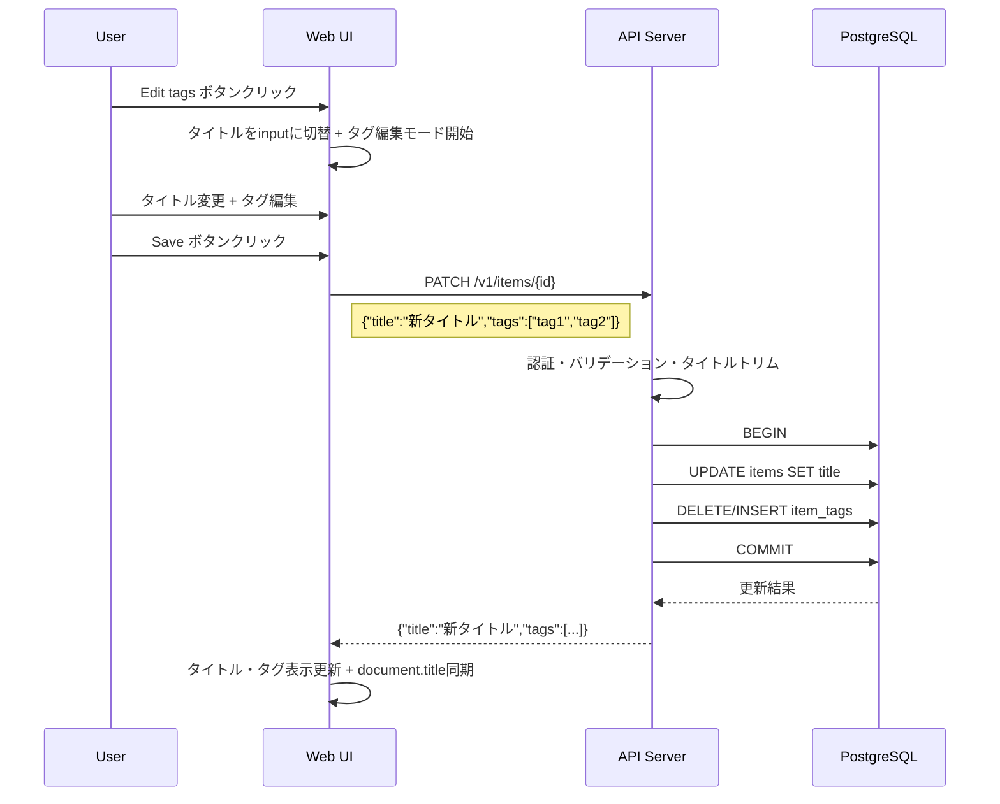

# Design Document: item-title-edit

## Overview

**Purpose**: 既存のタグ編集UIにタイトル編集を統合し、ユーザーが「Edit tags」ボタン1つでタイトルとタグを同時に編集・保存できるようにする。新規 `PATCH /v1/items/{id}` エンドポイントで一括更新し、既存の `PUT /v1/items/{id}/tags` は拡張機能互換のために維持する。

**Users**: altpocketのWeb UIユーザーが、保存済みアイテムのタイトルとタグを一括で修正する際に利用する。

**Impact**: 新規APIエンドポイントとStoreメソッドを追加し、既存のタグ編集UIと `item_detail.html` を拡張する。既存エンドポイントは変更しない。

### Goals
- 既存のタグ編集操作にタイトル編集を統合し、1ボタン・1リクエストで完結する編集体験を提供する
- セマンティクスが明確な `PATCH /v1/items/{id}` を新設し、将来の拡張にも対応できる設計にする
- 既存 `PUT /v1/items/{id}/tags` の後方互換性を維持する

### Non-Goals
- excerpt（要約）など他フィールドの編集機能（今回はタイトルのみ）
- 既存 `PUT /v1/items/{id}/tags` エンドポイントの廃止や変更
- 拡張機能UIからのタイトル編集（APIは利用可能だがUI対応はスコープ外）

## Architecture

### Existing Architecture Analysis

現在のタグ編集フローは以下の構成で動作する：

- **テンプレート**: `templates/item_detail.html` — タグチップ表示、input、Save/Cancel ボタン
- **JavaScript**: `static/app.js` — openEditor/closeEditor によるモード切替、fetch API で `PUT /v1/items/{id}/tags`
- **APIハンドラー**: `server.handleUpdateItemTags` — JSON デコード → Store 呼び出し → JSON レスポンス
- **Store**: `store.ReplaceItemTags` — トランザクション内で所有権チェック → タグ置換

タイトル編集はUIレイヤーを拡張し、APIレイヤーには新規エンドポイントを追加する。既存コードへの変更は `ReplaceItemTags` のラッパー化のみ。

### Architecture Pattern & Boundary Map



**Architecture Integration**:
- Selected pattern: 新規 `PATCH /v1/items/{id}` エンドポイント（部分更新セマンティクス）
- Existing patterns preserved: レイヤード構成、トランザクション内処理、JSON レスポンス形式
- 既存 `PUT /v1/items/{id}/tags` は変更なし（`ReplaceItemTags` のラッパー化で内部呼び出しのみ変更）

### Technology Stack

| Layer | Choice / Version | Role in Feature | Notes |
|-------|------------------|-----------------|-------|
| Frontend | Vanilla JS + HTML Template | 統合編集UI | 既存 app.js・item_detail.html を拡張 |
| Backend | Go + chi v5 | 新規ハンドラー追加 | handlePatchItem を新設 |
| Data | PostgreSQL 16 + pgx/v5 | タイトル+タグ更新 | PatchItem メソッド新設 |

新規依存なし。

## Requirements Traceability

| Requirement | Summary | Components | Interfaces | Flows |
|-------------|---------|------------|------------|-------|
| 1.1 | Edit tagsでタイトルも編集モードに | item_detail.html, app.js openEditor | — | 編集開始 |
| 1.2 | タイトルとタグの同時編集、ボタン共有 | item_detail.html, app.js | — | 編集モード |
| 1.3 | キャンセルで両方復帰 | app.js closeEditor | — | キャンセル |
| 1.4 | 保存で1リクエスト送信 | app.js saveHandler | PATCH /v1/items/{id} | 保存フロー |
| 2.1 | タイトル+タグ一括更新・返却 | handlePatchItem, PatchItem | PATCH /v1/items/{id} | 保存フロー |
| 2.2 | 既存PUT /tagsの互換維持 | handleUpdateItemTags, ReplaceItemTags | PUT /v1/items/{id}/tags | 後方互換 |
| 2.3 | 非所有者に404 | handlePatchItem, PatchItem | — | エラー処理 |
| 2.4 | 不正リクエストに400 | handlePatchItem | — | エラー処理 |
| 3.1 | 空タイトル保存防止 | app.js | — | バリデーション |
| 3.2 | サーバー側トリム | handlePatchItem | — | バリデーション |
| 3.3 | 二重送信防止 | app.js | — | 保存フロー |
| 4.1 | document.title同期 | app.js | — | 保存成功後 |

## Components and Interfaces

| Component | Domain/Layer | Intent | Req Coverage | Key Dependencies | Contracts |
|-----------|-------------|--------|--------------|------------------|-----------|
| item_detail.html 拡張 | Presentation | タイトル入力フィールド追加 | 1.1, 1.2 | — | — |
| app.js 拡張 | Presentation | openEditor/closeEditor/saveにタイトル処理を統合 | 1.1-1.4, 3.1, 3.3, 4.1 | API (P0) | API |
| handlePatchItem | HTTP | アイテム部分更新ハンドラー（新規） | 2.1, 2.3, 2.4, 3.2 | Store (P0) | API |
| PatchItem | Data | タイトル+タグの一括DB更新（新規） | 2.1, 2.3 | PostgreSQL (P0) | Service |
| ReplaceItemTags リファクタ | Data | PatchItemのラッパーに変更 | 2.2 | PatchItem (P0) | Service |

### Presentation Layer

#### item_detail.html テンプレート拡張

| Field | Detail |
|-------|--------|
| Intent | 既存 `<h1>` の隣にタイトル編集用 input フィールドを追加する |
| Requirements | 1.1, 1.2 |

**Responsibilities & Constraints**
- `<h1>` の直後にタイトル用 `<input>` を追加し、初期状態は `hidden`
- 編集モード開始時に `<h1>` を非表示、`<input>` を表示に切替
- 既存の Save/Cancel ボタンをタイトルとタグで共有（新規ボタン追加なし）

**Implementation Notes**
- input に `id="detail-title-input"` を付与し、JS から参照
- 既存の `data-item-id` 属性をそのまま利用

#### app.js タグ編集ロジック拡張

| Field | Detail |
|-------|--------|
| Intent | openEditor/closeEditor/save ハンドラーにタイトルの状態管理を統合する |
| Requirements | 1.1, 1.2, 1.3, 1.4, 3.1, 3.3, 4.1 |

**Responsibilities & Constraints**
- `openEditor()`: `<h1>` の現在テキストを `originalTitle` に保存し、input に設定して表示切替
- `closeEditor()`: `<h1>` のテキストを復帰（キャンセル時は `originalTitle`、保存成功時は新タイトル）し、input を非表示に
- Save ハンドラー: `PATCH /v1/items/{id}` に `{ tags: draftTags, title: inputValue }` を送信。トリム後空文字の場合は alert で保存中止
- 保存成功後: `document.title` を `{新タイトル} | altpocket` に更新

**Contracts**: API [x]

##### API Contract（クライアント側）

```
PATCH /v1/items/{itemID}
Content-Type: application/json
Body: { "title": "新しいタイトル", "tags": ["tag1", "tag2"] }
```

**Implementation Notes**
- 既存の `headers` 変数（CSRF トークン含む）を再利用
- レスポンスの `title` フィールドで表示と `document.title` を更新

### HTTP Layer

#### handlePatchItem（新規）

| Field | Detail |
|-------|--------|
| Intent | アイテムの部分更新リクエストを処理する新規ハンドラー |
| Requirements | 2.1, 2.3, 2.4, 3.2 |

**Responsibilities & Constraints**
- 認証済みユーザーの確認
- レート制限チェック
- リクエストボディの JSON デコード（`title *string`, `tags []string`）
- `title` が非 nil の場合、前後の空白をトリムし、トリム後空文字なら 400 エラー
- Store.PatchItem 呼び出しとエラーハンドリング

**Dependencies**
- Inbound: Web UI — 編集リクエスト (P0)
- Outbound: Store.PatchItem — DB操作 (P0)

**Contracts**: API [x]

##### API Contract

| Method | Endpoint | Request | Response | Errors |
|--------|----------|---------|----------|--------|
| PATCH | /v1/items/{id} | `{"title":"...", "tags":["..."]}` | `{"title":"...", "tags":[...]}` | 400, 404, 429, 500 |

- `title`, `tags` はいずれもオプション。指定されたフィールドのみ更新
- Preconditions: ユーザー認証済み、リクエストボディが JSON 形式
- Postconditions: 指定されたフィールドが更新され、更新後の値が返却される
- Error responses:
  - 400: JSON デコード失敗またはトリム後タイトルが空文字
  - 404: アイテム不在または非所有者
  - 429: レート制限超過
  - 500: DB エラー

#### handleUpdateItemTags（既存・変更なし）

既存のハンドラーは変更しない。内部で呼ぶ `ReplaceItemTags` がラッパー化されるが、シグネチャと動作は維持。

### Data Layer

#### PatchItem（新規）

| Field | Detail |
|-------|--------|
| Intent | トランザクション内でタイトルとタグを一括更新する |
| Requirements | 2.1, 2.3 |

**Responsibilities & Constraints**
- トランザクション開始 → 所有権チェック → タイトル更新（指定時） → タグ置換（指定時） → コミット
- `title` が nil の場合はタイトル更新をスキップ
- `tags` が nil の場合はタグ操作をスキップ
- 所有権チェック失敗時は `pgx.ErrNoRows` を返却

**Dependencies**
- External: PostgreSQL — items, tags, item_tags テーブル (P0)

**Contracts**: Service [x]

##### Service Interface

```go
// PatchItem はアイテムのタイトルとタグをオプションで一括更新する。
// title が nil の場合タイトルは変更しない。tags が nil の場合タグは変更しない。
// アイテムが存在しないか userID が一致しない場合は pgx.ErrNoRows を返す。
func (s *Store) PatchItem(ctx context.Context, userID, itemID string, title *string, tags *[]string) (updatedTitle string, updatedTags []Tag, err error)
```

- Preconditions: `title` が非 nil の場合、トリム済み・空文字でないこと（ハンドラー側で保証）
- Postconditions: 指定されたフィールドが更新される
- Invariants: `user_id` が一致するアイテムのみ操作可能
- 戻り値: 更新後のタイトルとタグ。未更新フィールドは現在値を返す

**Implementation Notes**
- タイトル更新 SQL: `UPDATE items SET title=$1 WHERE id=$2 AND user_id=$3`
- タグ置換ロジック: 既存 `ReplaceItemTags` のコア処理（DELETE → INSERT → 孤立タグ削除 → SELECT）を移植

#### ReplaceItemTags リファクタリング

| Field | Detail |
|-------|--------|
| Intent | 既存メソッドを PatchItem のラッパーに変更し後方互換を維持する |
| Requirements | 2.2 |

**Responsibilities & Constraints**
- シグネチャは変更しない: `(ctx, userID, itemID string, tagNames []string) ([]Tag, error)`
- 内部で `PatchItem(ctx, userID, itemID, nil, &tagNames)` を呼び出す
- 既存の `handleUpdateItemTags` からの呼び出しに影響なし

##### Service Interface

```go
// ReplaceItemTags は PatchItem のラッパー。タグのみを置換する。
func (s *Store) ReplaceItemTags(ctx context.Context, userID, itemID string, tagNames []string) ([]Tag, error) {
    _, tags, err := s.PatchItem(ctx, userID, itemID, nil, &tagNames)
    return tags, err
}
```

## Data Models

### Physical Data Model

既存の `items` テーブルの `title` カラムをそのまま使用。スキーマ変更なし。

```sql
-- 既存定義（変更なし）
-- items.title TEXT NOT NULL DEFAULT ''
```

### Data Contracts & Integration

**PATCH API Request**:
```json
{
  "title": "新しいタイトル",
  "tags": ["tag1", "tag2"]
}
```
- `title`, `tags` はいずれもオプション。指定されたフィールドのみ更新

**PATCH API Response（成功時）**:
```json
{
  "title": "新しいタイトル",
  "tags": [{"id": "...", "name": "tag1", "normalized_name": "tag1"}]
}
```

**既存 PUT /tags API（変更なし）**:
- Request: `{"tags": ["tag1", "tag2"]}`
- Response: `{"tags": [...]}`

**API Response（エラー時）**:
```json
{
  "error": "string"
}
```

## Error Handling

### Error Categories and Responses

**User Errors (4xx)**:
- 400 `invalid_request`: JSON デコード失敗またはトリム後タイトルが空文字
- 404 `not_found`: アイテム不在または非所有者
- 429 `rate_limited`: レート制限超過

**System Errors (5xx)**:
- 500 `db_error`: DB 更新失敗 → サーバーログ出力

## Testing Strategy

### Unit Tests
- `PatchItem`: title+tags 同時更新、title のみ更新、tags のみ更新、非所有者拒否
- `ReplaceItemTags` ラッパー: 既存テストがそのまま通ること（後方互換）
- ハンドラーのバリデーション: 空タイトル拒否、トリム処理の確認

### Integration Tests
- `PATCH /v1/items/{id}` に title+tags: 両方更新される
- `PATCH /v1/items/{id}` に tags のみ: タグのみ更新される
- `PUT /v1/items/{id}/tags`: 既存動作が維持される
- 拡張機能契約テスト: 既存リクエスト形式のレスポンスが変わらないことを確認

### E2E Tests
- 手動確認: Edit tags → タイトル変更+タグ編集 → Save → 両方の表示更新 → ページタイトル同期
- 手動確認: Edit tags → タイトル変更+タグ編集 → Cancel → 両方が元に戻る
