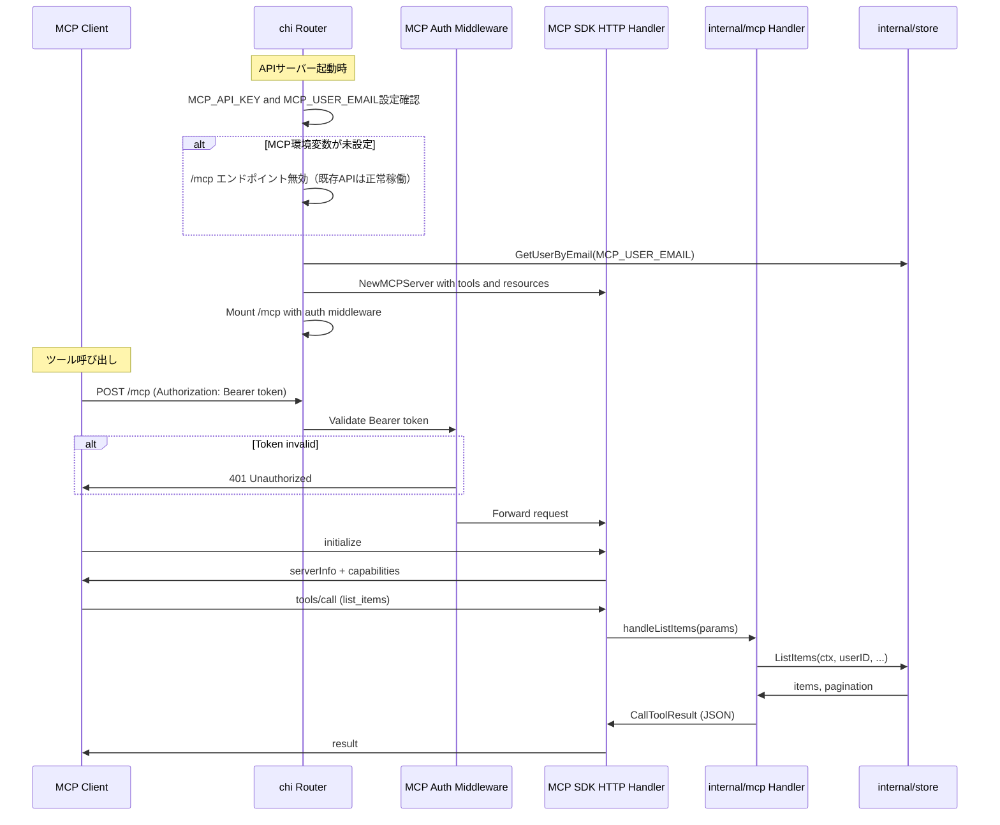

# Design Document: mcp-article-features

## Overview
**Purpose**: altpocketの既存APIサーバーにMCP (Model Context Protocol) Serverエンドポイントを追加し、AIエージェントがインターネット経由で保存済み記事データにアクセスできるインターフェースを提供する。
**Users**: AIエージェント開発者・利用者が、Claude Desktop、Cline、その他MCPクライアントからaltpocketの記事検索・解析・要約データ取得のワークフローに利用する。
**Impact**: 既存の`cmd/api`サーバーに`/mcp`エンドポイントを追加。新規バイナリやDockerサービスは不要。既存のstore層を共有し、新規コードの大部分はMCPハンドラー層に集約する。

### Goals
- MCP準拠のStreamable HTTPエンドポイントを既存APIサーバーの`/mcp`パスに追加する
- 4つのツール（list_items, search_items, get_item, list_tags）と1つのリソース（recent-articles）を公開する
- Bearer Token認証と`MCP_USER_EMAIL`によるユーザースコープでデータアクセスを制限する
- MCP環境変数が未設定の場合はエンドポイントを無効化し、既存機能に影響を与えない

### Non-Goals
- stdioトランスポートのサポート（HTTP Streamableのみ）
- マルチユーザー同時アクセス（1つのAPIキーに1ユーザーをバインド）
- 記事の作成・更新・削除操作（読み取り専用）
- LLMによる要約生成機能（AIエージェント側の責務）

## Architecture

### Existing Architecture Analysis
altpocketは`cmd/`（実行境界）と`internal/`（ドメイン/インフラ）を分離したレイヤード構成を採用している。

- `cmd/api/main.go`: HTTP API + Web UI サーバー（chi v5）
- `cmd/worker/main.go`: 非同期コンテンツ取得ワーカー
- `internal/server`: chiルーター定義、HTTPハンドラー、ミドルウェア
- `internal/store`: PostgreSQLへのデータアクセス層
- `internal/config`: 環境変数ベースの設定管理

MCP Serverは`internal/server`のルーティングに`/mcp`パスとして組み込み、`internal/mcp`パッケージでツール/リソースハンドラーを定義する。

### Architecture Pattern & Boundary Map

```mermaid
graph TB
    subgraph MCPClient[MCP Client - Remote]
        Claude[Claude Desktop / Cline]
    end

    subgraph ExistingAPI[cmd/api - Existing Docker Container]
        ChiRouter[chi Router]
        APIHandlers[internal/server - Existing API Handlers]
        MCPEndpoint[/mcp - MCP Streamable HTTP]
        MCPAuth[MCP Bearer Token Auth Middleware]
        MCPHandlers[internal/mcp - Tool and Resource Handlers]
    end

    subgraph SharedInternal[internal shared packages]
        Store[internal/store]
        Config[internal/config]
        DB[internal/db]
        Logger[internal/logger]
    end

    subgraph Database[PostgreSQL]
        Items[items + item_contents]
        Tags[tags + item_tags]
        Users[users]
    end

    Claude -->|HTTPS| ChiRouter
    ChiRouter --> APIHandlers
    ChiRouter --> MCPAuth
    MCPAuth --> MCPEndpoint
    MCPEndpoint --> MCPHandlers
    MCPHandlers --> Store
    APIHandlers --> Store
    ExistingAPI --> Config
    ExistingAPI --> DB
    ExistingAPI --> Logger
    Store --> Items
    Store --> Tags
    Store --> Users
```

**Architecture Integration**:
- Selected pattern: 既存APIサーバーへの埋め込み。chiルーターに`/mcp`パスをマウントし、MCP SDKのHTTPハンドラーに委譲
- Domain boundaries: MCPハンドラーは読み取り専用。store層の既存メソッドを直接利用
- Existing patterns preserved: chiルーティング、`internal/store`集約、`internal/config`環境変数管理
- New components: `internal/mcp`パッケージ（MCPツール/リソースハンドラー）、MCP認証ミドルウェア
- Steering compliance: 「既存レイヤーを崩さず追加できること」の原則に準拠

### Technology Stack

| Layer | Choice / Version | Role in Feature | Notes |
|-------|------------------|-----------------|-------|
| MCP SDK | `modelcontextprotocol/go-sdk` v1.4.1 | MCP Server基盤、JSON-RPC処理、ツール/リソース登録 | 公式安定版。Streamable HTTP transport内蔵 |
| Backend | Go 1.22 + chi v5 | 既存APIサーバーにMCPエンドポイント追加 | 既存と同一 |
| Data | PostgreSQL 16 (pgx/v5) | 記事・タグ・ユーザーデータ | 既存store層を共有 |
| Infrastructure | Docker | 既存apiコンテナで稼働 | 追加コンテナ不要 |

## System Flows

### MCP エンドポイントの初期化とツール呼び出しフロー



## Requirements Traceability

| Requirement | Summary | Components | Interfaces | Flows |
|-------------|---------|------------|------------|-------|
| 1.1 | MCP Streamable HTTP transport | MCPServer, server.go | StreamableHTTPHandler | 初期化フロー |
| 1.2 | /mcp パスとしてマウント | server.go | chi.Mount | 初期化フロー |
| 1.3 | 既存store層を介したDBアクセス | MCPHandlers | store.Store | ツール呼び出しフロー |
| 1.4 | initializeレスポンス | MCPServer | ServerInfo | 初期化フロー |
| 1.5 | エラーレスポンス | MCPServer | go-sdk組み込み | — |
| 2.1–2.4 | list_items ツール | ListItemsHandler | ListItemsInput | ツール呼び出しフロー |
| 3.1–3.5 | search_items ツール | SearchItemsHandler | SearchItemsInput | ツール呼び出しフロー |
| 4.1–4.3 | get_item ツール | GetItemHandler | GetItemInput | ツール呼び出しフロー |
| 5.1–5.2 | list_tags ツール | ListTagsHandler | ListTagsInput | ツール呼び出しフロー |
| 6.1–6.3 | recent-articles リソース | RecentArticlesHandler | Resource URI | リソース読み取りフロー |
| 7.1–7.2 | Bearer Token認証 | MCPAuthMiddleware | Authorization header | 認証フロー |
| 7.3 | ユーザースコープ制限 | server.go起動時検証 | MCP_USER_EMAIL | 初期化フロー |
| 7.4 | 環境変数未設定時の無効化 | server.go | config | 初期化フロー |
| 7.5 | 401レスポンス | MCPAuthMiddleware | HTTP 401 | 認証フロー |

## Components and Interfaces

| Component | Domain/Layer | Intent | Req Coverage | Key Dependencies | Contracts |
|-----------|-------------|--------|--------------|------------------|-----------|
| server.go MCP統合 | internal/server | chiルーターへのMCPマウント | 1.1, 1.2, 7.3, 7.4 | config (P0), mcp SDK (P0) | — |
| MCPAuthMiddleware | internal/mcp | Bearer Token認証 | 7.1, 7.2, 7.5 | config (P0) | Service |
| MCPConfig | internal/config | MCP用設定読み込み | 1.2, 7.1–7.4 | — | Service |
| ListItemsHandler | internal/mcp | 記事一覧取得ツール | 2.1–2.4 | store.ListItems (P0) | Service |
| SearchItemsHandler | internal/mcp | 記事検索ツール | 3.1–3.5 | store.ListItems (P0) | Service |
| GetItemHandler | internal/mcp | 記事詳細取得ツール | 4.1–4.3 | store.GetItemDetail (P0) | Service |
| ListTagsHandler | internal/mcp | タグ一覧取得ツール | 5.1–5.2 | store.ListTagsWithCountFiltered (P0) | Service |
| RecentArticlesHandler | internal/mcp | 新着記事リソース | 6.1–6.3 | store.ListRecentItems (P0) | Service |
| GetUserByEmail | internal/store | メールアドレスでユーザー取得 | 7.3 | pgxpool (P0) | Service |
| ListRecentItems | internal/store | 過去N時間の記事取得 | 6.1 | pgxpool (P0) | Service |

### Config Layer

#### MCPConfig（internal/config への追加）

| Field | Detail |
|-------|--------|
| Intent | MCP Server用の設定を環境変数から読み込む（オプション） |
| Requirements | 1.2, 7.1, 7.2, 7.3, 7.4 |

**Contracts**: Service [x]

##### Service Interface
```go
// MCPConfig はMCP Server用のオプション設定
type MCPConfig struct {
    APIKey    string // MCP_API_KEY: Bearer Token認証キー
    UserEmail string // MCP_USER_EMAIL: データスコープ対象ユーザー
    Enabled   bool   // 両方が設定されている場合にtrue
}

// LoadMCPConfig はMCP用の設定を環境変数から読み込む
// MCP_API_KEY, MCP_USER_EMAIL のいずれかが未設定の場合、Enabled=false を返す
func LoadMCPConfig() MCPConfig
```

### Auth Layer

#### MCPAuthMiddleware

| Field | Detail |
|-------|--------|
| Intent | MCP エンドポイントへのリクエストをBearer Token認証で保護 |
| Requirements | 7.1, 7.2, 7.5 |

**Contracts**: Service [x]

##### Service Interface
```go
// NewMCPAuthMiddleware はBearer Token検証のchiミドルウェアを返す
// Authorization ヘッダーの値がapiKeyと一致しない場合は401を返す
func NewMCPAuthMiddleware(apiKey string) func(http.Handler) http.Handler
```
- Preconditions: apiKeyが空でないこと
- Postconditions: 認証成功時はリクエストを次のハンドラーに転送。失敗時は401

### Store Layer（既存パッケージへの追加）

#### GetUserByEmail

| Field | Detail |
|-------|--------|
| Intent | メールアドレスからユーザーを取得 |
| Requirements | 7.3 |

**Contracts**: Service [x]

##### Service Interface
```go
// GetUserByEmail はメールアドレスでユーザーを検索する
// 該当ユーザーが存在しない場合は pgx.ErrNoRows を返す
func (s *Store) GetUserByEmail(ctx context.Context, email string) (User, error)
```

#### ListRecentItems

| Field | Detail |
|-------|--------|
| Intent | 指定時間以降に作成された記事をタグ付きで取得 |
| Requirements | 6.1 |

**Contracts**: Service [x]

##### Service Interface
```go
// ListRecentItems は指定されたユーザーのsince以降に作成された記事を
// 作成日時降順で返す。タグ情報を含む
func (s *Store) ListRecentItems(ctx context.Context, userID string, since time.Time) ([]ItemListRow, error)
```

### MCP Handler Layer（新規パッケージ）

#### internal/mcp パッケージ概要

MCPツールとリソースのハンドラーを定義するパッケージ。各ハンドラーはstore層のメソッドを呼び出し、結果をMCPレスポンス形式に変換する。

```go
// NewMCPServer はツールとリソースを登録済みのMCP Serverインスタンスを生成する
// userIDは全ツール/リソースのデータスコープに使用される
func NewMCPServer(st *store.Store, userID string) *mcp.Server

// HTTPHandler はMCP ServerのStreamable HTTP handlerを返す
// chiルーターにマウントして使用する
func HTTPHandler(server *mcp.Server) http.Handler
```

#### ListItemsHandler

| Field | Detail |
|-------|--------|
| Intent | 記事一覧をページネーション付きで返却するMCPツールハンドラー |
| Requirements | 2.1, 2.2, 2.3, 2.4 |

**Contracts**: Service [x]

##### Service Interface
```go
type ListItemsInput struct {
    Page    int    `json:"page"    jsonschema:"ページ番号（デフォルト: 1）"`
    PerPage int    `json:"per_page" jsonschema:"1ページあたりの件数（デフォルト: 30, 最大: 50）"`
    Sort    string `json:"sort"    jsonschema:"並び替え: newest または oldest（デフォルト: newest）"`
}
```
- Store呼び出し: `store.ListItems(ctx, userID, input.Page, input.PerPage, "", nil, input.Sort)`

#### SearchItemsHandler

| Field | Detail |
|-------|--------|
| Intent | キーワード・タグによる記事検索ツールハンドラー |
| Requirements | 3.1, 3.2, 3.3, 3.4, 3.5 |

**Contracts**: Service [x]

##### Service Interface
```go
type SearchItemsInput struct {
    Query   string   `json:"query"    jsonschema:"検索キーワード"`
    Tags    []string `json:"tags"     jsonschema:"タグによる絞り込み（AND結合）"`
    Page    int      `json:"page"     jsonschema:"ページ番号（デフォルト: 1）"`
    PerPage int      `json:"per_page" jsonschema:"1ページあたりの件数（デフォルト: 30, 最大: 50）"`
}
```
- Preconditions: `Query`または`Tags`の少なくとも一方が指定されていること
- Error: 両方未指定の場合はエラーレスポンス
- Sort: queryが指定されている場合は`relevance`、tagsのみの場合は`newest`

#### GetItemHandler

| Field | Detail |
|-------|--------|
| Intent | 記事の全文コンテンツ含む詳細を返却するツールハンドラー |
| Requirements | 4.1, 4.2, 4.3 |

**Contracts**: Service [x]

##### Service Interface
```go
type GetItemInput struct {
    ID string `json:"id" jsonschema:"記事のUUID,required"`
}
```
- Error (4.2): 存在しない場合は「記事が見つかりません」エラー
- 動作 (4.3): fetch_statusがpending/fetchingの場合、content_fullは空文字列として返却し、fetch_statusを明示

#### ListTagsHandler

| Field | Detail |
|-------|--------|
| Intent | タグ一覧を記事数付きで返却するツールハンドラー |
| Requirements | 5.1, 5.2 |

**Contracts**: Service [x]

##### Service Interface
```go
type ListTagsInput struct {
    Query string `json:"query" jsonschema:"タグ名フィルタ（前方一致）"`
}
```
- Store呼び出し: `store.ListTagsWithCountFiltered(ctx, userID, input.Query, nil)`

#### RecentArticlesHandler

| Field | Detail |
|-------|--------|
| Intent | 過去24時間の新着記事をリソースとして公開するハンドラー |
| Requirements | 6.1, 6.2, 6.3 |

**Contracts**: Service [x]

##### Service Interface
- Resource URI: `altpocket://recent-articles`
- Resource Name: `新着記事（過去24時間）`
- MimeType: `application/json`
- Store呼び出し: `store.ListRecentItems(ctx, userID, time.Now().Add(-24*time.Hour))`
- 返却: 記事一覧JSON。0件でも空配列

### Server Layer（既存パッケージへの統合）

#### server.go MCP統合

| Field | Detail |
|-------|--------|
| Intent | 既存chiルーターにMCPエンドポイントをマウント |
| Requirements | 1.1, 1.2, 7.3, 7.4 |

**Implementation Notes**
- `server.New()`の引数に`MCPConfig`を追加
- `MCPConfig.Enabled == true`の場合のみ`/mcp`ルートを登録
- ルート構成: `r.Route("/mcp", func(r chi.Router) { r.Use(MCPAuthMiddleware); r.Handle("/*", mcpHTTPHandler) })`
- 起動時に`GetUserByEmail`でユーザー存在確認。不在時はログ警告を出してMCP無効化（サーバー自体は起動）

## Data Models

### Domain Model
既存のドメインモデルを変更せず再利用する。MCP固有の新規エンティティは発生しない。

- **Item / ItemDetail / ItemListRow**: 記事データ（既存）
- **Tag**: タグデータ（既存）
- **User**: ユーザーデータ（既存）
- **Pagination**: ページネーション情報（既存）

### Physical Data Model
スキーマ変更なし。既存テーブル（items, item_contents, tags, item_tags, users）をそのまま利用する。

### Data Contracts

#### ツールレスポンス共通構造（TextContent内のJSON）

**記事一覧レスポンス**（list_items, search_items共通）:
```json
{
  "items": [
    {
      "id": "uuid",
      "url": "https://example.com/article",
      "title": "記事タイトル",
      "excerpt": "記事概要...",
      "tags": [{"name": "go", "normalized_name": "go"}],
      "fetch_status": "success",
      "created_at": "2026-03-30T00:00:00Z"
    }
  ],
  "pagination": {
    "page": 1,
    "per_page": 30,
    "total": 150
  }
}
```

**記事詳細レスポンス**（get_item）:
```json
{
  "id": "uuid",
  "url": "https://example.com/article",
  "canonical_url": "https://example.com/article",
  "title": "記事タイトル",
  "excerpt": "記事概要...",
  "content_full": "記事全文テキスト...",
  "tags": [{"name": "go", "normalized_name": "go"}],
  "fetch_status": "success",
  "created_at": "2026-03-30T00:00:00Z"
}
```

**タグ一覧レスポンス**（list_tags）:
```json
{
  "tags": [
    {"name": "Go", "normalized_name": "go", "count": 42}
  ]
}
```

**新着記事リソース**（recent-articles）:
```json
{
  "articles": [
    {
      "id": "uuid",
      "url": "https://example.com/article",
      "title": "記事タイトル",
      "excerpt": "記事概要...",
      "tags": [{"name": "go", "normalized_name": "go"}],
      "created_at": "2026-03-30T00:00:00Z"
    }
  ],
  "generated_at": "2026-03-30T12:00:00Z",
  "count": 5
}
```

## Error Handling

### Error Strategy
MCP SDKの組み込みエラーハンドリングを活用し、ツールハンドラー内のエラーはMCPプロトコル準拠のレスポンスとして返却する。HTTP層の認証エラーはMCP SDKの手前でミドルウェアが処理する。

### Error Categories and Responses

| Category | Trigger | Response |
|----------|---------|----------|
| 認証失敗 | Bearerトークン不一致/欠如 | HTTP 401 Unauthorized（MCP SDK到達前） |
| パラメータ不足 | search_itemsでquery/tags未指定 | `isError: true`、エラーメッセージをTextContentで返却 |
| 記事未発見 | get_itemで存在しないID | `isError: true`、「記事が見つかりません」 |
| UUID形式不正 | get_itemで不正なID形式 | `isError: true`、「IDの形式が不正です」 |
| DB接続エラー | PostgreSQL接続失敗 | `isError: true`、「データベース接続エラー」 |
| MCP無効 | 環境変数未設定 | /mcpパス未登録（404） |

### Monitoring
- 既存の`internal/logger`（slog）を使用した構造化ログ
- ツール呼び出しごとにツール名・パラメータ・実行時間をINFOログ出力
- 認証失敗はWARNログ出力（IPアドレス含む）
- エラー発生時はERRORログ出力

## Testing Strategy

### Unit Tests
- `internal/mcp`: 各ハンドラーの入力バリデーション（パラメータデフォルト値、範囲チェック、必須パラメータ）
- `internal/mcp`: MCPAuthMiddleware（有効トークン/無効トークン/ヘッダー欠如）
- `internal/store.GetUserByEmail`: 存在するユーザー/存在しないユーザーのケース
- `internal/store.ListRecentItems`: 過去24h以内/以外の記事の境界テスト

### Integration Tests
- MCP SDK HTTP handler経由のツール呼び出しend-to-end
- store層の新規メソッドのDB統合テスト（テスト用PostgreSQL）
- 認証ミドルウェア統合テスト（有効/無効トークン + MCPリクエスト）

### E2E Tests
- Claude Desktop設定での接続確認（手動）
- 各ツールの呼び出しと期待レスポンスの検証（手動）

## Security Considerations
- **Bearer Token認証**: `MCP_API_KEY`環境変数で管理。十分な長さ（32文字以上）を推奨
- **ユーザースコープ**: 全クエリにuserIDが含まれ、他ユーザーのデータへのアクセス不可
- **読み取り専用**: 記事の作成・更新・削除操作を一切提供しない
- **オプショナル有効化**: 環境変数未設定時はエンドポイント自体が存在しない（攻撃面ゼロ）
- **HTTPS前提**: 本番環境ではリバースプロキシ（nginx等）でTLS終端することを推奨
- **DB接続情報**: ログ出力に含めない（既存slogポリシーに準拠）
