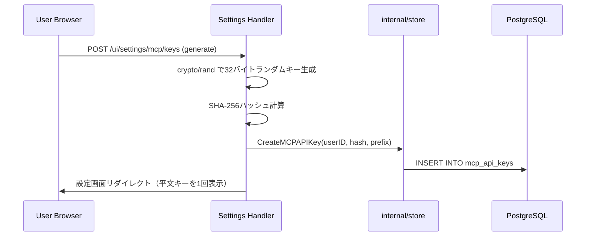
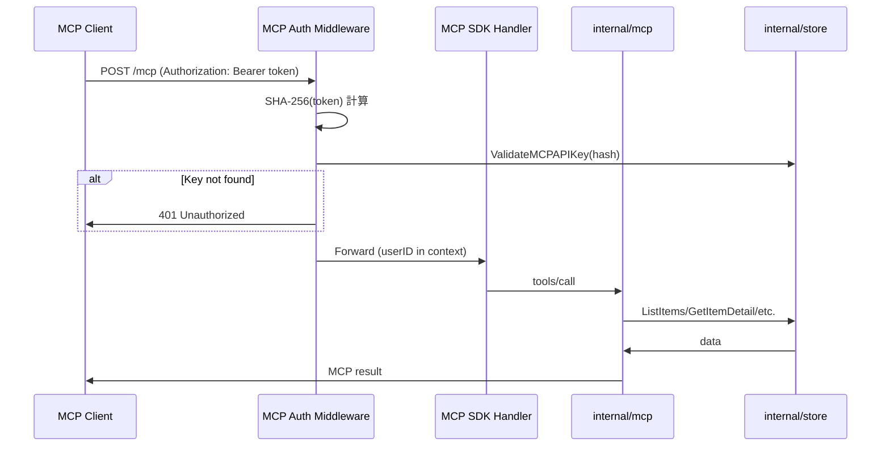

# Design Document: mcp-article-features

## Overview
**Purpose**: altpocketの既存APIサーバーにMCP Serverエンドポイントを追加し、AIエージェントがインターネット経由で記事データにアクセスできるインターフェースを提供する。APIキーは設定画面から生成・管理し、SHA-256ハッシュでDB保存する。
**Users**: AIエージェント開発者が、Claude Desktop・Cline等のMCPクライアントから記事検索・解析・要約データ取得に利用する。altpocketユーザーが設定画面からAPIキーを発行・管理する。
**Impact**: 既存`cmd/api`に`/mcp`エンドポイント追加。APIキー管理用のDBマイグレーション・設定画面UI・ハンドラーを追加。

### Goals
- MCP準拠のStreamable HTTPエンドポイントを`/mcp`パスに追加する
- 4ツール（list_items, search_items, get_item, list_tags）と1リソース（recent-articles）を公開する
- 設定画面でAPIキーを生成・失効管理し、Bearer Token認証でアクセスを保護する

### Non-Goals
- stdioトランスポート
- マルチユーザー同時アクセス
- 記事の作成・更新・削除（読み取り専用）
- LLMによる要約生成（AIエージェント側の責務）

## Architecture

### Existing Architecture Analysis
- `cmd/api/main.go`: HTTP API + Web UIサーバー（chi v5）
- `internal/server`: chiルーター、HTTPハンドラー、ミドルウェア
- `internal/store`: PostgreSQLデータアクセス層
- `internal/config`: 環境変数設定管理
- `templates/settings.html`: 設定画面（Account, Appearance, Google Sheets, Tools）

### Architecture Pattern & Boundary Map

```mermaid
graph TB
    subgraph MCPClient[MCP Client - Remote]
        Claude[Claude Desktop / Cline]
    end

    subgraph ExistingAPI[cmd/api - Docker Container]
        ChiRouter[chi Router]
        APIHandlers[internal/server - API Handlers]
        SettingsUI[Settings UI - API Key Management]
        MCPAuth[MCP Auth Middleware]
        MCPEndpoint[/mcp - Streamable HTTP]
        MCPHandlers[internal/mcp - Handlers]
    end

    subgraph SharedInternal[internal packages]
        Store[internal/store]
        DB[internal/db]
    end

    subgraph Database[PostgreSQL]
        Items[items + item_contents]
        Tags[tags + item_tags]
        Users[users]
        APIKeys[mcp_api_keys]
    end

    Claude -->|HTTPS + Bearer| ChiRouter
    ChiRouter --> APIHandlers
    ChiRouter --> MCPAuth
    MCPAuth --> MCPEndpoint
    MCPEndpoint --> MCPHandlers
    MCPHandlers --> Store
    APIHandlers --> Store
    SettingsUI --> Store
    Store --> Items
    Store --> Tags
    Store --> Users
    Store --> APIKeys
```

**Architecture Integration**:
- 既存APIサーバーへの埋め込み。`/mcp`パスをchiルーターにマウント
- MCPハンドラーは読み取り専用。store層の既存メソッドを直接利用
- APIキー管理は既存の設定画面（`/ui/settings`）に統合
- 新規テーブル`mcp_api_keys`を追加（マイグレーション）

### Technology Stack

| Layer | Choice / Version | Role in Feature | Notes |
|-------|------------------|-----------------|-------|
| MCP SDK | `modelcontextprotocol/go-sdk` v1.4.1 | MCP Server基盤、Streamable HTTP transport | 公式安定版 |
| Backend | Go 1.22 + chi v5 | 既存APIサーバー拡張 | 既存と同一 |
| Data | PostgreSQL 16 (pgx/v5) | 記事・タグ・APIキーデータ | mcp_api_keysテーブル追加 |
| Crypto | Go標準 `crypto/rand`, `crypto/sha256` | APIキー生成・ハッシュ化 | 外部依存なし |

## System Flows

### APIキー生成フロー



### MCPツール呼び出しフロー



## Requirements Traceability

| Requirement | Summary | Components | Interfaces |
|-------------|---------|------------|------------|
| 1.1–1.5 | MCP Server基盤 | MCPServer, server.go | StreamableHTTPHandler |
| 2.1–2.4 | list_items | ListItemsHandler | ListItemsInput |
| 3.1–3.5 | search_items | SearchItemsHandler | SearchItemsInput |
| 4.1–4.3 | get_item | GetItemHandler | GetItemInput |
| 5.1–5.2 | list_tags | ListTagsHandler | ListTagsInput |
| 6.1–6.3 | recent-articles | RecentArticlesHandler | Resource URI |
| 7.1–7.5 | 認証・セキュリティ | MCPAuthMiddleware, Store | Bearer Token, mcp_api_keys |
| 8.1–8.5 | APIキー管理UI | SettingsHandlers, Store, Template | Settings UI |

## Components and Interfaces

| Component | Domain/Layer | Intent | Req Coverage | Key Dependencies |
|-----------|-------------|--------|--------------|------------------|
| server.go MCP統合 | internal/server | chiルーターへのMCPマウント | 1.1–1.2 | mcp SDK (P0) |
| MCPAuthMiddleware | internal/mcp | Bearer Token→DB照合認証 | 7.1–7.5 | store (P0) |
| ListItemsHandler | internal/mcp | 記事一覧取得ツール | 2.1–2.4 | store.ListItems (P0) |
| SearchItemsHandler | internal/mcp | 記事検索ツール | 3.1–3.5 | store.ListItems (P0) |
| GetItemHandler | internal/mcp | 記事詳細取得ツール | 4.1–4.3 | store.GetItemDetail (P0) |
| ListTagsHandler | internal/mcp | タグ一覧取得ツール | 5.1–5.2 | store.ListTagsWithCountFiltered (P0) |
| RecentArticlesHandler | internal/mcp | 新着記事リソース | 6.1–6.3 | store.ListRecentItems (P0) |
| handleMCPKeyGenerate | internal/server | APIキー生成ハンドラー | 8.1–8.2 | store, crypto/rand (P0) |
| handleMCPKeyRevoke | internal/server | APIキー失効ハンドラー | 8.4 | store (P0) |
| settings.html MCP section | templates | APIキー管理UI | 8.2–8.5 | — |
| MCPAPIKey store methods | internal/store | APIキーCRUD | 7.2, 8.1, 8.3, 8.4 | pgxpool (P0) |
| ListRecentItems | internal/store | 過去N時間の記事取得 | 6.1 | pgxpool (P0) |
| Migration 002 | migrations | mcp_api_keysテーブル作成 | 7.2, 8.1 | — |

### MCP Handler Layer（internal/mcp）

#### NewMCPServer / HTTPHandler

```go
// NewMCPServer はツールとリソースを登録済みのMCP Serverを生成する
func NewMCPServer(st *store.Store, userID string) *mcp.Server

// HTTPHandler はStreamable HTTP handlerを返す
func HTTPHandler(server *mcp.Server) http.Handler
```

#### MCPAuthMiddleware

```go
// NewMCPAuthMiddleware はBearer Token検証ミドルウェアを返す
// トークンのSHA-256ハッシュをDBと照合し、一致するキーのuserIDをcontextに格納
func NewMCPAuthMiddleware(st *store.Store) func(http.Handler) http.Handler
```
- Bearer トークンを受け取り、SHA-256ハッシュを計算してDB照合
- 一致したAPIキーの`user_id`をcontextに格納（ツールハンドラーが参照）
- 不一致/欠如の場合は401

#### Tool Input Types

```go
type ListItemsInput struct {
    Page    int    `json:"page"    jsonschema:"ページ番号（デフォルト: 1）"`
    PerPage int    `json:"per_page" jsonschema:"1ページあたりの件数（デフォルト: 30, 最大: 50）"`
    Sort    string `json:"sort"    jsonschema:"並び替え: newest or oldest（デフォルト: newest）"`
}

type SearchItemsInput struct {
    Query   string   `json:"query"    jsonschema:"検索キーワード"`
    Tags    []string `json:"tags"     jsonschema:"タグ絞り込み（AND結合）"`
    Page    int      `json:"page"     jsonschema:"ページ番号（デフォルト: 1）"`
    PerPage int      `json:"per_page" jsonschema:"1ページあたりの件数（デフォルト: 30, 最大: 50）"`
}

type GetItemInput struct {
    ID string `json:"id" jsonschema:"記事のUUID,required"`
}

type ListTagsInput struct {
    Query string `json:"query" jsonschema:"タグ名フィルタ（前方一致）"`
}
```

#### RecentArticlesHandler
- Resource URI: `altpocket://recent-articles`
- Resource Name: `新着記事（過去24時間）`
- Store呼び出し: `store.ListRecentItems(ctx, userID, time.Now().Add(-24*time.Hour))`

### Store Layer（internal/store への追加）

```go
// --- APIキー管理 ---

type MCPAPIKey struct {
    ID        string    `json:"id"`
    UserID    string    `json:"user_id"`
    KeyHash   string    `json:"-"`          // SHA-256ハッシュ（非公開）
    KeyPrefix string    `json:"key_prefix"` // 先頭8文字（表示用）
    CreatedAt time.Time `json:"created_at"`
}

// CreateMCPAPIKey はハッシュ化済みAPIキーをDBに保存する
func (s *Store) CreateMCPAPIKey(ctx context.Context, userID, keyHash, keyPrefix string) (MCPAPIKey, error)

// ListMCPAPIKeys はユーザーの全APIキー（プレフィックス・作成日時）を返す
func (s *Store) ListMCPAPIKeys(ctx context.Context, userID string) ([]MCPAPIKey, error)

// ValidateMCPAPIKey はハッシュでAPIキーを検索し、対応するuserIDを返す
func (s *Store) ValidateMCPAPIKey(ctx context.Context, keyHash string) (string, error)

// DeleteMCPAPIKey は指定IDのAPIキーを削除する（userID照合あり）
func (s *Store) DeleteMCPAPIKey(ctx context.Context, userID, keyID string) error

// --- 新着記事 ---

// ListRecentItems はsince以降に作成された記事をタグ付きで返す
func (s *Store) ListRecentItems(ctx context.Context, userID string, since time.Time) ([]ItemListRow, error)
```

### Server Layer（internal/server への追加）

#### APIキー管理ハンドラー

```go
// handleMCPKeyGenerate はAPIキーを生成してセッション経由で1回表示
// POST /ui/settings/mcp/keys
func (s *Server) handleMCPKeyGenerate(w http.ResponseWriter, r *http.Request)

// handleMCPKeyRevoke はAPIキーを失効（削除）
// POST /ui/settings/mcp/keys/{id}/revoke
func (s *Server) handleMCPKeyRevoke(w http.ResponseWriter, r *http.Request)
```

#### ルーティング追加

```go
// 既存UIルート内に追加
r.Post("/ui/settings/mcp/keys", s.requireWeb(s.handleMCPKeyGenerate))
r.Post("/ui/settings/mcp/keys/{id}/revoke", s.requireWeb(s.handleMCPKeyRevoke))

// MCPエンドポイント（常に有効、認証はミドルウェアで制御）
r.Route("/mcp", func(r chi.Router) {
    r.Use(mcpAuthMiddleware)
    r.Handle("/*", mcpHTTPHandler)
})
```

### UI Layer（templates/settings.html への追加）

設定画面にMCPセクションを追加。既存のGoogle Sheets・Toolsセクションと同じ`settings-group`パターンに従う。

**表示内容**:
- 「MCP API Keys」セクション見出し
- 既存APIキー一覧テーブル（プレフィックス、作成日時、失効ボタン）
- 「Generate New Key」ボタン
- 生成直後: 平文キーを`<code>`で1回表示 + コピーボタン + 警告文
- MCPクライアント設定例（接続URL・Bearerトークン設定のコードブロック）

## Data Models

### Domain Model
既存モデル（Item, ItemDetail, Tag, User, Pagination）に加え、MCPAPIKeyエンティティを追加。

### Physical Data Model

#### Migration: `002_mcp_api_keys.sql`

```sql
CREATE TABLE mcp_api_keys (
    id UUID PRIMARY KEY DEFAULT gen_random_uuid(),
    user_id UUID NOT NULL REFERENCES users(id) ON DELETE CASCADE,
    key_hash TEXT NOT NULL UNIQUE,
    key_prefix TEXT NOT NULL,
    created_at TIMESTAMPTZ NOT NULL DEFAULT now()
);

CREATE INDEX idx_mcp_api_keys_user_id ON mcp_api_keys(user_id);
CREATE INDEX idx_mcp_api_keys_key_hash ON mcp_api_keys(key_hash);
```

### Data Contracts

**記事一覧レスポンス**（list_items, search_items）:
```json
{
  "items": [{"id":"uuid","url":"...","title":"...","excerpt":"...","tags":[{"name":"go"}],"fetch_status":"success","created_at":"..."}],
  "pagination": {"page":1,"per_page":30,"total":150}
}
```

**記事詳細レスポンス**（get_item）:
```json
{"id":"uuid","url":"...","title":"...","excerpt":"...","content_full":"...","tags":[{"name":"go"}],"fetch_status":"success","created_at":"..."}
```

**タグ一覧レスポンス**（list_tags）:
```json
{"tags":[{"name":"Go","normalized_name":"go","count":42}]}
```

**新着記事リソース**（recent-articles）:
```json
{"articles":[...],"generated_at":"...","count":5}
```

## Error Handling

| Category | Trigger | Response |
|----------|---------|----------|
| 認証失敗 | Bearerトークン不一致/欠如 | HTTP 401 |
| パラメータ不足 | search_itemsでquery/tags未指定 | MCP isError + メッセージ |
| 記事未発見 | get_itemで存在しないID | MCP isError |
| DB接続エラー | PostgreSQL障害 | MCP isError |

## Testing Strategy

### Unit Tests
- MCPAuthMiddleware: 有効/無効トークン/ヘッダー欠如
- 各ツールハンドラー: 入力バリデーション、デフォルト値
- Store: CreateMCPAPIKey, ValidateMCPAPIKey, DeleteMCPAPIKey, ListRecentItems

### Integration Tests
- MCP SDK HTTP handler経由のツール呼び出しE2E
- APIキー生成→MCP認証→ツール呼び出しの一連のフロー

## Security Considerations
- **APIキーハッシュ保存**: 平文をDBに保存しない（SHA-256ハッシュのみ）
- **1回表示**: 生成時のみ平文キーを表示。以後再表示不可
- **ユーザースコープ**: 全クエリにuserID含む。他ユーザーデータへのアクセス不可
- **読み取り専用**: 記事の変更操作なし
- **HTTPS前提**: 本番環境ではTLS終端必須
- **CSRFトークン**: キー生成・失効はPOSTリクエスト + CSRF保護（既存パターン）
