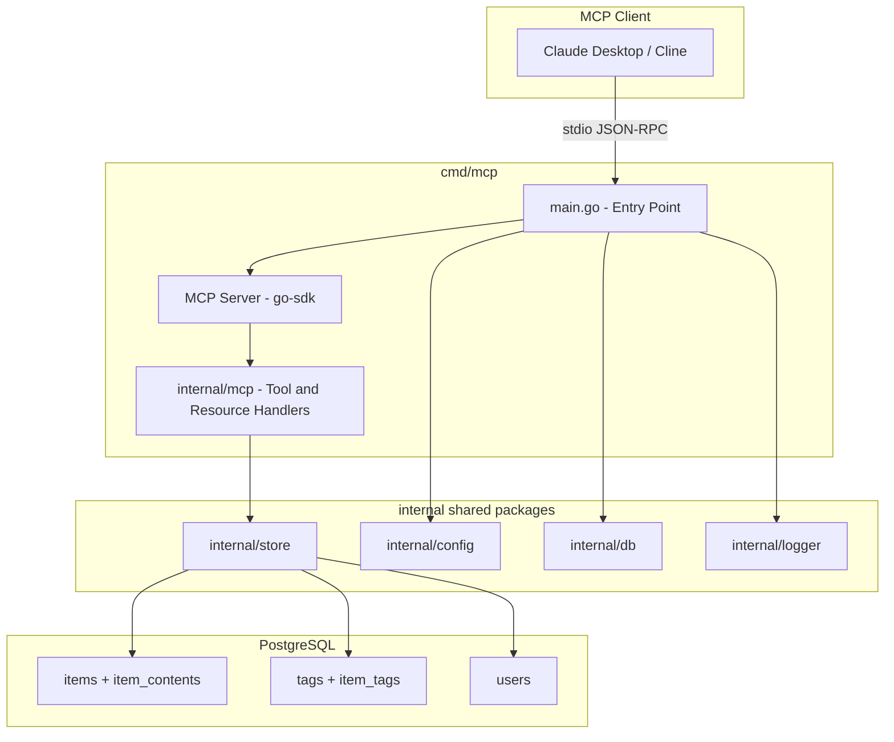
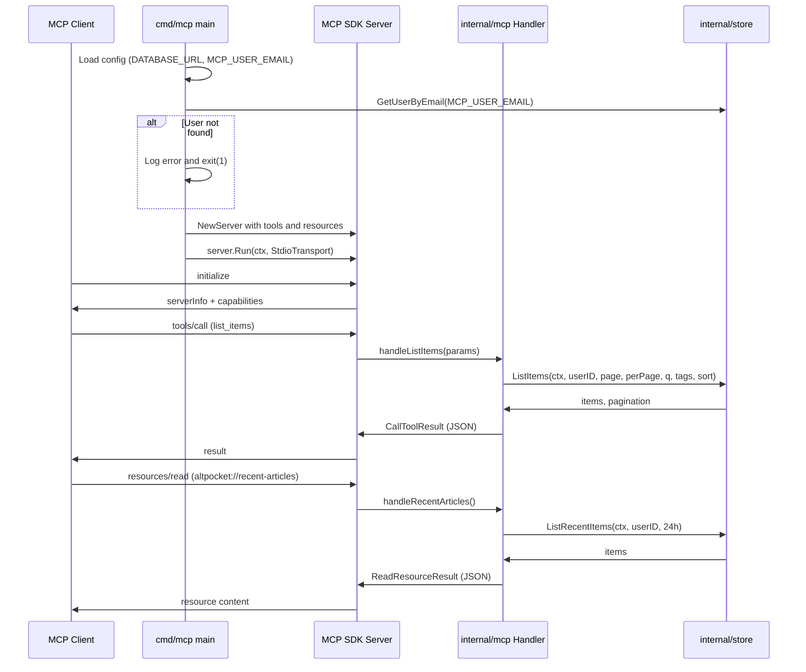

# Design Document: mcp-article-features

## Overview
**Purpose**: altpocketにMCP (Model Context Protocol) Serverを追加し、AIエージェントが保存済み記事データにstdioトランスポート経由でアクセスできるインターフェースを提供する。
**Users**: AIエージェント開発者・利用者が、Claude Desktop、Cline、その他MCPクライアントからaltpocketの記事検索・解析・要約データ取得のワークフローに利用する。
**Impact**: 既存の`cmd/api`・`cmd/worker`と並列する第3のエントリーポイント`cmd/mcp`を追加。既存のstore層・config層を共有し、新規コードの大部分はMCPハンドラー層に集約する。

### Goals
- MCP準拠のstdio Serverを`cmd/mcp`として提供し、既存store層を再利用する
- 4つのツール（list_items, search_items, get_item, list_tags）と1つのリソース（recent-articles）を公開する
- 環境変数`MCP_USER_EMAIL`による単一ユーザースコープでデータアクセスを制限する

### Non-Goals
- HTTP/SSEトランスポートのサポート（stdioのみ）
- マルチユーザー同時アクセス
- 記事の作成・更新・削除操作（読み取り専用）
- LLMによる要約生成機能（AIエージェント側の責務）

## Architecture

### Existing Architecture Analysis
altpocketは`cmd/`（実行境界）と`internal/`（ドメイン/インフラ）を分離したレイヤード構成を採用している。

- `cmd/api/main.go`: HTTP API + Web UI サーバー
- `cmd/worker/main.go`: 非同期コンテンツ取得ワーカー
- `internal/store`: PostgreSQLへのデータアクセス層（ListItems, GetItemDetail, ListTagsWithCount等）
- `internal/config`: 環境変数ベースの設定管理
- `internal/db`: pgxpool接続プール管理

MCP Serverは同じパターンで`cmd/mcp/main.go`として追加し、`internal/store`を直接利用する。

### Architecture Pattern & Boundary Map



**Architecture Integration**:
- Selected pattern: レイヤード（既存パターンの踏襲）。`cmd/mcp`が実行境界、`internal/mcp`がMCPハンドラー層
- Domain boundaries: MCPハンドラーは読み取り専用アクセスに限定。store層の既存メソッドを直接呼び出す
- Existing patterns preserved: `cmd/`エントリーポイント分離、`internal/store`集約、`internal/config`環境変数管理
- New components: `internal/mcp`パッケージ（MCPツール/リソースハンドラーの定義）
- Steering compliance: 「既存レイヤーを崩さず追加できること」の原則に準拠

### Technology Stack

| Layer | Choice / Version | Role in Feature | Notes |
|-------|------------------|-----------------|-------|
| MCP SDK | `modelcontextprotocol/go-sdk` v1.4.1 | MCP Server基盤、JSON-RPC処理、ツール/リソース登録 | 公式安定版。詳細は`research.md`参照 |
| Backend | Go 1.22 | MCP Serverバイナリ | 既存と同一 |
| Data | PostgreSQL 16 (pgx/v5) | 記事・タグ・ユーザーデータ | 既存store層を共有 |
| Infrastructure | Docker | MCPバイナリのビルド・配布 | 既存パターンに追従 |

## System Flows

### MCP Serverの起動とツール呼び出しフロー



## Requirements Traceability

| Requirement | Summary | Components | Interfaces | Flows |
|-------------|---------|------------|------------|-------|
| 1.1 | MCP JSON-RPC 2.0 over stdio | MCPServer, main.go | StdioTransport | 起動フロー |
| 1.2 | cmd/mcp エントリーポイント | main.go | — | 起動フロー |
| 1.3 | DATABASE_URL共有 | main.go, config | LoadMCP() | 起動フロー |
| 1.4 | initializeレスポンス | MCPServer | ServerInfo | 起動フロー |
| 1.5 | エラーレスポンス | MCPServer | go-sdk組み込み | — |
| 2.1–2.4 | list_items ツール | ListItemsHandler | ListItemsInput | ツール呼び出しフロー |
| 3.1–3.5 | search_items ツール | SearchItemsHandler | SearchItemsInput | ツール呼び出しフロー |
| 4.1–4.3 | get_item ツール | GetItemHandler | GetItemInput | ツール呼び出しフロー |
| 5.1–5.2 | list_tags ツール | ListTagsHandler | ListTagsInput | ツール呼び出しフロー |
| 6.1–6.3 | recent-articles リソース | RecentArticlesHandler | Resource URI | リソース読み取りフロー |
| 7.1–7.3 | 認証・セキュリティ | main.go, config | MCP_USER_EMAIL | 起動フロー |

## Components and Interfaces

| Component | Domain/Layer | Intent | Req Coverage | Key Dependencies | Contracts |
|-----------|-------------|--------|--------------|------------------|-----------|
| main.go | cmd/mcp | MCPサーバー起動・DI | 1.1–1.5, 7.1–7.3 | config, db, store, logger (P0) | — |
| MCPConfig | internal/config | MCP用設定読み込み | 1.3, 7.1 | — | Service |
| ListItemsHandler | internal/mcp | 記事一覧取得ツール | 2.1–2.4 | store.ListItems (P0) | Service |
| SearchItemsHandler | internal/mcp | 記事検索ツール | 3.1–3.5 | store.ListItems (P0) | Service |
| GetItemHandler | internal/mcp | 記事詳細取得ツール | 4.1–4.3 | store.GetItemDetail (P0) | Service |
| ListTagsHandler | internal/mcp | タグ一覧取得ツール | 5.1–5.2 | store.ListTagsWithCountFiltered (P0) | Service |
| RecentArticlesHandler | internal/mcp | 新着記事リソース | 6.1–6.3 | store.ListRecentItems (P0) | Service |
| GetUserByEmail | internal/store | メールアドレスでユーザー取得 | 7.1–7.2 | pgxpool (P0) | Service |
| ListRecentItems | internal/store | 過去N時間の記事取得 | 6.1 | pgxpool (P0) | Service |

### Entrypoint Layer

#### cmd/mcp/main.go

| Field | Detail |
|-------|--------|
| Intent | MCP Server起動：設定読み込み→ユーザー検証→ツール/リソース登録→stdio開始 |
| Requirements | 1.1, 1.2, 1.3, 1.4, 1.5, 7.1, 7.2, 7.3 |

**Responsibilities & Constraints**
- 環境変数からDB接続情報とユーザーメールを読み込む
- `GetUserByEmail`でユーザー存在確認。不在時はエラー終了
- `internal/mcp`パッケージの関数でツール/リソースを登録
- `server.Run(ctx, &mcp.StdioTransport{})`でstdio待受開始

**Dependencies**
- Outbound: `internal/config` — MCP設定読み込み (P0)
- Outbound: `internal/db` — DB接続プール生成 (P0)
- Outbound: `internal/store` — ユーザー検証 (P0)
- Outbound: `internal/mcp` — ハンドラー登録 (P0)
- External: `modelcontextprotocol/go-sdk` — MCP Server実装 (P0)

### Config Layer

#### MCPConfig（internal/config への追加）

| Field | Detail |
|-------|--------|
| Intent | MCP Server専用の軽量設定読み込み |
| Requirements | 1.3, 7.1 |

**Contracts**: Service [x]

##### Service Interface
```go
// MCPConfig はMCP Server起動に必要な設定を保持する
type MCPConfig struct {
    DatabaseURL  string
    UserEmail    string
}

// LoadMCP はMCP Server用の設定を環境変数から読み込む
// DATABASE_URL, MCP_USER_EMAIL が未設定の場合はpanicする
func LoadMCP() MCPConfig
```

### Store Layer（既存パッケージへの追加）

#### GetUserByEmail

| Field | Detail |
|-------|--------|
| Intent | メールアドレスからユーザーを取得 |
| Requirements | 7.1, 7.2 |

**Contracts**: Service [x]

##### Service Interface
```go
// GetUserByEmail はメールアドレスでユーザーを検索する
// 該当ユーザーが存在しない場合は pgx.ErrNoRows を返す
func (s *Store) GetUserByEmail(ctx context.Context, email string) (User, error)
```

#### ListRecentItems

| Field | Detail |
|-------|--------|
| Intent | 指定時間内に作成された記事をタグ付きで取得 |
| Requirements | 6.1 |

**Contracts**: Service [x]

##### Service Interface
```go
// ListRecentItems は指定されたユーザーのsince以降に作成された記事を
// 作成日時降順で返す。タグ情報を含む
func (s *Store) ListRecentItems(ctx context.Context, userID string, since time.Time) ([]ItemListRow, error)
```

### MCP Handler Layer（新規パッケージ）

#### internal/mcp パッケージ概要

MCPツールとリソースのハンドラーを定義するパッケージ。各ハンドラーはstore層のメソッドを呼び出し、結果をMCPレスポンス形式に変換する。

```go
// RegisterTools はMCPサーバーに全ツールを登録する
func RegisterTools(server *mcp.Server, st *store.Store, userID string)

// RegisterResources はMCPサーバーに全リソースを登録する
func RegisterResources(server *mcp.Server, st *store.Store, userID string)
```

#### ListItemsHandler

| Field | Detail |
|-------|--------|
| Intent | 記事一覧をページネーション付きで返却するMCPツールハンドラー |
| Requirements | 2.1, 2.2, 2.3, 2.4 |

**Contracts**: Service [x]

##### Service Interface
```go
// ListItemsInput はlist_itemsツールの入力パラメータ
type ListItemsInput struct {
    Page    int    `json:"page"    jsonschema:"ページ番号（デフォルト: 1）"`
    PerPage int    `json:"per_page" jsonschema:"1ページあたりの件数（デフォルト: 30, 最大: 50）"`
    Sort    string `json:"sort"    jsonschema:"並び替え: newest または oldest（デフォルト: newest）"`
}
```
- Preconditions: userIDは起動時に確定済み
- Postconditions: 空配列の場合もtotal_count: 0を含むJSON返却
- Store呼び出し: `store.ListItems(ctx, userID, input.Page, input.PerPage, "", nil, input.Sort)`

#### SearchItemsHandler

| Field | Detail |
|-------|--------|
| Intent | キーワード・タグによる記事検索ツールハンドラー |
| Requirements | 3.1, 3.2, 3.3, 3.4, 3.5 |

**Contracts**: Service [x]

##### Service Interface
```go
// SearchItemsInput はsearch_itemsツールの入力パラメータ
type SearchItemsInput struct {
    Query   string   `json:"query"    jsonschema:"検索キーワード"`
    Tags    []string `json:"tags"     jsonschema:"タグによる絞り込み（AND結合）"`
    Page    int      `json:"page"     jsonschema:"ページ番号（デフォルト: 1）"`
    PerPage int      `json:"per_page" jsonschema:"1ページあたりの件数（デフォルト: 30, 最大: 50）"`
}
```
- Preconditions: `Query`または`Tags`の少なくとも一方が指定されていること
- Error: 両方未指定の場合はエラーレスポンス
- Sort: queryが指定されている場合は`relevance`、tagsのみの場合は`newest`
- Store呼び出し: `store.ListItems(ctx, userID, input.Page, input.PerPage, input.Query, input.Tags, sort)`

#### GetItemHandler

| Field | Detail |
|-------|--------|
| Intent | 記事の全文コンテンツ含む詳細を返却するツールハンドラー |
| Requirements | 4.1, 4.2, 4.3 |

**Contracts**: Service [x]

##### Service Interface
```go
// GetItemInput はget_itemツールの入力パラメータ
type GetItemInput struct {
    ID string `json:"id" jsonschema:"記事のUUID,required"`
}
```
- Preconditions: IDが有効なUUID形式であること
- Error (4.2): 存在しない場合は「記事が見つかりません」エラー
- 動作 (4.3): fetch_statusがpending/fetchingの場合、content_fullはnull（空文字列）として返却し、fetch_statusを明示
- Store呼び出し: `store.GetItemDetail(ctx, userID, input.ID)`

#### ListTagsHandler

| Field | Detail |
|-------|--------|
| Intent | タグ一覧を記事数付きで返却するツールハンドラー |
| Requirements | 5.1, 5.2 |

**Contracts**: Service [x]

##### Service Interface
```go
// ListTagsInput はlist_tagsツールの入力パラメータ
type ListTagsInput struct {
    Query string `json:"query" jsonschema:"タグ名フィルタ（前方一致）"`
}
```
- Store呼び出し: `store.ListTagsWithCountFiltered(ctx, userID, input.Query, nil)`

#### RecentArticlesHandler

| Field | Detail |
|-------|--------|
| Intent | 過去24時間の新着記事をリソースとして公開するハンドラー |
| Requirements | 6.1, 6.2, 6.3 |

**Contracts**: Service [x]

##### Service Interface
- Resource URI: `altpocket://recent-articles`
- Resource Name: `新着記事（過去24時間）`
- MimeType: `application/json`
- Store呼び出し: `store.ListRecentItems(ctx, userID, time.Now().Add(-24*time.Hour))`
- 返却: 記事一覧JSON（ID、URL、タイトル、概要、タグ、作成日時）。0件でも空配列

## Data Models

### Domain Model
既存のドメインモデルを変更せず再利用する。MCP固有の新規エンティティは発生しない。

- **Item / ItemDetail / ItemListRow**: 記事データ（既存）
- **Tag**: タグデータ（既存）
- **User**: ユーザーデータ（既存）
- **Pagination**: ページネーション情報（既存）

### Physical Data Model
スキーマ変更なし。既存テーブル（items, item_contents, tags, item_tags, users）をそのまま利用する。

### Data Contracts

#### ツールレスポンス共通構造（TextContent内のJSON）

**記事一覧レスポンス**（list_items, search_items共通）:
```json
{
  "items": [
    {
      "id": "uuid",
      "url": "https://example.com/article",
      "title": "記事タイトル",
      "excerpt": "記事概要...",
      "tags": [{"name": "go", "normalized_name": "go"}],
      "fetch_status": "success",
      "created_at": "2026-03-30T00:00:00Z"
    }
  ],
  "pagination": {
    "page": 1,
    "per_page": 30,
    "total": 150
  }
}
```

**記事詳細レスポンス**（get_item）:
```json
{
  "id": "uuid",
  "url": "https://example.com/article",
  "canonical_url": "https://example.com/article",
  "title": "記事タイトル",
  "excerpt": "記事概要...",
  "content_full": "記事全文テキスト...",
  "tags": [{"name": "go", "normalized_name": "go"}],
  "fetch_status": "success",
  "created_at": "2026-03-30T00:00:00Z"
}
```

**タグ一覧レスポンス**（list_tags）:
```json
{
  "tags": [
    {"name": "Go", "normalized_name": "go", "count": 42}
  ]
}
```

**新着記事リソース**（recent-articles）:
```json
{
  "articles": [
    {
      "id": "uuid",
      "url": "https://example.com/article",
      "title": "記事タイトル",
      "excerpt": "記事概要...",
      "tags": [{"name": "go", "normalized_name": "go"}],
      "created_at": "2026-03-30T00:00:00Z"
    }
  ],
  "generated_at": "2026-03-30T12:00:00Z",
  "count": 5
}
```

## Error Handling

### Error Strategy
MCP SDKの組み込みエラーハンドリングを活用し、ツールハンドラー内のエラーはMCPプロトコル準拠のレスポンスとして返却する。

### Error Categories and Responses

| Category | Trigger | Response |
|----------|---------|----------|
| パラメータ不足 | search_itemsでquery/tags未指定 | `isError: true`、エラーメッセージをTextContentで返却 |
| 記事未発見 | get_itemで存在しないID | `isError: true`、「記事が見つかりません」 |
| UUID形式不正 | get_itemで不正なID形式 | `isError: true`、「IDの形式が不正です」 |
| DB接続エラー | PostgreSQL接続失敗 | `isError: true`、「データベース接続エラー」 |
| 起動時エラー | ユーザー未発見/DB接続不可 | slogでエラー出力後、os.Exit(1) |

### Monitoring
- 既存の`internal/logger`（slog）を使用した構造化ログ
- ツール呼び出しごとにツール名・パラメータ・実行時間をINFOログ出力
- エラー発生時はERRORログ出力（スタックトレース付き）

## Testing Strategy

### Unit Tests
- `internal/mcp`: 各ハンドラーの入力バリデーション（パラメータデフォルト値、範囲チェック、必須パラメータ）
- `internal/store.GetUserByEmail`: 存在するユーザー/存在しないユーザーのケース
- `internal/store.ListRecentItems`: 過去24h以内/以外の記事の境界テスト

### Integration Tests
- MCP SDK経由のツール呼び出しend-to-end（stdin/stdout模擬）
- store層の新規メソッドのDB統合テスト（テスト用PostgreSQL）

### E2E Tests
- Claude Desktop設定での接続確認（手動）
- 各ツールの呼び出しと期待レスポンスの検証（手動）

## Security Considerations
- stdioトランスポートのみ：ネットワーク経由のアクセスを完全に排除
- `MCP_USER_EMAIL`による単一ユーザースコープ：他ユーザーのデータへのアクセス不可
- 読み取り専用：記事の作成・更新・削除操作を一切提供しない
- DB接続情報は環境変数経由のみ：ログ出力に含めない（既存slogポリシーに準拠）
