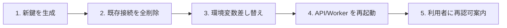

# 暗号鍵ローテーション運用手順（`ENCRYPTION_KEY`）

altpocket では Google Sheets 連携の `refresh_token` を `ENCRYPTION_KEY`（AES-256-GCM）で
暗号化しています。鍵漏洩疑い・定期更新・運用都合での差し替えが必要になったときの
手順をここに集約します。

> **対象**: セルフホスト運用者
> **対象外（本ドキュメントでは扱わない）**: HSM / クラウド KMS（GCP / AWS / Vault）連携、
> 鍵自動ローテーション機構、二重鍵での自動再暗号化。これらは [Issue #81 design.md](specs/81-google-sheets-refresh-token/design.md) の
> Non-Goals に該当します（必要になったら別 Issue で議論）。

## 採用している鍵ローテーション戦略: 再認可方式

altpocket は **再認可方式**を採用しています。

- 新鍵を設定した時点で、旧鍵で書かれた `user_google_sheets_connections` 行は
  復号できなくなり、`store.ErrRefreshTokenDecryptFailed` として「未接続相当」に
  合流します
- 利用者は `/ui/settings` から Google アカウントを **再接続（再認可）** することで、
  新鍵で暗号化された行が新規挿入されます
- **二重鍵での自動再暗号化（migration ジョブ等）は実装していません**。
  両方の鍵を保持してローリング再暗号化する仕組みは、本機能のスコープ外です
  （要件 5.3）。
- 既存平文レコードを暗号化済みデータと自動マージする処理も提供しません
  （要件 4.2 / 4.5）

メリット:
- 実装・運用が単純（プロセスは「鍵差し替え→再認可」のみ）
- 鍵の世代管理・復号失敗時のフォールバック分岐が不要

デメリット:
- 利用者全員に再接続を依頼する必要がある（セルフホスト運用＝自分自身という
  altpocket の前提では許容範囲）

## 鍵生成

```bash
openssl rand -base64 32
```

出力（base64 文字列、44 文字、デコード後 32 バイト）を `ENCRYPTION_KEY` に設定します。

別の生成方法:

```bash
# Linux / macOS（dd + base64）
dd if=/dev/urandom bs=32 count=1 status=none | base64

# Python
python3 -c 'import os, base64; print(base64.b64encode(os.urandom(32)).decode())'
```

## ローテーション手順（番号付き）



1. **新鍵を生成**: 上の「鍵生成」セクション参照
2. **既存接続を全削除**: 旧鍵で暗号化された `user_google_sheets_connections`
   レコードは新鍵で復号できないため、明示的に削除します。
   ```sql
   DELETE FROM user_google_sheets_connections;
   ```
   - 初回導入時はこれと同じ SQL が `migrations/005_invalidate_legacy_refresh_tokens.sql`
     にあります。**ローテーション時にこのマイグレーションファイルを再利用したり、
     新しい番号で同じ SQL を追加したりしないでください**（CLAUDE.md「マイグレーション
     規約」に従って既存番号を再利用しない／既存ファイルの中身を変更しない）。
     運用 SQL は手元で `psql` 実行に留めます。
   - 削除すると `spreadsheet_id` 列も失われますが、再認可後の初回エクスポート時に
     新規スプレッドシートが自動作成されるため、利用者操作は不要です
3. **環境変数差し替え**:
   - `.env` / `deploy/.env.production` の `ENCRYPTION_KEY` を新鍵に置き換える
   - 旧鍵は破棄してよい（再暗号化に使う必要がない＝再認可方式のため）
4. **API / Worker を再起動**: `cmd/api` と `cmd/worker` が再起動時に新鍵を fail-fast
   検証します。値が未設定／不正なら起動が中止されるので、ここで設定ミスに気付けます
5. **利用者に再認可案内**: `/ui/settings` で Google アカウントを再接続するよう
   案内してください。利用者は次回エクスポート時に「Connect Google before
   exporting.」と表示されるので、そのまま「Connect Google account」ボタンから
   再認可フローに進めます

## 自動化はしません（手動運用）

- **鍵自動ローテーション（cron / 鍵バージョニング / ダブルキー再暗号化の自動化）は
  実装していません**（要件 5.3）
- 上の手順は「鍵漏洩疑いがある／定期更新の意思決定をした」タイミングで運用者が
  判断・実行します
- 自動化が必要な規模（複数組織・大規模利用）に達した場合は、HSM / クラウド KMS への
  移行を別 Issue で検討してください（本リポジトリのスコープ外）

## 鍵漏洩時のチェックリスト

万一 `ENCRYPTION_KEY` が外部に漏れた疑いがある場合:

1. **本ドキュメントのローテーション手順を実行**（新鍵への差し替え＋全行削除＋再認可案内）
2. **Google Cloud Console** で OAuth クライアント Secret も差し替えると安全側
   （`GOOGLE_CLIENT_SECRET` と `ENCRYPTION_KEY` は別の機密ですが、漏洩経路が共通
   であれば両方差し替える方が無難）
3. **DB ダンプの外部共有履歴**を確認し、漏洩したダンプに `refresh_token`
   暗号文が含まれていた可能性があるなら、念のため利用者に Google アカウントの
   接続済みアプリ一覧から altpocket を取り消すよう案内してください
   （旧鍵 + 旧暗号文の組み合わせで悪用される可能性を排除するため）

## 関連

- 初回導入の移行手順: [`README.md`](../README.md) 「Google Sheets `refresh_token`
  暗号化への移行（Issue #81）」節
- 設計の根拠: [`docs/specs/81-google-sheets-refresh-token/design.md`](specs/81-google-sheets-refresh-token/design.md)
- 暗号アルゴリズム実装: [`internal/crypto/crypto.go`](../internal/crypto/crypto.go)
