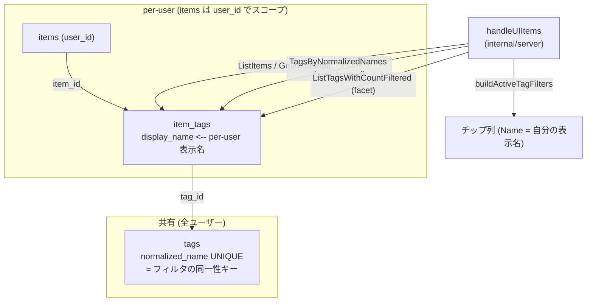
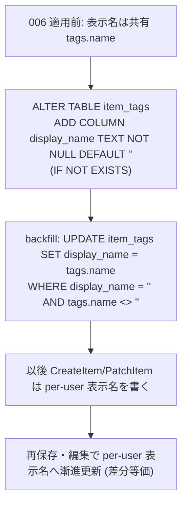

# Design Document — Issue #115 アクティブフィルタをメインエリア上部にチップ表示

## Overview

`/ui/items` 一覧画面のメインエリア上部に「現在のアクティブフィルタ」をチップ列として
可視化し、各チップから 1 クリックでの個別解除・「すべてクリア」での一括解除を提供する。
チップは SSR で常時描画し、JS あり環境ではフラグメント差し替えで動的更新する。

本設計書は実装 PR #137 に対する codex レビューで掘り当てられた **マルチテナント表示名漏洩
（multi-tenant isolation）** の根本欠陥をリデザインで修正する点を中核に据える。UI / JS の
チップ操作自体は既に実装済みのため、本書は **タグ表示名のデータモデル**（どこに per-user
表示名を保存し、どう解決するか）と、それを支える store 層・migration を主対象とする。
チップ列レンダリングと JS 操作の詳細は `impl-notes.md` を正準とする。

- **対象ユーザー**: `/ui/items` を複数経路（サイドバー / カード上タグ / URL 直接入力）で
  絞り込むログインユーザー
- **インパクト**: 各ユーザーが「自分が入力した表示名・casing」をチップ・カード・サイドバーで
  見られるようになり、他ユーザーの表示名が混入しなくなる（AC 1.3 / マルチテナント分離）

## Goals / Non-Goals

### Goals

- タグ表示名を **per-user（per-item）** に保存し、同じ `normalized_name` を複数ユーザーが
  異なる表示名で共有しても、各ユーザーが自分の表示名のみを見る
- 既存の lowercase tag 行・別ユーザー作成済み行と衝突しても、保存時に入力表示名を捨てない
- タグ編集（casing 変更）が編集ユーザーのチップ・カード表示に追従する
- ゼロ件絞り込み URL 直開きでも自分の表示名がチップに出る（既存 fix の per-user 化）
- 既存 URL クエリ正準形式（`?tag=<normalized>` 反復）との後方互換を維持する

### Non-Goals

- 検索キーワード（`?q=`）・並び順（`?sort=`）・件数（`?per_page=`）のチップ表示
- グローバルタグ autocomplete（`/api/tags?q=`）の per-user 化（後述 Non-Goals 詳細）
- タグの並び替え・プリセット・お気に入り
- `requirements.md` の AC 増減（既存 AC を尊重し、データモデルのみリデザイン）

## Architecture Pattern & Boundary Map

レイヤは「グローバルなフィルタ同一性キー」と「per-user 表示名」を**責務分離**する。



**境界の要点**:

- `tags` テーブルは **normalized_name によるグローバル同一性のみ**を担う。`tags.name` は
  legacy 列に縮退し、表示名解決には**使わない**（後方互換のため列は残す）。
- 表示名は `item_tags.display_name` に保存する。`item_tags` は user-scoped な `items` への
  join 行なので、表示名は**実質 per-user**。他ユーザーの行は user_id フィルタで到達不能。

## Technology Stack

| レイヤ | 技術 | 備考 |
|---|---|---|
| DB | PostgreSQL 16 | `migrations/006_item_tag_display_name.sql` で列追加 |
| store | Go (pgx v5) | `internal/store/store.go` |
| handler / chip 構築 | Go (`net/http`, html/template) | `internal/server/server.go` |
| chip UI | SSR (`templates/items_list.html`) + vanilla JS | `static/items_active_filters.js`（既存・本リデザインで不変） |

## File Structure Plan

```
migrations/
└── 006_item_tag_display_name.sql   # item_tags へ display_name 列追加 + 既存データ backfill (NEW)

internal/store/
├── store.go                        # CreateItem/PatchItem/upsertItemTags=write,
│                                   #   ListItems/GetItemDetail/TagsByNormalizedNames/
│                                   #   ListTagsWithCountFiltered=read を per-user 表示名へ
└── tags_lookup_test.go             # multi-tenant isolation / conflict 回帰テスト (integration)

internal/server/
├── server.go                       # buildActiveTagFilters 他チップ構築 (既存・表示名 source は store 経由)
└── items_active_filters_integration_test.go  # チップ end-to-end multi-tenant 回帰テスト

templates/
├── items.html                      # chip 列マウントポイント (既存)
└── items_list.html                 # chip 列 SSR テンプレート (既存)

static/
├── items_active_filters.js         # chip 操作 JS (既存・本リデザインで不変)
└── items_active_filters.test.mjs   # JS テスト (既存)
```

## Data Models

### 物理モデル（変更点のみ）

`item_tags`（既存。`migrations/001_init.sql`）に `display_name` 列を追加:

| 列 | 型 | 制約 | 説明 |
|---|---|---|---|
| `item_id` | UUID | PK 一部, FK→items ON DELETE CASCADE | 既存 |
| `tag_id` | UUID | PK 一部, FK→tags ON DELETE CASCADE | 既存（グローバル tag への参照） |
| `display_name` | TEXT | NOT NULL DEFAULT '' | **NEW**: per-user 表示名（NFKC + trim, case 保持） |

`tags`（既存）は不変。`normalized_name UNIQUE` を**グローバル同一性キー**として維持。
`tags.name` は legacy 列として残すが、表示名解決には参照しない。

### 表示名の書き込み / 読み出しモデル

- **書き込み**（`upsertItemTags`、CreateItem / PatchItem 共通）:
  1. 共有 `tags` 行を `normalized_name` で upsert（`ON CONFLICT DO UPDATE` は no-op、`name` は
     上書きしない）。
  2. `item_tags` に `(item_id, tag_id, display_name)` を upsert（`ON CONFLICT (item_id, tag_id)
     DO UPDATE SET display_name=EXCLUDED.display_name`）。casing 変更は per-item に追従。
- **読み出し**（全 per-user 表示面）:
  - `ListItems` / `GetItemDetail`: `array_agg(it.display_name ORDER BY t.id)`（id 整列で 3 配列を
    アラインさせる）
  - `TagsByNormalizedNames`: `MIN(it.display_name)`（同一 normalized を複数 item に異なる casing で
    持つ場合に 1 件へ確定）を user_id でスコープ
  - `ListTagsWithCountFiltered`（サイドバー facet）: 同じく `MIN(it.display_name)` を user スコープ

## Components and Interfaces

### Store: 書き込み

```go
// upsertItemTags は共有 tags 行を normalized_name で upsert し、表示名は
// item_tags.display_name へ per-item で保存する。CreateItem / PatchItem が共有。
func upsertItemTags(ctx context.Context, tx pgx.Tx, itemID string, tagInputs []TagInput) error

// CreateItem / PatchItem は upsertItemTags を呼ぶ。表示名は per-user。
func (s *Store) CreateItem(ctx, userID, url, canonicalURL, canonicalHash string, tagInputs []TagInput, title, excerpt string) (string, bool, error)
func (s *Store) PatchItem(ctx, userID, itemID string, title *string, tags *[]TagInput) (string, []Tag, error)
func (s *Store) ReplaceItemTags(ctx, userID, itemID string, tagInputs []TagInput) ([]Tag, error)  // PatchItem 薄ラッパ
```

`TagInput{Name, NormalizedName}` の write-side 構造は不変。`Name`（表示名）の保存先が
`tags.name` → `item_tags.display_name` へ移る点のみが本リデザインの差分。

### Store: 読み出し（per-user 表示名解決）

```go
// チップ表示名を viewer 自身の item_tags.display_name から解決（user-scoped）。
// 他ユーザーの表示名は user_id フィルタで到達不能（multi-tenant isolation）。
func (s *Store) TagsByNormalizedNames(ctx, userID string, normalizedNames []string) ([]Tag, error)

// サイドバー facet。表示名も per-user 解決。
func (s *Store) ListTagsWithCountFiltered(ctx, userID, q string, selectedTags []string) ([]Tag, error)

// カード / 詳細のタグ表示も per-user 表示名。
func (s *Store) ListItems(...) ([]ItemListRow, Pagination, error)
func (s *Store) GetItemDetail(...) (ItemDetail, error)
```

返り値 `Tag{ID, Name, NormalizedName}` の構造は不変。`Name` の解決元が `tags.name` →
`item_tags.display_name` へ移る。

### Server: チップ構築（不変）

`buildActiveTagFilters` / `mergeTagDisplaySources` / `mergeSidebarFacet` /
`buildTagRemovedURL` / `buildClearAllTagsURL` は API 不変。これらは `store.Tag.Name` を
表示名として読むだけで、その `Name` が per-user 化されたことで結果が正しくなる。

## Requirements Traceability

| Req ID | 設計要素 | 検証 |
|---|---|---|
| 1.1 / 1.2 | SSR チップ列（既存・`items_list.html`） | render/server test（既存） |
| **1.3** | `item_tags.display_name` per-user 保存 + `TagsByNormalizedNames`/`ListTagsWithCountFiltered`/`ListItems` の per-user 解決 | `TestTagsByNormalizedNames*` / `TestSaveAndEditPathPreservesDisplayName` / `TestCreateAndPatchAgainstExistingSharedRow` |
| 1.4 / 1.5 | チップ解除要素 / facet ↔ チップ ↔ URL 整合（既存） | server test（既存） |
| 2.1〜2.6 | 個別解除（`buildTagRemovedURL` + JS、既存） | JS test / server test（既存） |
| 3.1〜3.6 | すべてクリア（`buildClearAllTagsURL` + JS、既存） | JS test（既存） |
| 4.1〜4.4 | 状態同期（既存 JS フラグメント差し替え） | JS test（既存） |
| **4.5** | URL 直開き時の per-user 表示名解決（ゼロ件含む） | `TestHandleUIItemsFullPageZeroResultResolvesDisplayName` / `TestActiveFilterChipsAreMultiTenantIsolated` |
| 5.1〜5.4 | 正準 URL 生成・既存クエリ保持（既存） | server test（既存） |
| 6.1〜6.5 | キーボード / aria（既存 SSR aria-label） | render/JS test（既存） |
| NFR 1.1〜1.3 | 300ms 反応 / ちらつき防止 / 連続操作（既存 JS） | JS test（既存） |
| NFR 2.1〜2.3 | JS 無効互換 / 既存 URL 互換 / #117 不変 | server/JS test（既存） |
| NFR 3.1〜3.2 | 配色 / 位置（既存 CSS） | 目視 / render test（既存） |
| **マルチテナント分離**（1.3 の正確性に内在） | `item_tags.display_name` + 全 read の user_id スコープ | `TestTagsByNormalizedNamesMultiTenantIsolation` / `TestTagsByNormalizedNamesAlsoSurfacesViaFacet` / `TestActiveFilterChipsAreMultiTenantIsolated` |

## Migration Strategy



- **forward-only**（本プロジェクト規約。down は必須としない）。番号 `006` は未使用。
- **冪等**: `ADD COLUMN IF NOT EXISTS` + backfill は `display_name = ''` の行のみ対象 → 再適用
  しても per-user 値を上書きしない。
- **後方互換**: backfill により導入前の見た目（共有表示名）を初期値として維持。漏洩は
  「2 ユーザーが同一 normalized を異なる表示名で持つ」既存データにのみ存在し得たが、それも
  各ユーザーが再保存すれば自分の表示名へ収束する。
- 適用は `psql ... -f migrations/006_item_tag_display_name.sql`（番号順、手動）。

## Error Handling

- `upsertItemTags` のエラーは tx をロールバックして呼び出し元へ伝播（CreateItem / PatchItem の
  既存トランザクション境界を維持。silent fail を作らない）。
- `TagsByNormalizedNames` / `ListTagsWithCountFiltered` のエラーはハンドラで `Warn` ログを出し、
  チップ表示名は normalized 形へ最後の手段としてフォールバック（既存挙動・round-6 で導入済み）。

## Testing Strategy

### 単体 / ロジック

- `buildActiveTagFilters` / `merge*` / `build*URL`（純粋関数）は既存 `server_test.go` でカバー済み。
  本リデザインで API 不変のため追加不要。

### 結合（integration, `-tags=integration` + `TEST_DATABASE_URL` gated, 実 DB で意味を持つ）

- `TestTagsByNormalizedNamesMultiTenantIsolation`: 2 ユーザーが同一 normalized を異なる表示名で
  持つとき、各ユーザーが自分の表示名のみを見る（**漏洩回帰**）。
- `TestTagsByNormalizedNamesAlsoSurfacesViaFacet`: サイドバー facet 経路でも同じ分離を検証。
- `TestCreateAndPatchAgainstExistingSharedRow`: 既存共有行があるとき Create で表示名を捨てない /
  Patch で casing 変更が反映される（**conflict 回帰**）。
- `TestActiveFilterChipsAreMultiTenantIsolated`: server 層の chip 構築 end-to-end で per-user 分離。
- 既存 `TestTagsByNormalizedNames` / `TestSaveAndEditPathPreservesDisplayName` /
  `TestHandleUIItemsFullPageZeroResultResolvesDisplayName` は新モデルでも green を維持。

### JS / E2E

- `static/items_active_filters.test.mjs`（61 ケース）退行なし。本リデザインは JS 不変。

## Security Considerations

- **マルチテナント分離**: 全表示名読み出し（`TagsByNormalizedNames` /
  `ListTagsWithCountFiltered` / `ListItems` / `GetItemDetail`）は `items.user_id` でスコープ
  され、表示名は viewer 自身の `item_tags.display_name` のみから解決される。別ユーザーの
  `item_tags` 行は join 経路上 user_id フィルタで到達不能。
- 書き込み（`upsertItemTags`）は呼び出し元の所有権チェック（CreateItem は user_id 指定の
  items insert、PatchItem は ownership check）配下のトランザクション内でのみ実行される。

## Supporting References

- `impl-notes.md`: チップ列レンダリング / JS 操作 / DOM 契約の正準
- PR #137 codex review（[high] × 3 / [medium] 群）: 本リデザインの起点
- `migrations/001_init.sql`: `tags` / `item_tags` 既存スキーマ
