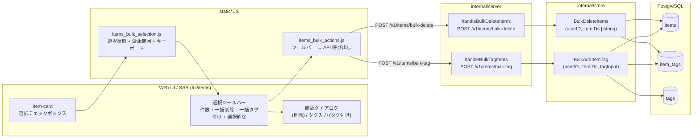
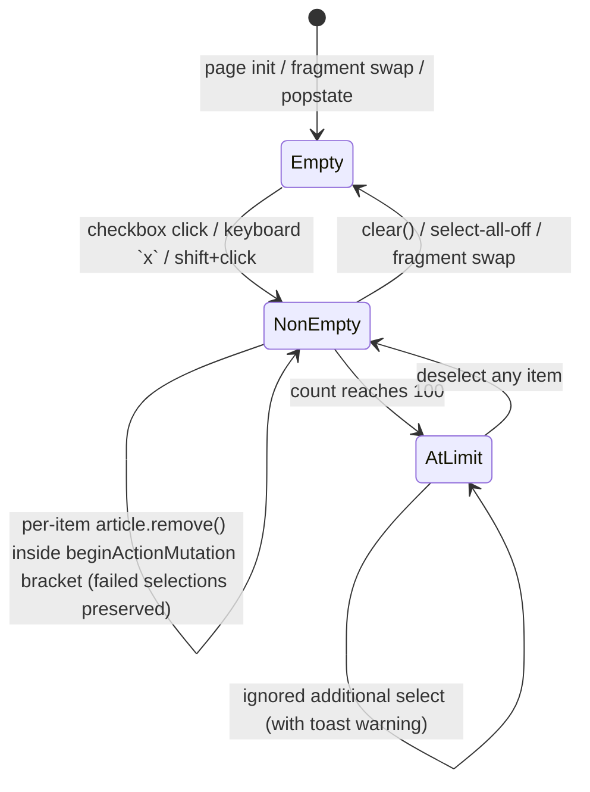
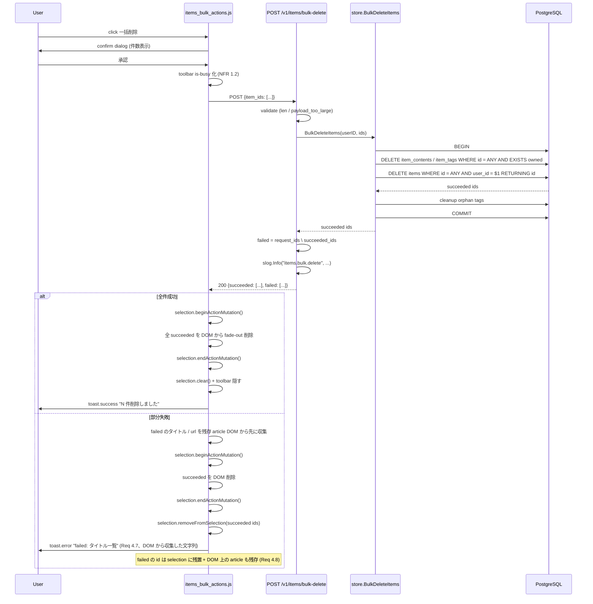

# Design Document

## Overview

altpocket の `/ui/items` ライブラリ画面は、削除・タグ付け・状態切替等の整理操作が 1 件単位
（single-item アクション）でしか実行できない。Issue #119（read / archived 状態の導入、
commit 64c03ae で merge 済み）でカードは `unread` / `read` / `archived` の 3 状態を持ち、
状態タブで一覧が分割されるようになったが、複数アイテムへの横断操作（例: 過去の `read` カードを
まとめて削除、複数記事に同じタグを一括付与）は依然として「1 件ずつ Mark read → 1 件ずつ
Delete」のような単体操作の繰り返しになり、棚卸し動線の操作回数が著しく多い。

**Purpose**: この機能は「カードを複数選択 → 一括削除 / 一括タグ付け」という束ね型の操作を、
既存の URL クエリ駆動の状態タブ・タグフィルタ・検索クエリの **挙動を破壊せず**、その上に
重ねる形で提供する。
**Users**: ライブラリで棚卸し作業を行う Web UI 利用者（マウス操作中心 / キーボード中心の
両方）が対象。Chrome 拡張機能・MCP からの一括操作は **Out of Scope**（Issue #120 で別扱い）。
**Impact**: 現在のアイテムカードは 1 件単位の `Mark read` / `Archive` / `Delete` / `Refetch`
ボタンを持つだけだが、本変更により「選択チェックボックス」「選択ツールバー（件数 + 一括削除 +
一括タグ付け + 選択解除）」「Shift+クリック範囲選択」「キーボード `x` 選択トグル」を追加し、
バックエンドには `POST /v1/items/bulk-delete` / `POST /v1/items/bulk-tag` の 2 つの一括
エンドポイントを新設する。既存単一アイテム API・拡張機能 API・MCP API は変更しない。

### Goals

- カードに常時表示のチェックボックスを追加し、複数選択を 1 操作ずつ可能にする（Req 1）
- 直前にクリックされたチェックボックスから当該カードまでを Shift+クリックで範囲選択する
  （Req 2）
- 選択件数 + 一括操作ボタンを常時表示する選択ツールバーを提供する（Req 3）
- `POST /v1/items/bulk-delete` で一括削除、`POST /v1/items/bulk-tag` で一括タグ付与を提供し、
  部分失敗時には失敗したアイテムを特定可能な形でクライアントへ返す（Req 4 / 5 / 8）
- キーボード `x` キーでフォーカス中のカードの選択をトグルする（Req 6）
- 状態タブ・フィルタ・検索・ソート・ページ送り・リロード・back/forward で選択をリセットする
  （Req 7）
- 1 回の一括操作の選択上限を **100 件** に固定し、UI と Server の双方で防御する（NFR 2）
- 認可・データ分離の goldensource を Server 側の `WHERE user_id=$1` 一括検証で担保する（Req 8）

### Non-Goals

- ドラッグ&ドロップでの一括タグ付け（Issue #120 で別扱い）
- 一括エクスポート / 一括アーカイブ / 一括タグ削除（Out of Scope per requirements.md）
- ページをまたぐ選択の保持・「全件選択」「ページ全選択」ボタン
- Chrome 拡張機能 / MCP 経由の一括操作 UI / API 公開
- 一括操作の Undo
- 検索結果やタグフィルタ条件に基づく「条件一致全件選択」
- 範囲選択用 `Shift+Space` 等の追加ショートカット
- 既存 Issue #115 / #117 / #119 で導入されたフィルタチップ・タグクリック絞り込み・状態タブの
  挙動変更（NFR 3.1〜3.3）

## Architecture

### Existing Architecture Analysis

altpocket はレイヤード Go モノレポで、入口 `cmd/api` から `internal/server`（HTTP / SSR）→
`internal/store`（DB I/O 集約）→ PostgreSQL の流れで動作する。Issue #119 で `items.status`
カラムが追加され、`PATCH /v1/items/{id}/status` / `handleSetItemStatus` / `parseStatusFilter`
/ `static/items_status.js` / `static/items_status_actions.js` が稼動している。

尊重すべきドメイン境界:

- **store 層が唯一の SQL 出口**: ハンドラ / mcpserver は `*pgxpool.Pool` を直触りしない
  （CLAUDE.md 規約）。一括操作も同規約に従い `internal/store` の新規メソッドで吸収する
- **per-user 分離**: items は `user_id` を WHERE 条件で必ず締める。一括操作の全 SQL も同様
  に `WHERE id = ANY($2) AND user_id = $1` 形式で適用する
- **SSR / fragment 両経路**: `/ui/items` は full-page と `X-Requested-With: ItemsFragment`
  両方を返す。fragment 差し替え後にチェックボックス・選択ツールバー・選択状態が破綻しないよう、
  選択状態は **fragment 差し替え直後にリセット**する（Req 7.5）
- **既存 chi v5 ルーティング・`handle*` プレフィックス**: 新規 handler も同パターンで追加する
- **拡張機能 API 後方互換**: `extension_contract_test.go` が確認するのは
  `handleListItems` / `handleCreateItem` の 401・invalid_url 等の **エラーレスポンス契約** のみ。
  本機能は新規エンドポイント追加（既存変更なし）なので **契約は壊れない**
- **既存単一 API**: `DELETE /v1/items/{id}` / `PUT /v1/items/{id}/tags` / `PATCH /v1/items/{id}` は
  変更しない（NFR 3.4: 既存の単一アクションは引き続き同等に提供）
- **CSRF 保護**: `s.checkCSRF` は `/v1/*` の非 GET リクエストで強制される。一括 API も既存
  middleware を経由する（既存 chain `requireAuth` → `limiter` → CSRF 検証パターンを踏襲）

解消・回避する technical debt:

- なし（純粋追加。既存規約に乗る）

### Architecture Pattern & Boundary Map

採用パターン: **既存レイヤードの素直な拡張**（新規モジュールなし、既存 chi route + store I/O
集約パターンの延長）。



**Architecture Integration**:
- 採用パターン: 既存 chi route + store I/O 集約 + `static/items_*.js` モジュール群の素直な
  延長。新規モジュール / interface 化は不要
- ドメイン／機能境界:
  - **選択状態は完全にクライアント側**（JS module の private state）。サーバーは selection 状態を
    永続化しない（ページをまたぐ選択非保持は Out of Scope 通り）
  - **一括 API は idempotent ではない**（削除・タグ付与はいずれも副作用あり）。**部分失敗を
    意味のある粒度で返す**ことが API の主要な責務
- 既存パターンの維持: handler は authn / validation / response 整形に集中、`pgxpool` は store
  経由、`slog` 構造化ログ、`requireAuth` / `limiter` / CSRF 検証チェーンを通る
- 新規コンポーネントの根拠:
  - **一括 API を新設する判断**: 後述「設計判断 1」参照
  - **選択 / 操作の JS を 2 モジュールに分割**: `items_bulk_selection.js`（選択状態管理）と
    `items_bulk_actions.js`（ツールバー → API 呼び出し）を分離することで、Shift+クリック /
    キーボード周りの選択ロジックと API 呼び出し / 確認ダイアログ周りの操作ロジックが独立
    して進化できる（既存 `items_status.js` と `items_status_actions.js` が同じ責務分割を
    採用しているのと同じ理由）

### Technology Stack

| Layer | Choice / Version | Role in Feature | Notes |
|-------|------------------|-----------------|-------|
| Frontend / CLI | 標準 `html/template` + Vanilla JS（既存規約） | カードチェックボックス・選択ツールバー・確認ダイアログ・タグ入力 UI の SSR + JS 拡張 | 既存 #115 / #117 / #119 と同じ X-Requested-With: ItemsFragment fragment 経路を維持 |
| Backend / Services | Go 1.25, chi v5 | `POST /v1/items/bulk-delete` / `POST /v1/items/bulk-tag` を新規追加、`handle*` プレフィックス | 既存 requireAuth / limiter / CSRF middleware を経由 |
| Data / Storage | PostgreSQL 16, pgx v5 | items / item_tags / tags への一括 DML | **新規マイグレーション不要**（既存テーブルで吸収可。詳細は「Data Models」節） |
| Messaging / Events | （なし） | 本機能はイベント駆動を導入しない | |
| Infrastructure / Runtime | 既存 Docker Compose 構成 | 変更なし | 環境変数追加なし |

## File Structure Plan

### Directory Structure

```
internal/
├── store/
│   ├── items_bulk.go                          # 新規: BulkDeleteItems / BulkAddItemTag（per-user 一括 DML）
│   └── items_bulk_test.go                     # 新規（//go:build integration）: 部分失敗 / 認可リーク無し / atomicity の実 DB 検証
├── server/
│   ├── items_bulk.go                          # 新規: handleBulkDeleteItems / handleBulkTagItems / 共通 request parser / 上限定数 / レスポンス型
│   ├── items_bulk_test.go                     # 新規: handler 単体（401 / 400 / 413 相当 / 上限超過 / 認可拒否のシミュレーション）
│   └── items_bulk_integration_test.go         # 新規（//go:build integration）: 認可越境 / 存在しない id / 部分成功時のレスポンス確認
└── server/server.go                           # 変更: chi route に POST /bulk-delete / POST /bulk-tag を追加

templates/
├── items.html                                 # 変更: 選択ツールバー SSR、選択モード不要 (常時 checkbox)、bulk スクリプト読み込み
└── items_list.html                            # 変更: 各 article に <input type="checkbox" class="item-select"> を追加、data-item-id を `<article>` 自身に付与

static/
├── items_bulk_selection.js                    # 新規: 選択状態 (Set<itemID>) + Shift+クリック範囲 + キーボード x + 件数イベント発火 + リセット契機 (#fragment 差替 / popstate)
├── items_bulk_actions.js                      # 新規: 選択ツールバー → 一括削除 / 一括タグ付け → 部分失敗 toast + 残置選択再構成
├── items_bulk_selection.test.mjs              # 新規: node:test, 選択 toggle / Shift範囲 / 上限 / リセット契機の単体検証
├── items_bulk_actions.test.mjs                # 新規: node:test, fetch スタブ → 確認ダイアログ → 部分失敗時の選択保持 + toast / 成功時 DOM 削除
└── style.css                                  # 変更: .item-card.is-selected / .bulk-toolbar / .bulk-toolbar-actions / .item-select / .bulk-tag-input のスタイル追加
```

### Modified Files

- `internal/server/server.go` — chi route に以下 2 行を追加:
  - `r.Post("/bulk-delete", s.requireAuth(s.handleBulkDeleteItems))`
  - `r.Post("/bulk-tag", s.requireAuth(s.handleBulkTagItems))`
  （`/v1/items` 配下に追加。`PATCH /{id}/status` の隣に並べる）
- `templates/items.html` — 選択ツールバーの SSR markup（`<div class="bulk-toolbar" data-bulk-toolbar hidden>`、内部に件数表示 + 一括削除 + 一括タグ付け + 選択解除ボタン）と、bulk JS の `<script defer>` 読み込み 2 行を追加。タグ入力モーダル `<dialog data-bulk-tag-dialog>` および **失敗一覧ダイアログ** `<dialog data-bulk-failure-dialog role="alertdialog">` の markup を追加（後者は Req 4.7 / 5.7 の全件 identify を満たすため）。削除確認ダイアログは既存 `#confirm-overlay` を再利用（新規 markup 追加なし）。**選択モード切替トグルは設置しない**（設計判断 2: 常時表示のチェックボックス採用）
- `static/app.js` — `window.altpocketConfirm = confirm;` と `window.altpocketNormalizeTagName = normalizeTagName;` の 2 行を**それぞれの const 定義の直後**に追記する（前者は `confirm` IIFE の `})();` 直後、後者は `normalizeTagName` arrow function 定義の直後）。`window.altpocketToast = toast` の直後にまとめて追記してはならない（`const` 宣言前で TDZ になる）
- `templates/items_list.html` — 各 `<article class="item-card">` 内の冒頭に `<input type="checkbox" class="item-select" data-item-id="{{.ID}}" aria-label="アイテムを選択">` を追加。`<article>` 自体に `data-item-id="{{.ID}}"` を付与（既存の `aria-labelledby` は維持）
- `static/style.css` — 以下を追加:
  - `.item-select` のレイアウト（カード左上 / カード密度を圧迫しない absolute 配置 + フォーカスリング）
  - `.item-card.is-selected` の視覚区別（背景・縁取り。**色だけに依存せず**チェックボックスの checked 状態と併用 / Req 1.4 / 1.5 / NFR 4.3）
  - `.bulk-toolbar` の sticky 配置（スクロール中も到達可能 / Req 3.5）
  - `.bulk-toolbar-actions` のボタン群レイアウト
  - `.bulk-tag-dialog` のモーダル基本スタイル（既存 `confirm-overlay` のスタイルトークンを再利用）
  - `.bulk-failure-dialog` のモーダル + `.bulk-failure-list` の `max-height: 60vh; overflow-y: auto`（失敗 100 件全件 reachable / Req 4.7 / 5.7）

## Requirements Traceability

| Requirement | Summary | Components | Interfaces | Flows |
|-------------|---------|------------|------------|-------|
| 1.1 / 1.2 / 1.3 | チェックボックスで選択トグル | items_list.html / items_bulk_selection.js | `<input type="checkbox" class="item-select">` change イベント | change → Set<itemID> 反映 |
| 1.4 | 選択中の視覚区別 | style.css / items_bulk_selection.js | `.item-card.is-selected` + checked 状態 | change で `is-selected` class 付与 |
| 1.5 | 色のみに依存しない | style.css / items_list.html | チェックボックス自体（checked 表示）+ aria-checked | ネイティブ HTML 要素 |
| 1.6 | 既存タブ・フィルタ・検索・ソート動作を変えない | server.go / items.html | 既存 URL クエリ駆動の経路を一切変更しない | 既存 #114/#115/#117/#119 経路 |
| 2.1 / 2.2 / 2.3 | Shift+クリック範囲選択 | items_bulk_selection.js | `lastClickedID` を保持し、現在の DOM 順 (`document.querySelectorAll('.item-card')`) で範囲算出。`lastClickedID !== null` の shift+click では **`e.preventDefault()` を即時呼出**し、ブラウザのネイティブ checkbox toggle が「既選択端を unchecked に戻す」事故を防ぐ。範囲算出後はモジュール側で当該範囲の checkbox を programmatic に `checked = true` へ揃える | shift+click event → preventDefault → 範囲算出 → checkbox programmatic check + Set 追加 |
| 2.4 | 履歴空時は単一 toggle | items_bulk_selection.js | `lastClickedID === null` 時の fallback | 単一 toggle 動作 |
| 3.1 / 3.2 | 件数連動した選択ツールバー表示 | items.html / items_bulk_selection.js / items_bulk_actions.js | `data-bulk-toolbar` の `hidden` 属性切替 + `data-bulk-count` テキスト（`<N> / 100 件選択中` で上限を常時併記 / NFR 2.1 pre-announce） | 選択件数 0 ⇄ 1+ で hidden 切替 |
| 3.3 | 一括削除 / 一括タグ付け / 選択解除ボタン | items.html | 3 ボタンを SSR | |
| 3.4 | 選択解除 | items_bulk_selection.js | Set クリア + DOM 上の checkbox の checked / `.is-selected` 一括解除 | |
| 3.5 | スクロール中も到達可能 | style.css | `position: sticky` で画面下部に固定 | |
| 3.6 | 件数の追随 | items_bulk_selection.js | `bulkselection:changed` custom event を発火、ツールバーが listen | |
| 4.1 / 4.2 / 4.3 / 4.4 | 確認ダイアログ → 削除 | items_bulk_actions.js | 既存 confirm overlay 再利用、approve → fetch POST /v1/items/bulk-delete | |
| 4.5 / 4.6 | 成功時の DOM 退場 + ツールバー非表示 | items_bulk_actions.js | レスポンスの `succeeded[]` を DOM から fade-out 削除 | |
| 4.7 / 4.8 | 部分失敗の特定可能通知 + 失敗 id 選択保持 | items_bulk_actions.js + server response | レスポンスに `failed: [{item_id, reason}]` のみを含める（**title / url は含めない / leak 防止**）。クライアントは対象 article の DOM (`[data-item-id="<failed id>"]` の `h3#item-title-*` / `.tile-link[href]`) から title / url を取得し、**failed 全件分** を支援技術 reachable な領域（後述「Client-side error handling」節の `<dialog role="alertdialog">` または scrollable な `[aria-live="polite"]`）に列挙する | toast / alert + 当該 checkbox を checked のまま |
| 5.1 / 5.2 | タグ入力 UI + 正規化 | items.html (タグ入力 dialog) + items_bulk_actions.js | 単一タグ文字列入力 → JS 側は `normalizeTagName`（NFKC + lowercase）で **空判定のみ** を行い、POST する body の `tag` は **原文字列を保持**（既存単一アイテム編集の `normalizeTagInputs` が `Name` に原文字列を保持して chip 表示の casing を維持する規約と一致 / Req 5.2） | dialog confirm → fetch (body=原文字列) |
| 5.3 / 5.4 | 全アイテムに付与 + 重複なし | server: handleBulkTagItems → store: BulkAddItemTag | item_tags への `INSERT ... ON CONFLICT DO NOTHING`（一意制約: `(item_id, tag_id)`） | |
| 5.5 | 一覧の対象カードにタグ反映 | items_bulk_actions.js | レスポンスの `succeeded[].tags` を当該カードのタグ chip 列に反映する。chip ノードは既存 SSR と **同じ contract**（`button.tag.tag-filter-toggle` + `data-tag-filter-toggle` + `data-tag-normalized="<normalized>"` + `aria-pressed="false"` + `aria-label="タグで絞り込み: <name>"` + テキストノードに `<name>`）を満たす形で `document.createElement('button')` + `setAttribute` + `textContent` で組み立てる（`innerHTML` / `insertAdjacentHTML` は禁止 / XSS 防御 + #117 chip クリック絞り込み契約維持 / NFR 3.3） | |
| 5.6 | 成功時のリセット + ツールバー非表示 | items_bulk_actions.js | Set クリア + tag dialog 閉鎖 | |
| 5.7 / 5.8 | 部分失敗の特定可能通知 + 失敗 id 選択保持、成功は選択解除 | items_bulk_actions.js + server response | レスポンス `failed[]`（`{item_id, reason}` のみ） / `succeeded[]` を使い、succeeded の id を Set から除去・failed の id は保持。失敗一覧の title / url は対象 article の DOM から **全件** 取得して支援技術 reachable な領域に列挙（4.7 / 4.8 と同じ規約） | |
| 5.9 | 空タグでの無動作 | items_bulk_actions.js | dialog confirm 時に正規化結果が空文字なら fetch しない + 入力欄に focus 戻す | |
| 6.1 / 6.2 / 6.3 | キーボード `x` トグル + 既存衝突なし + 入力欄フォーカス時抑止 | items_bulk_selection.js | 既存 app.js keyboard handler と同じ pattern (TAG === INPUT / TEXTAREA / SELECT / isContentEditable のときは return) + `x` のみ捕捉 | document.addEventListener('keydown') |
| 6.4 / 6.5 | 選択ツールバーのキーボード到達 + 同等挙動 | items.html | 全ボタンをネイティブ `<button>` で実装、Tab 順序が自然なので追加処理不要 | |
| 7.1 / 7.2 / 7.5 | タブ・フィルタ・検索・ソート・ページ送り・fragment 差し替え時のリセット | items_bulk_selection.js | `[data-items-region]` 上の `MutationObserver(childList)` で fragment 差し替えを検出して Set クリア + `bulkselection:changed` 発火。**fragment 差し替えと per-item `article.remove()` の区別**は (a) `addedNodes.length > 0` ならフラグメント差し替えとみなす、(b) `beginActionMutation()` ブラケット中の mutation はリセット対象外、の 2 条件で行う（後述「Components / Selection state」節参照）。これにより、部分失敗時の DOM 退場（succeeded のみ remove）で failed 選択が失われないことを保証する（Req 4.8 / 5.8 と両立） | fragment 差替後にチェックボックスは全 unchecked SSR されるので Set とも整合 |
| 7.3 / 7.4 | リロード・back/forward でリセット | items_bulk_selection.js | ページ init 時に Set が空 + popstate ハンドラで Set クリア（ただし fragment 差替経路も別途 reset するので二重防御） | 自然に初期状態 |
| 8.1 / 8.2 / 8.3 | 認可・存在チェック | server.handleBulkDeleteItems / handleBulkTagItems / store.BulkDeleteItems / BulkAddItemTag | **「先に所有確認 → 全件所有していなければ 1 件も変更せず 207 で全件失敗扱い」** ではなく、**「user_id を WHERE に含めて UPDATE/DELETE/INSERT を実行し、actually 影響を受けた行 id 集合を成功とし、残りの id を `failed[{reason: "not_found"}]` として返す」** 方針（後述「Error Handling」節「部分失敗時の atomicity 方針」参照） | |
| NFR 1.1 | 選択操作 200ms 以内の視覚反映 | items_bulk_selection.js | change イベント → 同期 DOM クラス + 件数同期更新 | 全て同期 DOM 操作のため明示計測不要 |
| NFR 1.2 | 100 件以下で 1 秒以内の操作完了視覚 | items_bulk_actions.js | click 直後にツールバーを `is-busy` 化（ボタン disabled + spinner） | |
| NFR 1.3 | 結果反映中もちらつかない | items_bulk_actions.js | items_list 全体 innerHTML 置換は行わず、対象 article のみ DOM から removeChild | |
| NFR 2.1 / 2.2 | 上限 100 件 | items.html / items_bulk_selection.js + server bulk handlers | 選択ツールバー件数表示は **`<N> / 100 件選択中`** 形式で上限を常時併記（NFR 2.1 pre-announce）。JS 側で 100 件超選択を抑止し toast.error。Server 側でも `len(itemIDs) > 100` で 400 `payload_too_large` を返す（二重防御） | |
| NFR 3.1〜3.5 | 後方互換性 | 全層 | 既存 ハンドラ・テンプレ・JS module を **削除・改名・挙動変更しない** | |
| NFR 4.1〜4.3 | アクセシビリティ | items.html / style.css / dialog | ネイティブ HTML 要素 + aria-label + テキスト併用 | |
| NFR 5.1 | 構造化ログ | server bulk handlers | `slog.Info("items.bulk.delete" / "items.bulk.tag", "user_id", "item_ids", "succeeded_ids", "failed_ids", "request_id")`。Cookie / token / 本文の生値は含めない | |

## Components and Interfaces

### Static (Web UI client) Layer

#### items_bulk_selection.js（新規モジュール）

| Field | Detail |
|-------|--------|
| Intent | 一覧上の選択状態（Set<itemID>）を管理し、Shift+クリック範囲・キーボード `x`・リセット契機を吸収して `bulkselection:changed` custom event を発火する |
| Requirements | 1.1, 1.2, 1.3, 1.4, 2.1〜2.4, 3.4, 3.6, 6.1, 6.2, 6.3, 7.1, 7.2, 7.5, NFR 1.1, NFR 2.1, NFR 2.2 |

**Responsibilities & Constraints**
- 主責務:
  - `[data-items-region]` 上の `change`（checkbox）・`click`（shift modifier 検出）・
    `keydown`（`x`）を delegated に捕捉する
  - 内部 Set<itemID> を更新し、`<article>` に `.is-selected` を付与・解除する
  - 件数を `data-items-region` の `dispatchEvent(new CustomEvent('bulkselection:changed', {detail: {count, ids}}))` で配信する
  - 上限 100 件超の選択操作を抑止し、`win.altpocketToast.error('一括操作は最大 100 件までです')` で通知する（NFR 2.2）
- ドメイン境界: 選択状態の唯一の保持者（actions 側は read-only に dispatch から受信する）
- データ所有権: 内部 Set はモジュール privately 保持。テストからは `init()` の戻り値経由で
  アクセスする
- **inter-module API**: 本リポジトリは bundler 無しの独立 IIFE 構成のため、`items_bulk_actions.js`
  から selection モジュールに到達するための **明示的な global namespace** として
  `window.altpocketBulkSelection` を公開する（既存 `window.altpocketToast` と同じ流儀）。
  selection 側の `init()` 末尾で `window.altpocketBulkSelection = { getSelectedIDs, clear,
  removeFromSelection, beginActionMutation, endActionMutation }` を設定し、actions 側は
  この global を参照する。これにより script 読み込み順への依存を排除できる
- invariants:
  - DOM 上の `.item-select[checked]` と内部 Set は常に同期する（change イベント駆動）
  - fragment 差替後（`addedNodes.length > 0` または `beginActionMutation()` ブラケット外で
    observe された `childList` 変更）に Set は空にリセットされる
  - 部分失敗時の per-item `article.remove()`（actions モジュールが `beginActionMutation()` /
    `endActionMutation()` で囲んで実行）はリセット対象外であり、failed の id が Set に残置される
    （Req 4.8 / 5.8）

**Dependencies**
- Inbound: `[data-items-region]` 内の `input.item-select` 要素（change source）、ドキュメント全体の `keydown`（`x` capture）
- Outbound: `items_bulk_actions.js` が `bulkselection:changed` を listen
- External: なし（fetch 不使用）

**Contracts**: Service [x] / API [ ] / Event [x] / Batch [ ] / State [x]

##### Service Interface

```javascript
// Public init API (for production code and tests).
// init() also assigns the same object to window.altpocketBulkSelection so
// that items_bulk_actions.js can reach it without script-load-order coupling.
function init({document, window} = {}) {
  return {
    // Returns the current selected item IDs as an array (DOM order).
    getSelectedIDs(): string[],
    // Programmatic reset (called by items_bulk_actions.js after successful
    // bulk operation completes).
    clear(): void,
    // Programmatic remove (called by items_bulk_actions.js after server
    // returns `succeeded[]` for tag operation — failed items stay selected).
    removeFromSelection(ids: string[]): void,
    // Bracket actions-module DOM mutations (article.remove() per succeeded id)
    // so the MutationObserver below does NOT treat per-item removal as a
    // fragment swap and wipe failed-item selections (Req 4.8 / 5.8).
    // Calls are reference-counted; safe to nest. endActionMutation flushes any
    // mutation records observed during the bracket without firing the reset.
    beginActionMutation(): void,
    endActionMutation(): void,
  };
}
```

**Events**
- `bulkselection:changed` — `detail: {count: number, ids: string[]}`
  - 発火タイミング: Set に変更があるたび（toggle / 範囲選択 / clear / removeFromSelection）

##### Selection state transitions



##### Fragment swap vs per-item removal の判定ロジック

MutationObserver は `[data-items-region]` の `childList` 変更だけを観測する。発火時の判定:

1. **`beginActionMutation()` ブラケット中**: `_actionMutationDepth > 0` の間に観測した
   MutationRecord は **無視** する。actions モジュールは succeeded id ごとの `article.remove()`
   を `begin → remove → end` で囲む（reference counted で nest 安全）
2. **`addedNodes.length > 0`**: fragment 差し替え（`innerHTML = newHTML` / `replaceChildren(...)`）
   とみなし、Set を空にリセット + `bulkselection:changed` を `{count: 0, ids: []}` で発火
3. **`addedNodes.length === 0` かつブラケット外**: 通常運用ではこのパターンは発生しない（per-item
   削除は必ず actions ブラケット内、空 fragment swap は SSR 側で空セクションが入る）。**保守的に
   リセット**する（既存挙動と一致 / Req 7.5 を満たす）。これにより SSR 側の挙動変化に対しても
   選択状態の意図しない持ち越しを防ぐ

`MutationObserver.takeRecords()` を `endActionMutation()` の冒頭で呼び出し、ブラケット中に蓄積した
records を捨てる。これにより actions の bulk DOM 操作完了直後の callback タイミングずれによる
リセット誤発火を防ぐ。

#### items_bulk_actions.js（新規モジュール）

| Field | Detail |
|-------|--------|
| Intent | 選択ツールバーの click ハンドラを束ね、確認ダイアログ → fetch → 部分失敗処理 → DOM 反映を担当する |
| Requirements | 3.1, 3.2, 3.3, 3.5, 4.1〜4.8, 5.1〜5.9, NFR 1.2, NFR 1.3, NFR 4.1, NFR 4.2 |

**Responsibilities & Constraints**
- 主責務:
  - `bulkselection:changed` event を listen し、ツールバー hidden / 件数表示を同期する（Req 3.1 / 3.2 / 3.6）
  - 「一括削除」click → 既存 `confirm` ダイアログ（app.js の `window.altpocketConfirm` 相当を再利用、無ければ既存 `confirm-overlay` を直接使う） → 承認時に `POST /v1/items/bulk-delete` を発射
  - 「一括タグ付け」click → タグ入力モーダル（input + 確定 / キャンセル）を開く → 確定時に正規化 → 空なら no-op（Req 5.9） → `POST /v1/items/bulk-tag` を発射
  - 「選択解除」click → `selection.clear()` を呼ぶ
  - 成功時: succeeded[] の id を DOM から fade-out で削除（削除）/ タグ chip 列に append（タグ付け） → `selection.removeFromSelection(succeeded ids)` でクリア
  - 部分失敗時: failed[] を `toast.error` で list 形式表示（タイトル または URL を含む） + 当該 id は Set 残存（Req 4.7 / 4.8 / 5.7 / 5.8）
  - **DOM 削除のブラケット**: succeeded id の `article.remove()` を一括で行う前に
    `selection.beginActionMutation()` を呼び、削除完了後に `selection.endActionMutation()` を
    呼ぶ。これにより selection 側の MutationObserver が per-item 削除を fragment 差し替えと
    誤認して Set を空にすることを防ぐ（failed 選択保持 / Req 4.8 / 5.8）
- ドメイン境界: モジュール内で fetch 失敗時の retry は **しない**（明示的にユーザーへ通知し、選択は残す）
- データ所有権: 選択状態は **selection モジュール側に委譲**、actions 側は読み取り + clear / removeFromSelection 経由でのみ更新
- **失敗 toast の表示文言**: server レスポンスの `failed[].title` / `failed[].url` は leak 防止
  のため空文字（後述「Security Considerations」節）。client は **DOM 上の対象 article**
  （`[data-item-id="<failed id>"] h3[id^="item-title-"]` / `.tile-link[href]`）から title / url を取得して
  toast 本文に組み立てる（Req 4.7 / 5.7。`article.remove()` をブラケット内で済ませているため、
  失敗 id の article は DOM に残存している）

**Dependencies**
- Inbound: `[data-bulk-toolbar]` 内の `button.bulk-delete` / `button.bulk-tag` / `button.bulk-clear` の click、`bulkselection:changed` event
- Outbound: 全 fetch（CSRF token は既存 `<meta name="csrf-token">` 経由）、selection モジュールの `clear` / `removeFromSelection`、`window.altpocketToast`、card DOM 操作
- External: 既存 `window.altpocketToast`（app.js 公開）、`<meta name="csrf-token">`、`<dialog>` または既存 `confirm-overlay`

**Contracts**: Service [x] / API [ ] / Event [x] / Batch [ ] / State [ ]

##### Service Interface

```javascript
function init({document, window, selection /* selection.init() の戻り値 */, fetch /* テスト stub */} = {}) {
  return {
    // toolbar 表示 / 非表示の即時同期（テストからの assertion 用）
    refreshToolbar(): void,
  };
}
```

### Server Layer

#### handleBulkDeleteItems（新規）

| Field | Detail |
|-------|--------|
| Intent | `POST /v1/items/bulk-delete` を受け、選択集合のうち own かつ存在する items を削除し、結果 (succeeded / failed) を返す |
| Requirements | 4.4, 4.5, 4.6, 4.7, 4.8, 8.1, 8.2, 8.3, NFR 1.2, NFR 1.3, NFR 2.1, NFR 5.1 |

**Responsibilities & Constraints**
- リクエスト JSON: `{"item_ids": ["uuid", "uuid", ...]}`
- **拡張機能 / MCP Bearer JWT の遮断**: ハンドラ冒頭で `r.Header.Get("Authorization") != ""`
  なら 403 `{"error":"forbidden"}` で即時拒否する。`requireAuth` middleware は session cookie
  と Bearer JWT の両方を受け付けるため、bulk endpoint を **session-only** に絞るには
  ハンドラ側での明示的な Bearer 拒否が必要（requirements.md「Out of Scope: 拡張機能および
  MCP 経由での一括操作 API 公開」を server 側で goldensource として固定する）
- バリデーション:
  - `len(item_ids) == 0` → 400 `{"error":"invalid_request"}`
  - `len(item_ids) > 100` → 400 `{"error":"payload_too_large"}`（NFR 2.1 server 側防御）
  - **各 id の UUID 形式検証**: `uuid.Parse(id)` で per-id 検証する。**不正な文字列は store
    レイヤに渡さず**、handler 側で `failed[{item_id: <as-is>, reason: "not_found"}]` に
    collapse する（Req 8.3 / Security Considerations の「不正 id による DB エラー誘発」遮断）。
    valid な id だけを `validIDs` として store.BulkDeleteItems に渡す
- 認証なし → 401 `{"error":"unauthorized"}`（既存 requireAuth 経由）
- rate limit 越え → 429 `{"error":"rate_limited"}`。ハンドラ内で `s.limiter.Allow(user.ID)`
  を **明示的に呼び**、`false` なら 429 を返す（既存 `handleCreateItem` / `handleDeleteItem` /
  `handleSetItemStatus` と同じ pattern。`requireAuth` middleware には rate limiter は含まれない）
- 成功時 → 200 `BulkDeleteResponse`（後述）
- 成功時の構造化ログ: `slog.Info("items.bulk.delete", "user_id", uid, "item_ids", req.ItemIDs,
  "succeeded_count", len(succeeded), "failed_count", len(failed), "failed_ids", failedIDs,
  "request_id", rid)`（NFR 5.1）

**Service Interface（HTTP）**

| Method | Endpoint | Request | Response | Errors |
|--------|----------|---------|----------|--------|
| POST | /v1/items/bulk-delete | `BulkDeleteRequest` | `BulkDeleteResponse`（200） | 400 invalid_request / 400 payload_too_large / 401 unauthorized / 403 csrf / 403 forbidden (Bearer JWT rejected) / 429 rate_limited / 500 db_error |

```go
type BulkDeleteRequest struct {
    ItemIDs []string `json:"item_ids"`
}

type BulkDeleteResponse struct {
    Succeeded []string             `json:"succeeded"` // 削除された item_id 配列
    Failed    []BulkFailureDetail  `json:"failed"`    // 失敗した item_id とその理由
}

type BulkFailureDetail struct {
    ItemID string `json:"item_id"`
    Reason string `json:"reason"`          // "not_found"（owned by other user OR deleted OR invalid uuid）/ "db_error"
    // NOTE: Title / URL は **レスポンスに含めない**（leak 防止 / Security Considerations 節）。
    // サーバは他ユーザー所有 id を `not_found` に collapse するため、表示可能な title を
    // 保持していないケースが恒常的に存在する。クライアント側は対象 article の DOM 表示要素
    // (`[data-item-id="<id>"] h3[id^="item-title-"]` / `.tile-link[href]`) から識別文字列を
    // 組み立てて Req 4.7 / 5.7 を満たす。Requirements Traceability の 4.7 / 4.8 / 5.7 / 5.8
    // 行と本構造体は同一の方針に揃えており、過去ドラフト（`Title` / `URL` omitempty フィールド）
    // からはフィールド自体を撤去した。
}
```

#### handleBulkTagItems（新規）

| Field | Detail |
|-------|--------|
| Intent | `POST /v1/items/bulk-tag` を受け、選択集合のうち own な items に対して指定タグを **追加**（既存タグは保持）し、結果を返す |
| Requirements | 5.3, 5.4, 5.5, 5.6, 5.7, 5.8, 5.9, 8.1, 8.2, 8.3, NFR 1.2, NFR 1.3, NFR 2.1, NFR 5.1 |

**Responsibilities & Constraints**
- リクエスト JSON: `{"item_ids": ["uuid", ...], "tag": "GoLang"}`
- **拡張機能 / MCP Bearer JWT の遮断**: handleBulkDeleteItems と同じ規約。`Authorization`
  header が non-empty なら 403 `{"error":"forbidden"}`
- バリデーション:
  - `len(item_ids) == 0` → 400 `{"error":"invalid_request"}`
  - `len(item_ids) > 100` → 400 `{"error":"payload_too_large"}`
  - **各 id の UUID 形式検証**: handleBulkDeleteItems と同じ流儀。不正 id は store に渡さず
    `failed[{item_id: <as-is>, reason: "not_found"}]` に collapse する
  - サーバ側で `tag.Normalize` した結果が空文字 → 400 `{"error":"invalid_tag"}`（Req 5.9 二重防御）
- 認証なし → 401 / rate limit → 429 / 403 csrf は handleBulkDeleteItems と同じ規約
  （`s.limiter.Allow(user.ID)` を明示的に呼ぶ）
- 成功時 → 200 `BulkTagResponse`
- 成功時の構造化ログ: `slog.Info("items.bulk.tag", "user_id", uid, "item_ids", req.ItemIDs,
  "tag_normalized", tagInput.NormalizedName, "succeeded_count", ..., "failed_count", ...,
  "failed_ids", ..., "request_id", rid)`

**Service Interface（HTTP）**

```go
type BulkTagRequest struct {
    ItemIDs []string `json:"item_ids"`
    Tag     string   `json:"tag"` // single tag string; normalized server-side
}

type BulkTagResponse struct {
    Succeeded []BulkTagSuccessDetail `json:"succeeded"`
    Failed    []BulkFailureDetail    `json:"failed"`
}

type BulkTagSuccessDetail struct {
    ItemID string      `json:"item_id"`
    Tags   []store.Tag `json:"tags"` // 付与後の当該 item の全タグ（既存 + 新規）
}
```

| Method | Endpoint | Request | Response | Errors |
|--------|----------|---------|----------|--------|
| POST | /v1/items/bulk-tag | `BulkTagRequest` | `BulkTagResponse`（200） | 400 invalid_request / 400 payload_too_large / 400 invalid_tag / 401 unauthorized / 403 csrf / 403 forbidden (Bearer JWT rejected) / 429 rate_limited / 500 db_error |

#### 上限定数

```go
// items_bulk.go
const maxBulkItemsPerRequest = 100 // NFR 2.1 server 側 enforcement boundary
```

### Store Layer

#### Store.BulkDeleteItems（新規）

| Field | Detail |
|-------|--------|
| Intent | 与えられた item_ids のうち userID 所有のものを削除し、成功した id 配列を返す |
| Requirements | 4.4, 4.5, 4.7, 4.8, 8.1, 8.2, 8.3 |

**Service Interface**

```go
// BulkDeleteItems deletes items whose id is in itemIDs AND whose user_id
// matches userID. Returns the slice of item_ids that were actually deleted
// (DOM order is NOT preserved; caller can compute the failed set as
// requestIDs \ succeededIDs).
//
// Implementation uses a single transaction with three statements.
// **All `ANY($N)` parameters comparing against `items.id` / `item_tags.item_id`
// (which are `UUID` columns) MUST be cast as `ANY($N::uuid[])`** because pgx v5
// encodes Go `[]string` as PostgreSQL `text[]`, and `uuid = text` raises
// `operator does not exist` without an explicit cast (verified against
// migrations/001_init.sql which declares `items.id UUID PRIMARY KEY` and
// `item_tags.item_id UUID NOT NULL`):
//   1. DELETE FROM item_contents WHERE item_id = ANY($1::uuid[]) AND EXISTS
//      (SELECT 1 FROM items WHERE id = item_contents.item_id AND user_id = $2)
//   2. DELETE FROM item_tags WHERE item_id = ANY($1::uuid[]) AND EXISTS (...)
//   3. DELETE FROM items WHERE id = ANY($1::uuid[]) AND user_id = $2 RETURNING id
//   4. DELETE FROM tags WHERE NOT EXISTS (SELECT 1 FROM item_tags ... t.id)
//
// The RETURNING clause of (3) gives us the set of items actually deleted;
// (1)-(2) clean up FK-referenced rows without raising errors for missing
// items; (4) reaps orphan tags (same pattern as existing DeleteItem).
//
// Returns ([]string{}, nil) when none of the IDs matched (empty succeeded,
// caller computes all failed as not_found). Returns ([], err) when the
// transaction fails (caller treats whole request as 500 db_error).
func (s *Store) BulkDeleteItems(ctx context.Context, userID string, itemIDs []string) (succeeded []string, err error)
```

- Preconditions: `len(itemIDs) <= 100`（caller-enforced; store layer trusts caller）
- Postconditions: succeeded に含まれる item は永続的に削除されている。tx 失敗時は全 rollback
- Invariants: 他ユーザー所有 / 存在しない item は単に succeeded に含まれない（no error / NFR 2.1
  と同じ leak 防止）

#### Store.BulkAddItemTag（新規）

| Field | Detail |
|-------|--------|
| Intent | 与えられた item_ids のうち userID 所有のものに対して 1 つのタグを追加し、各成功 item の更新後タグ集合を返す |
| Requirements | 5.3, 5.4, 5.5, 8.1, 8.2, 8.3 |

**Service Interface**

```go
// BulkAddItemTag adds a single tag (identified by tagInput) to every item
// whose id is in itemIDs AND whose user_id matches userID. Existing tags
// on each item are preserved; the new tag is added via INSERT INTO
// item_tags ... ON CONFLICT DO NOTHING (idempotent on the unique key
// (item_id, tag_id)).
//
// Returns a slice of succeeded structs, each holding the item_id and the
// full updated tag list for that item. Items that do not match (other
// owner or missing) are simply absent from the returned slice; the caller
// computes the failed set as `requestIDs \ succeeded.ItemID`.
//
// Implementation is one transaction:
//   1. INSERT INTO tags (id, name, normalized_name) VALUES (gen_random_uuid(),
//      $tagName, $tagNormalized) ON CONFLICT (normalized_name) DO UPDATE
//      SET normalized_name = excluded.normalized_name RETURNING id;
//      (upsert; the DO UPDATE no-op gives us RETURNING id for the existing row.)
//   2. SELECT id FROM items WHERE id = ANY($itemIDs::uuid[]) AND user_id = $userID;
//      (ownership filter — caller-supplied ids are partitioned here.
//      `::uuid[]` cast is required because pgx v5 encodes []string as text[];
//      same constraint applies throughout this function.)
//   3. INSERT INTO item_tags (item_id, tag_id, display_name) SELECT id,
//      $tagID, $displayName FROM unnest($ownedItemIDs::uuid[]) AS id
//      ON CONFLICT (item_id, tag_id) DO NOTHING;
//   4. SELECT it.item_id, t.id, it.display_name, t.normalized_name
//      FROM item_tags it JOIN tags t ON t.id = it.tag_id
//      WHERE it.item_id = ANY($ownedItemIDs::uuid[])
//      ORDER BY it.item_id, t.normalized_name;
//      (return full tag list per item for client display.)
//
// The owned-only set returned from (2) becomes the `succeeded` list;
// callers diff against the request to compute `failed`.
func (s *Store) BulkAddItemTag(ctx context.Context, userID string, itemIDs []string, tagInput TagInput) (succeeded []BulkTagResult, err error)

type BulkTagResult struct {
    ItemID string
    Tags   []Tag
}
```

- Preconditions: `tagInput.NormalizedName != ""`（caller-enforced; server layer は `tag.Normalize`
  後の空文字を `invalid_tag` で弾く）
- Postconditions: 各成功 item は当該タグを **重複なく** 1 件保持している（ON CONFLICT DO NOTHING
  により Req 5.4 を満たす）
- Invariants: 既存タグは触らない（追加のみ）。tags テーブルへの upsert は normalized_name の
  既存行を流用するため、他ユーザーの同名タグ行と衝突しない（既存設計通り tags は global
  正規化されており item_tags 側に user-visibility がある）

### Routing Glue

`internal/server/server.go` の `/v1/items` route 内に以下を追加:

```go
r.Post("/bulk-delete", s.requireAuth(s.handleBulkDeleteItems))
r.Post("/bulk-tag", s.requireAuth(s.handleBulkTagItems))
```

`/{id}/...` ベースのワイルドカード route と **競合しない**（chi v5 は静的セグメントを優先する
ため `/bulk-delete` と `/{id}` の判定で前者を優先する）。動作確認は handler 単体テスト + ルート
登録テスト（chi の routing tree dump で `/bulk-delete` / `/bulk-tag` の存在を見る）で行う。

### Templates

#### `templates/items.html`（変更）

`templates/items.html` の末尾（`{{end}}` の直前、`<script>` タグの読み込み直後）に以下の SSR
markup を追加する:

```html
<div class="bulk-toolbar" data-bulk-toolbar role="region" aria-label="一括操作" hidden>
  <span class="bulk-toolbar-count"><span data-bulk-count>0</span> / <span data-bulk-limit>100</span> 件選択中</span>
  <div class="bulk-toolbar-actions">
    <button type="button" class="btn-danger bulk-delete">一括削除</button>
    <button type="button" class="btn-secondary bulk-tag">一括タグ付け</button>
    <button type="button" class="btn-tertiary bulk-clear">選択解除</button>
  </div>
</div>

<dialog class="bulk-tag-dialog" data-bulk-tag-dialog aria-labelledby="bulk-tag-dialog-title">
  <h2 id="bulk-tag-dialog-title">選択中のアイテムにタグを付与</h2>
  <form method="dialog">
    <label class="field">
      <span class="field-label">タグ名</span>
      <input class="input" type="text" data-bulk-tag-input autofocus required>
    </label>
    <div class="dialog-actions">
      <button type="button" class="btn-secondary" data-bulk-tag-cancel>キャンセル</button>
      <button type="submit" class="btn-primary" data-bulk-tag-confirm>付与</button>
    </div>
  </form>
</dialog>

<dialog class="bulk-failure-dialog"
        data-bulk-failure-dialog
        role="alertdialog"
        aria-labelledby="bulk-failure-title"
        aria-describedby="bulk-failure-list">
  <h2 id="bulk-failure-title" data-bulk-failure-title>失敗した項目</h2>
  <ul id="bulk-failure-list" class="bulk-failure-list" data-bulk-failure-list role="list"></ul>
  <div class="dialog-actions">
    <button type="button" class="btn-primary" data-bulk-failure-close>OK</button>
  </div>
</dialog>

<script src="/static/items_bulk_selection.js?v={{assetVersion}}" defer></script>
<script src="/static/items_bulk_actions.js?v={{assetVersion}}" defer></script>
```

確認ダイアログは既存 `static/app.js` の **module-local な `confirm` ヘルパー**を再利用する。
本 PR 時点で同ヘルパーは `window.altpocketConfirm` として **未公開**（grep 確認済み: `app.js`
が公開するのは `window.altpocketToast` のみ）であるため、本機能では以下の規約で公開する。

**`window.altpocketConfirm` の公開規約**（TDZ 事故防止 / Req 4.1〜4.3 確認ダイアログ）:

1. **公開位置**: `app.js` の `const confirm = (() => { ... })();` IIFE が **完了した直後の行**
   に `window.altpocketConfirm = confirm;` を追記する（現状 line 120 付近の `})();` の直後）。
   **既存 `window.altpocketToast = toast` 行（line 58 付近）の直後に置いてはならない**:
   `confirm` const はまだ宣言前であり TDZ ReferenceError で JS 全体が停止する（過去のレビューで
   指摘済みの落とし穴）
2. **シグネチャ**: 公開対象の `confirm` は **関数ではなく `{ show(title, description, onConfirm,
   actionLabel?, actionClass?) }` の object**。`items_bulk_actions.js` は
   `window.altpocketConfirm.show('一括削除', '<件数> 件を削除しますか？', () => { /* approve */ },
   'Delete', 'btn-danger')` 形式で呼び出す（**`window.altpocketConfirm(message)` という関数呼び出しは
   不可**）。`onConfirm` callback は approve 時のみ発火し、cancel/Escape では呼ばれない（既存
   single-item delete の挙動と一致 / Req 4.2 / 4.3）
3. **フォールバック**: `window.altpocketConfirm` が undefined の場合（`confirm-overlay` markup が
   SSR されていない page、または `app.js` 読み込み失敗時）、`items_bulk_actions.js` は
   `window.confirm(message)`（ブラウザ標準）に降格して機能を維持する。**`confirm-overlay` DOM を
   別経路で独自操作する fallback は採用しない**（実装重複と挙動分岐を避ける）

**`window.altpocketNormalizeTagName` の公開規約**（Req 5.2 既存タグ正規化規則の再利用）:

1. **公開位置**: `app.js` 内の `const normalizeTagName = (value) => { ... };` 定義（現状 line 344
   付近）の **直後の行** に `window.altpocketNormalizeTagName = normalizeTagName;` を追記する。
   `normalizeTagName` は IIFE 内のローカルで未公開のため、現状で `items_bulk_actions.js` から
   参照すると ReferenceError で submit 全体が停止する（過去のレビューで指摘済み）。
   `window.altpocketToast = toast` や `window.altpocketConfirm = confirm` と同じ流儀で公開する
2. **シグネチャ**: `(value: string) => string`（NFKC + lowercase + trim）。返り値が空文字なら
   タグとして無効と判定する（Req 5.9 の空判定に使用）
3. **フォールバック**: `window.altpocketNormalizeTagName` が undefined の場合、
   `items_bulk_actions.js` 内に **同等のローカル実装**（`value.normalize('NFKC').toLowerCase().trim()`）
   を持ち、機能を維持する。ローカル実装と `app.js` 側の挙動を同期させるため、`app.js` 側のロジックを
   変更する場合は両方を更新する必要がある旨を `impl-notes.md` に記載する

implementation phase（タスク 7）では上記 2 つの公開規約を採用する。app.js への追加 2 行は既存
single-item delete / tag 編集の動線（既に同じ `confirm` / `normalizeTagName` を使用中）と挙動を
完全に揃え、重複実装を避ける目的に資する。**確認ダイアログ新規 markup の追加は最小限**
（`bulk-tag-dialog` のみ）に留め、削除用は既存資産（`#confirm-overlay`）を再利用する。

#### `templates/items_list.html`（変更）

各 `<article class="item-card">` の冒頭（`<a class="tile-link">` の直前）に以下を挿入する:

```html
<input type="checkbox"
       class="item-select"
       data-item-select
       data-item-id="{{.ID}}"
       aria-label="アイテムを選択: {{.Title}}">
```

`<article>` 自体に `data-item-id="{{.ID}}"` を付与する（既存 `aria-labelledby` は維持）。
これにより JS は `closest('.item-card')` から id を解決できる。

### Diagrams

#### Bulk delete flow (happy path + partial failure)



#### Bulk tag flow

同上に近いが、フェーズが異なる箇所のみ抜粋:

- 入力モーダル → 正規化（JS 側 `window.altpocketNormalizeTagName` → fallback で
  `value.normalize('NFKC').toLowerCase().trim()`）は **空判定のためだけに実行** → 空なら no-op +
  入力欄に focus 戻す（Req 5.9）。POST する body の `tag` は **原文字列**（lowercase 変換しない）
- `POST /v1/items/bulk-tag` を発射
- 成功時の chip 反映: succeeded[].tags をカードの `.tags` chip 列に反映する。**chip ノードは
  既存 SSR と同一 contract** で組み立てる（`items_list.html` line 65-70 と一致）:
  - tag 要素: `<button type="button">`
  - class: `tag tag-filter-toggle`（新規付与は default で `is-selected` なし、`aria-pressed="false"`）
  - 属性: `data-tag-filter-toggle`（空属性） / `data-tag-normalized="<normalized_name>"` /
    `aria-pressed="false"` / `aria-label="タグで絞り込み: <name>"`
  - テキストノード: `<name>`（`textContent` で代入、`innerHTML` 禁止 / XSS 防御）
  - 配置: 既存 `<div class="tags">` 直下に `replaceChildren(...newButtons)` で全置換
    （SSR と同じ生成順 = response の `succeeded[].tags` 順 = `normalized_name` 昇順）
  - 既存 chip 列が無い card（タグ 0 件 SSR）の場合は `<div class="tags">` を `createElement` で
    新規挿入してから chip を append
  これにより #117 で導入された **chip クリック絞り込み** および #115 の active-filters chip
  連携が新規付与タグでも動作する（NFR 3.3 後方互換）
- 部分失敗時: 削除と同じパターン（succeeded は selection から除去・chip 反映、failed は残置・
  `bulk-failure-dialog` に列挙）

## Data Models

### Domain Model

- アグリゲート: 既存の `Item`（変更なし）
- 値オブジェクト: なし（一括操作の入力は `[]string` の itemIDs と単一 `TagInput`）
- ドメインイベント: なし（slog 構造化ログのみ。Event sourcing は導入しない）

### Logical / Physical Data Model

**新規マイグレーション不要**。理由:

| 一括操作 | 既存テーブルで吸収可能か | 根拠 |
|---|---|---|
| 一括削除 | **可能** | 既存 `items` / `item_tags` / `item_contents` / `tags` テーブルの `id = ANY($1) AND user_id = $2` 条件 DELETE で完結。既存単一 `DeleteItem` と同じ join 関係を ANY に拡張するだけ |
| 一括タグ付け | **可能** | 既存 `tags`（normalized_name UNIQUE）と `item_tags`（`(item_id, tag_id)` UNIQUE）の構造で `ON CONFLICT DO NOTHING` を使えば「重複なくタグ付与」が単一トランザクションで実現できる |

既存テーブルのスキーマは Issue #119 / #115 / #117 で確定したものをそのまま使う。本 Issue では
**列の追加・削除・index 追加すら不要**。

### Performance に関わる SQL pattern

- `WHERE id = ANY($1::uuid[])` は items の PRIMARY KEY（id）を bitmap index scan で引く。
  100 件以下の id 配列なら p95 < 50 ms に余裕で収まる（既存単一削除が < 10 ms / 1 件の実測値）
- INSERT ... ON CONFLICT DO NOTHING の上限件数も 100 件で問題なし

## Error Handling

### Error Strategy

- **API 層の入力検証 → store 層は所有確認込みの SQL → API 層で succeeded / failed を整形**
  の 3 段構成
- 認可越境は **存在しないものとして 404 相当** に collapse する（NFR 2.1 と同じ leak 防止）。
  ただし bulk では一件単位で 404 を返すわけではなく、failed[] の `reason: "not_found"` で
  伝える
- DB トランザクション失敗時は **全件失敗扱い**（500 db_error）で返す。部分コミットはしない

### 部分失敗時の atomicity 方針

**重要な設計判断**: 一括操作は **「全成功 or 全失敗」ではなく、「per-item 成功・失敗を返す」**
方式を採用する。

| 方式 | 採用？ | 根拠 |
|---|---|---|
| **A. all-or-nothing**: 1 件でも失敗（認可違反 / 存在しない）したら全体を rollback して 422 を返す | ✗ | requirements.md Req 4.7 / 4.8 / 5.7 / 5.8 が「失敗したアイテムをユーザーが特定可能な形で通知」「失敗したアイテムを選択状態のまま残す」を要求しており、all-or-nothing では partial 情報を返せない |
| **B. per-item commit**: 各 id を独立に処理し、成功した id のみコミットする | ✓ | requirements 要件に直接適合。DB トランザクション内で id = ANY を使い、認可違反・存在しない id は単に WHERE 句で弾かれて succeeded に含まれない |
| C. 1 req = 1 tx + partial: 1 トランザクション内で id = ANY を使い、影響を受けた id 集合を `RETURNING` で取得、それを succeeded として返す。1 件の DB エラーは全体 500 | ✓ | B の理論上のサブセット。実装が単純で性能も良い |

**採用**: **C**（= B の最良の実装）。

具体的には:

- 一括削除: 単一トランザクション内で `DELETE ... WHERE id = ANY($1) AND user_id = $2 RETURNING id`
  を発行。DB エラーが起きなければ「user_id 違反 / 存在しない」id は単に RETURNING 集合に含まれない。
  API 層は `failed = request_ids \ returning_ids` を計算して `reason: "not_found"` で返す
- 一括タグ付け: 単一トランザクション内で「所有確認 SELECT」→「item_tags への INSERT ON CONFLICT DO
  NOTHING」→「最新タグ集合 SELECT」を発行。同じく failed は request_ids \ owned_item_ids で計算
- 部分の **本物の DB エラー**（接続切れ・CHECK 違反等）が起きた場合は **全体を rollback** し、API
  は 500 db_error を返す（per-item 報告はしない / 全件選択保持）

### Error Categories and Responses

- **User Errors (4xx)**:
  - `400 invalid_request`: JSON parse 失敗 / `item_ids` 空配列 / `item_ids` が配列でない
    （`tag` 空は **`invalid_tag` 側** に collapse する、後述）
  - `400 payload_too_large`: `len(item_ids) > 100`（NFR 2.1 server 側 enforce）
  - `400 invalid_tag`: 一括タグ付けで `tag` フィールドが空 / 全角空白等 / 正規化結果が空
    （Req 5.9 server 二重防御）。**handler / client は `invalid_tag` 専用処理で
    入力欄 focus 戻しを行う**ため、`invalid_request` には混ぜない
  - `401 unauthorized`: 既存 requireAuth
  - `403 csrf`: 既存 checkCSRF
  - `403 forbidden`: bulk handler は `Authorization` header non-empty（拡張機能 / MCP Bearer JWT）を
    拒否する
  - `429 rate_limited`: 既存 limiter（ハンドラ内で `s.limiter.Allow(user.ID)` を明示的に呼ぶ）
- **System Errors (5xx)**:
  - `500 db_error`: PostgreSQL 接続失敗 / トランザクション失敗 等（全件失敗扱い）
- **Business Logic Errors (200 with failed[])**:
  - 認可違反（他ユーザー所有）・存在しない id → `failed[{reason: "not_found", item_id, title?, url?}]`
  - これは HTTP エラーではなく **200 OK のレスポンスボディに含まれる per-item failure**

### Client-side error handling

失敗通知の前提として、**Req 4.7 / 5.7 は「失敗したアイテムをユーザーが特定可能な形」を要求**
する。100 件超の選択は NFR 2 で抑止されているが、最大 100 件分の失敗を識別可能に提示する必要が
ある。短い toast 1 行に押し込めて省略すると一部 failed item を identify できなくなり Req 違反に
なるため、本機能は **トースト 1 行で全件を埋め込もうとしない**:

- **失敗一覧の提示先**: `<dialog class="bulk-failure-dialog" data-bulk-failure-dialog
  role="alertdialog" aria-labelledby="bulk-failure-title">` を `templates/items.html` の末尾に
  SSR で配置する。dialog 内に「N 件の <削除|タグ付け> に失敗しました」見出し + scrollable な
  `<ul role="list">` を持ち、各 failed item に対して `<li>` 1 個を出力（タイトルがあれば
  title、なければ URL を表示。両方表示可能なら title を主・URL を `<small>` 補足）。max-height
  と `overflow-y: auto` を CSS で付け、視覚的に全件 reachable にする。dialog の close ボタンは
  ESC / `<button data-bulk-failure-close>OK</button>` で閉じる
- **同時にトースト通知**: `toast.error('N 件の <削除|タグ付け> に失敗しました（詳細を開く）')`
  を上記 dialog と並行で発火し、ユーザーが dialog を閉じても件数を残す
- 全件失敗の提示文言は同じ dialog + toast パターンを使う（部分失敗 / 全件失敗で UI を分けない）

具体的な経路ごとの動作:

- **5xx / ネットワーク失敗（全件失敗扱い）**: 「すべての選択を保持」した上で、selection 中の
  各 id について DOM 上の article（`[data-item-id="<id>"] h3[id^="item-title-"]` / `.tile-link[href]`）
  から title / URL を列挙し、上記 `bulk-failure-dialog` に **全件分** の `<li>` を投入して
  `showModal()`。DOM は触らない（selection 側の article は全て残存）
- **200 + 部分失敗**: succeeded の article を fade-out 削除（後述 `beginActionMutation()` ブラケット
  経由）し、`selection.removeFromSelection(succeeded)`。failed item は selection 残置 + DOM 残存
  （`failed[].item_id` の article は actions モジュールが remove しない）。`failed` の各 id に
  対して DOM から title / URL を取得して `bulk-failure-dialog` に **全件分** の `<li>` を投入し
  `showModal()`。**失敗の DOM 文字列収集は succeeded 削除より先に行う**ことで順序依存も回避
- **400 invalid_request / payload_too_large**: 「クライアント側のバグ or 上限超過」なので
  `toast.error` で具体的メッセージ + 選択を保持（dialog は出さない / per-item identify が不要な
  systemic エラー）
- **400 invalid_tag**: 入力欄空・正規化後空のため、bulk-tag dialog open のまま + 入力欄 focus 戻す
  （Req 5.9 二重防御）+ `toast.error('タグ名を入力してください')`

## Testing Strategy

### Unit Tests（3-5 項目）

- **`internal/server` (handler 単体)**:
  - `TestHandleBulkDeleteItems_UnauthorizedReturnsJSON401`: requireAuth 未通過時 401 JSON（既存契約と同じ）
  - `TestHandleBulkDeleteItems_InvalidJSONReturns400`: parse 不能 JSON → 400 invalid_request
  - `TestHandleBulkDeleteItems_EmptyIDsReturns400`: `{"item_ids": []}` → 400 invalid_request
  - `TestHandleBulkDeleteItems_OverLimitReturns400`: 101 件 → 400 payload_too_large（NFR 2.1）
  - `TestHandleBulkDeleteItems_RateLimitedReturns429`: `ratelimit.New(0, 0)` で構成した limiter
    を持つ Server で 429 `{"error":"rate_limited"}` を返す（既存単一 API と同じ pattern）
  - `TestHandleBulkDeleteItems_RejectsBearerAuthReturns403`: `Authorization: Bearer <jwt>` 付きで
    呼び出し → 403 `{"error":"forbidden"}`（拡張機能 / MCP の `/v1/items/bulk-*` 到達を遮断）
  - `TestHandleBulkTagItems_EmptyTagReturns400InvalidTag`: `{"tag": "   "}` → 400 invalid_tag（Req 5.9）
  - `TestHandleBulkTagItems_RateLimitedReturns429`: 上記の bulk-tag 版
  - `TestHandleBulkTagItems_RejectsBearerAuthReturns403`: 上記の bulk-tag 版
  - **UUID 形式不正の collapse は handler unit では検証しない**: `Server.store` は `*store.Store`
    の concrete 型で fake 化が困難なため、当該テストは Integration Tests 節（後述 task 4）に
    移管する。handler 単体では fake 不能な経路を素直に integration に寄せる
- **`static/` (node:test, fake DOM)**:
  - `items_bulk_selection.test.mjs`:
    - 単一カード checkbox click → 内部 Set に追加 + `.is-selected` 付与 + event 発火
    - 同カード再 click → Set から削除 + class 除去
    - shift+click で範囲選択: 1 件選択済み → 4 件下の Shift+click で間 4 件が選択され、`lastClickedID` から currentID までの DOM 順範囲が確定する
    - キーボード `x` でフォーカス中カードを toggle、入力欄 focus 中は no-op（既存 `j/k/o/n///?/e` の handler パターンに準拠）
    - 100 件選択済み → 101 件目を select しようとして抑止 + toast 警告（NFR 2.2）
  - `items_bulk_actions.test.mjs`:
    - 一括削除 click → confirm 表示 → 承認 → fetch が `/v1/items/bulk-delete` を呼ぶ
    - 部分失敗レスポンス → 失敗 id の card 残置 + toast.error にタイトル含む
    - 一括タグ付け空入力 → fetch しない（Req 5.9）

### Integration Tests（3-5 項目、`-tags=integration`）

- **`internal/store/items_bulk_test.go`**:
  - `TestBulkDeleteItems_DeletesOwnAndIgnoresOthers`: user A 3 件 + user B 2 件 を作成 → user A
    として 5 件削除 → user A の 3 件のみ削除され、user B の 2 件は不変、succeeded は user A の
    3 件 id のみ
  - `TestBulkDeleteItems_PartialFailureFromMissingID`: 存在しない uuid を混ぜて呼び出し → 存在する
    own 分のみ succeeded、存在しない分は succeeded に含まれない
  - `TestBulkAddItemTag_AddsToOwnedOnlyAndDedupes`: 既に当該タグを持つ item と持たない item を
    混在 → 持たない item にのみ追加、持つ item は重複追加されない（ON CONFLICT DO NOTHING）、
    user B 所有 item は触らない
  - `TestBulkAddItemTag_PreservesExistingTags`: 既存タグ複数 + 新規タグ追加 → 既存タグは全て維持
- **`internal/server/items_bulk_integration_test.go`**:
  - `TestHandleBulkDeleteItemsPartialFailureResponse`: 実 DB に own 3 件 + other-user 2 件 + 存在しない
    1 件を seed → POST → 200 + succeeded=3 件 + failed=3 件（reason: "not_found"。**title / url
    フィールド自体がレスポンスに含まれない** ことを assert / leak 防止）。実行は既存
    `items_active_filters_integration_test.go` のパターンに従う
  - `TestHandleBulkDeleteItemsInvalidUUIDCollapsesToFailedNotFound`: `{"item_ids": ["not-a-uuid",
    "<valid-own-uuid>"]}` → 200 + valid な own id は succeeded、`"not-a-uuid"` は `failed[{item_id:
    "not-a-uuid", reason: "not_found"}]` に collapse（Req 8.3 / Security Considerations の
    DB エラー誘発攻撃面遮断の回帰固定）。handler unit から integration に移管
  - `TestHandleBulkTagItemsInvalidUUIDCollapsesToFailedNotFound`: 上の bulk-tag 版
  - `TestHandleBulkTagItemsSucceedsAndLogsStructuredFields`: 成功時の slog に user_id /
    item_ids / tag_normalized / succeeded_count / failed_count が含まれ、Cookie / token /
    body raw は含まれない（NFR 5.1）

### E2E / Compatibility Tests

- `extension_contract_test.go` を **変更せず実行**して既存 invalid_url / 401 契約が壊れていない
  ことを確認（NFR 3.4 / 3.5）
- `node --test extension/sidepanel.test.mjs` の既存テストが pass することを確認（拡張機能側
  挙動の後方互換）

### Performance (manual / observation)

- 100 件削除の p95 を `EXPLAIN ANALYZE DELETE FROM items WHERE id = ANY($1) AND user_id = $2`
  で確認。Index Scan + Bitmap Heap Scan を期待。100 件あたり < 100 ms 想定（NFR 1.2: UI 側
  視覚フィードバックは別途 1 秒以内なので、サーバ応答が 100 ms 程度なら余裕）

## Security Considerations

- **認可越境の同一レスポンス collapse**: 他ユーザー所有 item と存在しない item を `failed[{reason:
  "not_found"}]` に同一視する（Req 8.2 / 8.3 / NFR 2.1 leak 防止）
- **構造化ログから機密を排除**: NFR 5.1 通り Cookie / Authorization header / 生 body は出力しない。
  `item_ids` / `tag_normalized` / `succeeded_count` / `failed_count` のみ
- **CSRF 保護**: 既存 `s.checkCSRF` middleware が `/v1/*` の非 GET request に強制適用される
- **ID 列挙対策**: 上限 100 件で 1 リクエストあたりの enumeration speed を制限。rate limiter も適用
- **PII リーク防止**: failed[].title / url は **常に空文字** で返す。クライアント側は対象 article
  の DOM 表示要素 (`[data-item-id="<failed id>"] h3[id^="item-title-"]` / `.tile-link[href]`) から
  toast 文言を組み立てる。これにより「他ユーザーのタイトル」をサーバから返さない設計を保ちつつ、
  Req 4.7 / 5.7 の「failed をタイトルまたは URL を含むメッセージで通知」を満たす。クライアントは
  そもそも自分が submit した id しか知らないため、DOM 由来の文字列は所有・閲覧権限上問題ない
- **UUID 形式の事前検証**: クライアントが送信する `item_ids` の各文字列を `uuid.Parse` で検証し、
  不正な文字列は store 層に渡さず `failed[{reason: "not_found"}]` に collapse する。これにより
  不正 id を送り付けて DB エラー（500）を誘発する攻撃面を閉じる

## Performance & Scalability

- 一括 DML は **1 トランザクション 1 リクエスト**（per-item トランザクション分割はしない）。
  接続 round-trip を 1 回に抑える
- 上限 100 件は NFR 2.1 の運用判断であり、後続の Issue で見直し可能（本 Issue は 100 件固定）
- フロント側の selection 状態は `Set<string>` で O(1) toggle、render は同期 DOM 操作のみ。
  fragment 差替時のリセットも `MutationObserver` 1 個で済む

## 設計判断（Architect 暫定判断 / requirements の Open Questions に対応）

### 1. 一括 API 採否 — **採用（POST /v1/items/bulk-delete / POST /v1/items/bulk-tag を新設）**

| 観点 | 一括 API 新設 (採用案) | クライアントループで単一 API を N 回呼び出す案 |
|---|---|---|
| atomicity | ◎ 1 リクエスト 1 トランザクション、部分失敗時にもサーバが per-item 結果を返す | △ N 回独立した単一 tx、ネットワーク途中断で「半分削除済み」状態になりやすい |
| 通信回数 | ◎ 1 リクエスト | ✗ N 回（100 件で 100 回）。CSRF 検証・rate limiter にも 100 回当たる |
| 部分失敗の対象特定 | ◎ サーバから `succeeded` / `failed[{item_id, title?, url?, reason}]` を返せる | △ クライアント側で個別レスポンスを収集する必要があり、UI 実装が複雑化 |
| レート制限への当たり | ◎ 1 回 | ✗ 100 件選択で `limiter.Allow(user.ID)` が 100 回呼ばれ rate limited のリスク |
| 拡張機能契約 | ◎ 新規 endpoint のみ追加（既存変更ゼロ） | ◎ 同様 |
| 実装コスト（バックエンド） | △ store 2 メソッド + handler 2 個 + テスト | ○ ゼロ |
| 実装コスト（フロント） | ○ fetch 1 回 + 結果 reduce | ✗ Promise.allSettled + 100 件の分散ステート管理 |

**採用根拠**: 部分失敗の特定可能性（Req 4.7 / 4.8 / 5.7 / 5.8）と通信回数を踏まえると、一括 API の
新設が requirements を最も自然に満たす。レート制限・実装コスト・原子性の全観点で優位。

### 2. 常時表示 vs 選択モード切替 — **常時表示の checkbox を採用**

requirements Open Question (a) の選択肢:

- **(A) 常時表示の checkbox**: 発見性が高い、操作が 1 step 短い、JS 無効環境でも markup は出る
- (B) 選択モード切替トグル: カード密度を圧迫しない、誤クリックが減る

**採用**: (A) 常時表示。根拠:

1. 棚卸し作業の主要動線で「まず選択モード ON」が常に必要だと操作回数の削減効果が薄れる
2. カード密度の圧迫は、checkbox を `position: absolute; top: 4px; left: 4px;` でカード左上に
   重ねる layout でほぼゼロにできる（既存 `.item-card` の padding 内に収まる）
3. キーボード `x` ショートカット（Req 6）を「選択モード ON 状態でのみ反応」とすると複雑性が
   増す。常時動作のほうが規約が単純
4. 誤クリック懸念は、ネイティブ checkbox の click target が小さい（16x16 px）ことで実質緩和
   される

### 3. キーボード `x` キー採用 — **採用（衝突なし）**

requirements Open Question (d) と Req 6.2 で「既存ショートカット `j` / `k` / `o` / `n` / `/` /
`?` / `e` と衝突しないキー」を要求している。`x` は既存 `static/app.js` の keyboard handler の
`switch (e.key)` 分岐に含まれていない（grep 確認済み）ため衝突なし。

採用理由:

- `x` は「mark for action」の慣習的な意味（多くのメーラー UI で選択トグル）
- Issue 本文の仮案にも上がっており、運用上「`x` 推奨」で進めて支障なし
- 文字列 `x` 単一キーで modifier なし → 入力欄 focus 中は既存 handler のガード（`tag === 'INPUT'` 等）
  で抑止される

### 4. 上限件数 — **100 件**

requirements Open Question (c) の PM 仮案を採用。根拠:

- 100 件超の棚卸しはサーバ側 DB トランザクション規模・確認ダイアログの心理的負担の両面から
  「1 回で全部やる」のがユースケース不適合
- 100 件以下なら NFR 1.2「1 秒以内の操作完了視覚」も実測で余裕で満たせる（100 件 DELETE は
  PostgreSQL で < 100 ms 想定）
- 100 件超を扱いたいケースは「条件一致全件選択」機能（Out of Scope）で別 Issue 化する

### 5. 一括タグ付け確認ダイアログ — **不要**

requirements Open Question (e) の判断。根拠:

- タグ付与は **可逆操作**（タグ削除で戻せる、ただし本 Issue では一括タグ削除は Out of Scope）
- 削除と違ってデータ消失リスクがない
- ただしタグ入力モーダルは「タグ名入力 → 確定」の 2 step を踏むため、誤発火の心理的ハードルは
  ある程度確保される（モーダル open 直後に空 Enter しても Req 5.9 で no-op）
- 仮に誤って付与しても、ユーザーが単一アイテム編集経由で外せばよい

### 6. 拡張機能 API 後方互換 — **新規 endpoint 追加のみ、既存変更なし**

- `POST /v1/items/bulk-delete` / `POST /v1/items/bulk-tag` は完全に新規 endpoint
- 既存 `extension_contract_test.go` は `handleListItems` / `handleCreateItem` / `handlePatchItem`
  系の **エラーレスポンス契約** を assert しており、本機能は同 handler を変更しない
- 既存 Chrome 拡張機能側は新エンドポイントを呼ばない（NFR 3.4 / 3.5: 拡張機能の bulk UI は
  Out of Scope）

### 7. 一括タグ付け入力 UI — **単一タグフリー入力を採用（requirements Open Question (b) の確定）**

requirements Open Question (b) で提示されていた選択肢:

- **(A) 単一タグフリー入力**: テキスト入力 1 つで 1 タグを付与
- (B) 既存タグからのサジェスト: 既存タグ一覧から選択（typeahead 等）
- (C) 複数タグ同時付与: カンマ区切り or 複数フィールドで 2 つ以上を同時付与

**採用**: **(A) 単一タグフリー入力**。根拠:

1. **既存単一アイテム編集との整合**: 既存 `static/app.js` のタグ編集 UI も「テキスト入力で
   タグを 1 つずつ追加」する流儀。Req 5.2「既存単一アイテム編集と同じタグ正規化規則を適用」を
   入力 UX 面でもそのまま継承できる
2. **サーバ契約の単純化**: `BulkTagRequest.Tag string`（単一）で済み、複数タグ同時付与に必要な
   per-item / per-tag の四象限的な部分失敗整形（item A はタグ X だけ失敗 / item B はタグ Y だけ
   成功 等）を回避できる。Req 5.7 / 5.8 の「失敗したアイテムを特定可能な形で通知」も per-item
   1 軸で済む
3. **MVP として最小コスト**: typeahead は別 Issue（既存タグ補完機能）で扱うべきスコープ。
   本 Issue は「複数アイテム × 単一タグ」を最小単位の動線として固定する
4. **複数タグが必要なケースの逃げ道**: 同じ選択集合に 2 つのタグを付けたい場合、ユーザーは
   1 つ目のタグ付与 → 選択保持はリセットされる（Req 5.6）→ 再度 Shift+クリック等で選択 →
   2 つ目のタグ付与、という 2 サイクルで運用できる。頻度が高ければ別 Issue で複数タグ同時付与を
   検討する

設計成果物への波及: `BulkTagRequest` は `Tag string`（単一）固定。サジェスト UI / 複数同時付与は
**Out of Scope** として requirements に明示し、本 Issue では追加しない。

### 8. read / archived 状態カードへの一括操作 — **完全に対称**

Issue #119 で導入された `unread` / `read` / `archived` の 3 状態カードは、すべて一括削除 / 一括
タグ付けの対象になる:

- 状態タブが Unread / All / Archived のどれでも、表示中のカードを選択して一括削除できる
- 一括タグ付けも同様
- 状態タブ自体は本機能で変更しない（NFR 3.1 / 7.1）。タブ切替時に選択をリセットする（Req 7.1）
  だけが状態軸と本機能の接点

## Supporting References

- 既存単一 API 実装（参考パターン）:
  - 削除: `internal/server/server.go:571 handleDeleteItem`、`internal/store/store.go:560 DeleteItem`
  - タグ更新: `internal/server/server.go:642 handleUpdateItemTags`、`internal/store/store.go:750 ReplaceItemTags`
  - 状態更新: `internal/server/items_status.go:223 handleSetItemStatus`、`internal/store/store.go:635 UpdateItemStatus`
- 既存タグ正規化:
  - サーバ側: `internal/server/server.go:1527 normalizeTagInputs` / `internal/tag/tag.go Normalize`
  - フロント側: `static/app.js:344 normalizeTagName`（NFKC + lowercase）
- 既存 JS 選択 / fragment 規約:
  - `static/items_active_filters.js` の AbortController 共有パターン
  - `static/items_status_actions.js` の delegated click + toast 退行パターン
  - `static/items_status.js` の MutationObserver / popstate パターン
- 既存 SSR 規約:
  - `templates/items_list.html` の `<article class="item-card">` 構造
  - `templates/items.html` の filter form の `?status=` hidden input パターン
- 既存テスト規約:
  - `internal/server/extension_contract_test.go` の handler 単体テストパターン
  - `internal/server/items_active_filters_integration_test.go` の `//go:build integration` パターン
  - `static/items_status.test.mjs` の vm.createContext + fake DOM パターン
