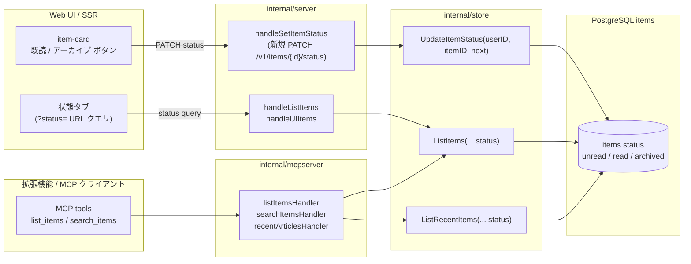
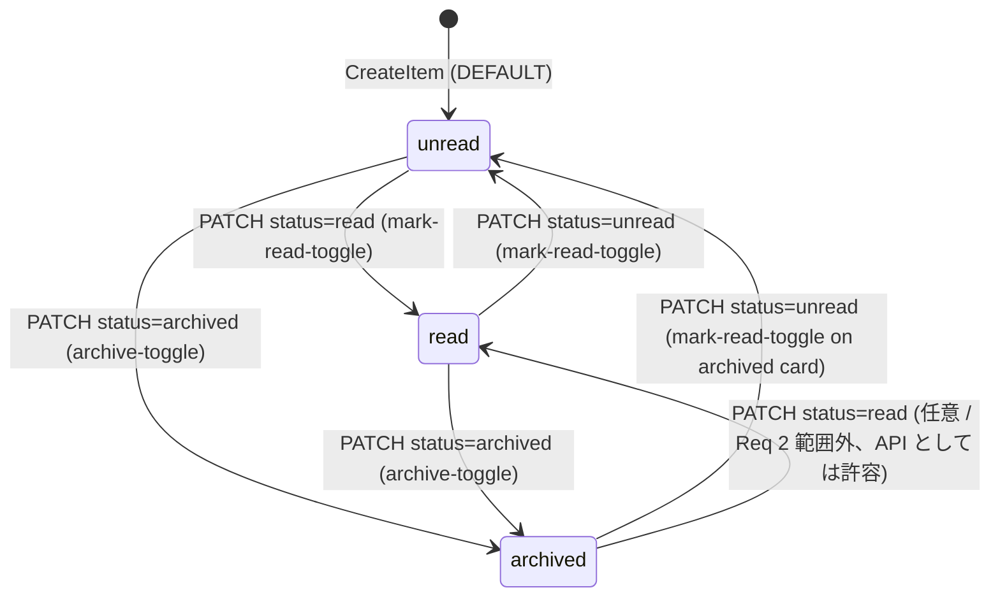
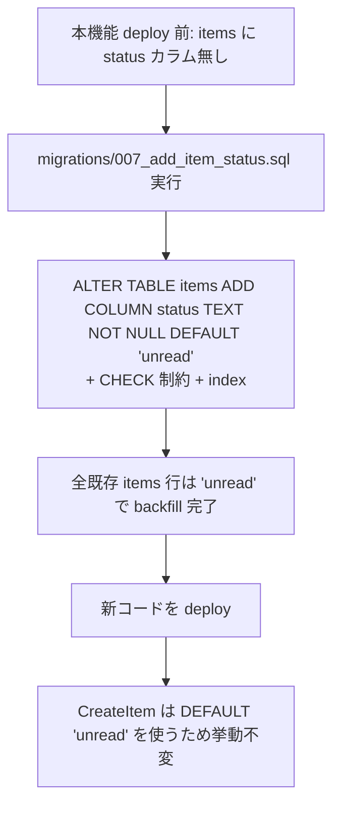

# Design Document

## Overview

altpocket は read-later サービスでありながら、現状は items に「未読 / 既読 / アーカイブ」を
表す **ユーザー可視な状態**を持たない。`items.fetch_status`（pending / fetching / success /
failed）は本文取得の進捗を示すだけで、読了消化や整理の指標として機能していない。本機能では
items テーブルに 3 値 enum `status`（`unread` / `read` / `archived`）を追加し、Web UI からの
状態遷移操作、デフォルト「未読のみ」表示、状態タブによる切替（Unread / All / Archived）、
状態に応じた視覚区別、および MCP 経由での状態の一貫した参照を提供する。

**Purpose**: この機能は「未読消化を中心に据えつつ、必要に応じて既読・アーカイブの履歴も
参照できる整理動線」を、Web UI と MCP の利用者の双方に提供する。
**Users**: Web UI 利用者（既読化・アーカイブ操作とタブ切替を行う）、MCP クライアント利用者
（API 経由で状態を一貫した範囲で参照する）の 2 系統が対象。
**Impact**: 現在の items は本文取得進捗のみが軸の単一系統で運用されている。本変更により
items は「fetch 軸 × user 状態軸」の 2 軸モデルに移行する。両軸は独立で、既存の `fetch_status`
は本機能による影響を受けない（Req 1.6 / Req 6.2）。

### Goals

- items に 3 値 enum `status`（`unread` / `read` / `archived`）を追加し、forward-only な
  マイグレーションで既存データを `unread` に backfill する
- Web UI 一覧で `Unread` を初期表示し、`Unread` / `All` / `Archived` の状態タブから切替できる
- 各アイテムカードに「既読切替（unread ⇄ read）」「アーカイブ（→ archived）」「アーカイブ
  解除（archived → unread）」のアクション要素をキーボードのみで操作可能に提供する
- 状態を色覚多様性に配慮したカード視覚（色 + テキストラベル / アイコン併用）で区別する
- MCP 公開オブジェクトに `status` フィールドを含め、`list_items` / `search_items` /
  `recent-articles` で `status` 引数フィルタを受け付ける

### Non-Goals

- 既読率ダッシュボード（消化率の集計・可視化）
- アーカイブの自動クリーンアップ
- 既読日時 / アーカイブ日時タイムスタンプの保持と期間集計（Option A 採用のため不要）
- 一括選択での複数アイテム状態変更
- Chrome 拡張機能 UI への状態操作要素の追加（拡張機能 API レスポンスへの `status` 露出は
  本 spec のスコープ内、UI 追加は別 Issue）
- グローバルキーボードショートカットの新規割当（後述 `## 設計確認事項` (c)）

## Architecture

### Existing Architecture Analysis

altpocket はレイヤード Go モノレポで、入口 `cmd/api` から `internal/server`（HTTP / SSR）→
`internal/store`（DB I/O 集約）→ PostgreSQL の流れで動作する。MCP は `/mcp` route 配下に
別中継として乗っており、`internal/mcpserver` が `internal/store` の `DataSource` interface
（`mcpserver/deps.go`）を介して同じ store 関数を共有する。

尊重すべきドメイン境界:

- **store 層が唯一の SQL 出口**: ハンドラ / mcpserver は `*pgxpool.Pool` を直触りしない
  （`CLAUDE.md` 規約「`pgxpool` の直触り禁止」）
- **fetch 進捗軸と user 状態軸の独立**: `fetch_status` は worker 側（`cmd/worker`）の
  `ClaimItemsForFetch` / `UpdateFetchSuccess` / `UpdateFetchFailure` でのみ書き換えられる。
  ユーザー状態軸は新規 API でのみ書き換えられ、両者は互いに上書きしない
- **per-user 分離**: items は `user_id` を WHERE 条件で必ず締める。状態更新も同条件を守る
- **SSR / fragment 両経路**: `/ui/items` は full-page と `X-Requested-With: ItemsFragment`
  両方を返し、後者は `items_list.html` partial だけを差し替える。状態タブの切替もこの両経路を
  経由する（既存 #114 / #115 / #117 と同パターン）
- **拡張機能 API 後方互換**: `extension_contract_test.go` が確認するのは「invalid_url 等の
  エラーレスポンス契約」「create item の JSON 受理形式」「Unauthorized JSON エラー本文」
  であり、レスポンス JSON の **新規フィールド追加は破壊変更ではない**（後述 設計確認事項 (e)）

解消・回避する technical debt:

- ない（純粋な拡張。既存 `fetch_status` enum と同じ書式の CHECK 制約と `DEFAULT 'unread'` で
  ミニマルに足す）

### Architecture Pattern & Boundary Map

採用パターン: **既存レイヤードの素直な拡張**（新規コンポーネントなし）。



**Architecture Integration**:
- 採用パターン: 既存 chi route + store I/O 集約の素直な延長。新規モジュールは追加しない
- ドメイン／機能境界: 状態の **書き込み** は新規 `Store.UpdateItemStatus` のみ。**読み出し**
  は既存 `ListItems` / `ListRecentItems` のシグネチャを **後方互換で**拡張する（後述「後方互換戦略」）
- 既存パターンの維持: handler は authn / validation / response 整形に集中、`pgxpool` は store
  経由、`slog` 構造化ログ、numeric ID は urlnorm / tag と同じ table-driven test 規約
- 新規コンポーネントの根拠: 不要（純粋な機能追加）

### Technology Stack

| Layer | Choice / Version | Role in Feature | Notes |
|-------|------------------|-----------------|-------|
| Frontend / CLI | 標準 `html/template` + Vanilla JS | 状態タブ・状態切替ボタンの SSR と fragment 取得 | 既存 #114 / #115 / #117 と同じ X-Requested-With: ItemsFragment 経路 |
| Backend / Services | Go 1.25, chi v5 | `PATCH /v1/items/{id}/status` を新規追加、`/v1/items` / `/ui/items` / MCP tools の status フィルタ拡張 | 既存 `handle*` プレフィックス命名 |
| Data / Storage | PostgreSQL 16, pgx v5 | `items.status TEXT NOT NULL DEFAULT 'unread'` + CHECK 制約 | forward-only マイグレーション、`migrations/007_*.sql` |
| Messaging / Events | （なし） | 本機能はイベント駆動を導入しない | |
| Infrastructure / Runtime | 既存 Docker Compose 構成 | 変更なし | 環境変数追加なし |

## File Structure Plan

### Directory Structure

```
migrations/
└── 007_add_item_status.sql                 # 新規: items.status カラム追加 + CHECK + index + backfill

internal/
├── store/
│   ├── store.go                            # 変更: Item 構造体に Status, ListItems / ListRecentItems 拡張, UpdateItemStatus 追加
│   ├── store_item_status_test.go           # 新規（integration tag）: UpdateItemStatus / ListItems 状態フィルタ
│   ├── json_tags_test.go                   # 変更: ItemListRow JSON に "status" snake_case が出ること
│   └── mcp_recent.go                       # 変更: ListRecentItems に status 引数追加（nil / 空 = 全状態 / status 条件を WHERE に追加しない、既定値は呼び出し側責務）
├── server/
│   ├── server.go                           # 変更: /v1/items/{id}/status route, handleSetItemStatus, parseStatusFilter, status クエリパース
│   ├── items_status_test.go                # 新規: handleSetItemStatus の認可 / 入力検証 / 後方互換テスト
│   └── extension_contract_test.go          # 変更なし（後方互換 baseline として実行）
└── mcpserver/
    ├── server.go                           # 変更: ListItemsInput / SearchItemsInput に Status 引数追加, formatItemList に status, recent も同様
    ├── deps.go                             # 変更: DataSource.ListItems / ListRecentItems のシグネチャ更新（追加引数 statuses []string）
    └── server_test.go                      # 変更: status 引数受理・既定値・出力フィールドの fake テスト

templates/
├── items.html                              # 変更: 状態タブ (Unread / All / Archived) を SSR 描画
├── items_list.html                         # 変更: card に状態クラス付与 + 既読/アーカイブ操作ボタン + status タブ active 表示
└── item_detail.html                        # 変更: 詳細ページ上部に状態ピル + 切替ボタンを追加（オプショナル / 後述）

static/
├── style.css                               # 変更: .item-card[data-status=...] / .status-tabs / .item-status-actions のスタイル追加
├── app.js                                  # 変更: 状態切替ボタンの delegated click → PATCH /v1/items/{id}/status
└── items_status.js                         # 新規: 状態タブ click 捕捉 → URL ?status= 書換 → fragment 取得（既存 items_active_filters.js と同じ pattern）
```

### Modified Files

- `migrations/007_add_item_status.sql` (新規): `ALTER TABLE items ADD COLUMN status TEXT NOT NULL
  DEFAULT 'unread'` + `CHECK (status IN ('unread','read','archived'))` + `CREATE INDEX
  items_user_status_idx ON items(user_id, status, created_at DESC)`。`ADD COLUMN ... NOT NULL
  DEFAULT 'unread'` は既存全行を `unread` で backfill する（Req 1.3 / Req 6.1）
- `internal/store/store.go`:
  - `Item` 構造体に `Status string \`json:"status"\`` フィールド追加
  - 定数 `ItemStatusUnread / ItemStatusRead / ItemStatusArchived` を追加（マジック文字列禁止規約）
  - `ListItems(... statuses []string ...)` 第 4 引数群に `statuses` を追加（nil / 空 = 全状態 / status 条件を WHERE に追加しない。既定値の適用責務は handler / mcpserver 側、後述「後方互換戦略」参照）
  - `GetItemDetail` の SELECT に `i.status` 追加
  - 新規メソッド `UpdateItemStatus(ctx, userID, itemID, next string) (prev string, err error)`：
    所有チェック → UPDATE → 旧値を返す（NFR 3.1 の遷移ログ生成に必要）
- `internal/store/mcp_recent.go`: `ListRecentItems(ctx, userID, since, statuses []string)` 拡張
- `internal/server/server.go`:
  - route `r.Patch("/{id}/status", s.requireAuth(s.handleSetItemStatus))` を `/v1/items` 配下に追加
  - 新規 `handleSetItemStatus`: JSON `{"status":"<next>"}` を受理、enum 検証、所有チェック後
    `Store.UpdateItemStatus` 呼び出し、構造化ログ出力（NFR 3.1）
  - `parseStatusFilter(q url.Values) []string` 追加（`?status=unread` 1 件、または `?status=all`
    で `[unread,read]` を返す。`archived` は単一指定が必須）
  - `handleListItems` / `handleUIItems` で `statuses := parseStatusFilter(...)` を `ListItems` に渡す
- `internal/mcpserver/server.go`:
  - `ListItemsInput` / `SearchItemsInput` に `Status string \`json:"status,omitempty"\`` 追加
  - `formatItemList` / `getItemHandler` JSON に `"status"` を含める
  - `recentArticlesHandler` の `ListRecentItems` 呼び出しに `statuses` を渡す（既定 `unread`）
- `internal/mcpserver/deps.go`: `DataSource` interface のメソッドシグネチャを上記に揃える
- `templates/items.html`: 状態タブ markup を追加（`<nav class="status-tabs">` に Unread / All /
  Archived の 3 リンク。`?status=<v>` 書換、aria-selected による active 表示、#115 の active-filter chip 列と矛盾しないよう **検索バー直下・active-filter chips の上**に配置）
- `templates/items_list.html`:
  - 各 `<article class="item-card">` に `data-status="{{.Status}}"` 属性を追加
  - card 下部の actions に `<button class="mark-read-toggle" data-item-id="{{.ID}}" data-current-status="{{.Status}}">`
    と `<button class="archive-toggle" data-item-id="{{.ID}}" data-current-status="{{.Status}}">`
    を追加（aria-label 必須、Req 2.1 / 2.2 / NFR 4.2）
- `templates/item_detail.html`: 詳細ページ右上 actions 列に同じ切替ボタンを追加（任意 / 同一 PATCH 経路）
- `static/style.css`:
  - `.item-card[data-status="read"]`: タイトル文字色を `--text-tertiary` トーンに、border-left を
    淡色化（color-only 依存を避ける）
  - `.item-card[data-status="archived"]`: 背景を `--bg-elevated` から弱化、status badge を併設
  - `.item-status-badge[data-status="read"]` / `[data-status="archived"]` を SSR で description
    span に追加し、テキストラベル（"既読" / "アーカイブ"）を併記（NFR 4 の色のみ依存禁止）
  - `.status-tabs`: 既存 `.active-filters` と同じ余白トークンで描画、`[aria-selected="true"]`
    で primary 反転スタイル
  - `.item-card.failed` （#12）の border-left との衝突回避: `failed` は既存通り
    `border-left: 3px solid var(--color-danger)` を維持、`status="archived"` は border-left を
    使わず背景・透明度で表現する（Req 4.3）
- `static/app.js`: 既存 delegated click handler の隣に `button.mark-read-toggle` /
  `button.archive-toggle` を追加。`fetch('/v1/items/{id}/status', {method:'PATCH', body: JSON.stringify({status: next})})` を呼び、失敗時は toast.error で通知（Req 2.7）
- `static/items_status.js` (新規): 状態タブ click 捕捉 → `?status=` 書換 → history.pushState →
  `X-Requested-With: ItemsFragment` で fragment 取得。`items_active_filters.js` と同じ
  AbortController slot（`region.__itemsFragmentInflight`）を共有して race 防止

## Requirements Traceability

| Requirement | Summary | Components | Interfaces | Flows |
|-------------|---------|------------|------------|-------|
| 1.1 | アイテムに 3 値状態を保持 | items テーブル / store.Item | `items.status` カラム / `Item.Status` | マイグレーション 007 |
| 1.2 | 初期状態 `unread` | items テーブル | `DEFAULT 'unread'` | CreateItem 経由 |
| 1.3 | 既存アイテム backfill | マイグレーション 007 | `ADD COLUMN ... NOT NULL DEFAULT 'unread'` | 適用時に既存行も backfill |
| 1.4 | 永続化 | store.UpdateItemStatus | `UPDATE items SET status=$3 WHERE id=$1 AND user_id=$2` | PATCH /v1/items/{id}/status |
| 1.5 | enum 範囲外を拒否 | server.handleSetItemStatus / DB CHECK | enum 検証 + CHECK 制約 | 400 invalid_status |
| 1.6 | fetch_status との独立 | store / DB | 既存 `items.fetch_status` 変更なし | worker 経路を変更しない |
| 2.1 / 2.2 | 既読・アーカイブのアクション要素 | items_list.html / app.js | `<button class="mark-read-toggle">` / `.archive-toggle` | カード markup |
| 2.3 / 2.4 / 2.5 | 状態遷移 | server.handleSetItemStatus | PATCH /v1/items/{id}/status | フロー: ボタン click → fetch → 楽観 UI 更新 |
| 2.6 | archived からの解除 | items_list.html / app.js | mark-read-toggle が archived 時は unread に戻す | UI 同じ button を文脈で振る舞い変更 |
| 2.7 | 失敗時の維持と通知 | app.js | fetch 失敗時 toast.error + revert | クライアント側 |
| 2.8 | 状態反映を再リロードなし | app.js | data-status 属性更新 + card 即時退場（filter 不一致時） | fragment 取得は不要、in-place |
| 3.1 / 3.3 | Unread 既定表示 | server.handleUIItems / parseStatusFilter | `handleUIItems` が defaultIfEmpty=`["unread"]` を渡す | /ui/items?status= 未指定時のみ unread 既定（/v1/items は nil 既定で全状態、Req 6.2） |
| 3.2 | 3 つの状態タブ | items.html (status-tabs) | Unread / All / Archived | SSR markup |
| 3.4 | All タブが unread+read | server.parseStatusFilter | `?status=all` → `["unread","read"]` | 設計確認事項 (d) 確定 |
| 3.5 | Archived タブ | server.parseStatusFilter | `?status=archived` → `["archived"]` | |
| 3.6 | 既存タグ / 検索 / ソート / ページ送りと併用 | server.handleUIItems | URL クエリ独立 | 既存ハンドラに status を AND 結合 |
| 3.7 | 状態タブと #115 active-filters と矛盾しない | items.html 配置 | status-tabs を active-filters の上に配置 | 視覚レイアウト |
| 3.8 | 状態タブ選択を保持 | URL クエリ駆動 | `?status=` を URL に持つ | 設計確認事項 (b) 確定 |
| 4.1 / 4.4 | 状態の視覚区別（色 + テキスト） | style.css / items_list.html | `[data-status]` + status-badge text | NFR 4.4 色覚配慮 |
| 4.2 | failed との別軸提示 | style.css | 既存 `.failed` border-left 維持 | 軸を直交させる |
| 4.3 | #12 との非衝突 | style.css | `archived` は border-left を使わない | 軸の干渉回避 |
| 5.1 | MCP 状態フィールド露出 | mcpserver/server.go formatItemList / getItemHandler | item / detail JSON に `"status"` 追加 | |
| 5.2 / 5.3 | MCP の既定値と受付値 | mcpserver listItemsHandler / searchItemsHandler / recentArticlesHandler | `Status` 引数空 → 既定 `nil`（全状態）、`unread/read/archived/all` を受理 | 設計確認事項 (a) 確定（高指摘 #2 反映、Req 6.3 と両立） |
| 5.4 | Web と MCP の整合 | store.UpdateItemStatus | 単一 DB を介す | データソース統一 |
| 6.1 | データ消失なし | マイグレーション 007 | `DEFAULT 'unread'` で backfill | |
| 6.2 | 既存挙動を壊さない | server.handleListItems / store.ListItems backwards compat | `/v1/items` で defaultIfEmpty=nil（全状態）、後方互換戦略（後述） | |
| 6.3 | 既存 MCP リクエストへの破壊変更なし | mcpserver mcpStatusFilter | `Status` 未指定で `nil`（全状態）を採用、`status` フィールドは追加のみ | 設計確認事項 (a) / (e) 参照 |
| NFR 1.1 / 1.2 / 1.3 | パフォーマンス | DB index | `items_user_status_idx (user_id, status, created_at DESC)` | EXPLAIN で seq scan 回避 |
| NFR 2.1 / 2.2 | 認可 | server / mcpserver | `WHERE user_id=$1 AND id=$2` を全経路で遵守 | |
| NFR 3.1 | 構造化ログ | server.handleSetItemStatus | `slog.Info("items.status.update", user_id, item_id, prev, next)` | トークン / Cookie を出力しない |
| NFR 4.1 / 4.2 | アクセシビリティ | items_list.html | `<button>` + aria-label + tab フォーカス | キーボード操作可 |

## Components and Interfaces

### Data Layer

#### items テーブル / store.Item

| Field | Detail |
|-------|--------|
| Intent | items の永続的な「ユーザー可視な状態」を保持する 3 値 enum |
| Requirements | 1.1, 1.2, 1.3, 1.5, 1.6, 6.1 |

**Responsibilities & Constraints**
- 主責務: items 行に `status` カラム（`unread` / `read` / `archived`）を持たせる
- ドメイン境界: `items` テーブルの単一行に閉じる（join テーブルを増やさない）
- データ所有権: items は `user_id` で per-user 分離済み。`status` は items に内包される
- invariants:
  - 全行が `unread` / `read` / `archived` のいずれか（CHECK 制約）
  - `fetch_status` と独立（互いに上書きしない）

**Dependencies**
- Inbound: store.ListItems, store.ListRecentItems, store.GetItemDetail, store.UpdateItemStatus
- Outbound: PostgreSQL items テーブル
- External: なし

**Contracts**: State [x] / API [ ] / Service [ ] / Event [ ] / Batch [ ]

##### State Transitions



invariant:
- 任意の遷移は **同 user の所有 item にのみ**適用される（NFR 2.1）
- enum 範囲外の値は API 層と DB CHECK の双方で拒否（Req 1.5、二重防御）

### store 層

#### Store.UpdateItemStatus（新規）

| Field | Detail |
|-------|--------|
| Intent | 所有チェック付きで items.status を遷移し、遷移前後の値を返す |
| Requirements | 1.4, 2.3, 2.4, 2.5, 2.6, NFR 2.1, NFR 3.1 |

**Service Interface**

```go
// UpdateItemStatus transitions items.status to next for itemID owned by userID.
// Returns the previous status string (for NFR 3.1 structured logging) and any
// DB error. Returns pgx.ErrNoRows when no row matches user_id+id (not found OR
// owned by another user — collapsed for NFR 2.1).
//
// next MUST be one of ItemStatusUnread / ItemStatusRead / ItemStatusArchived;
// callers validate the value before invocation. The DB CHECK constraint is a
// defense-in-depth safety net.
func (s *Store) UpdateItemStatus(ctx context.Context, userID, itemID, next string) (prev string, err error)
```

- Preconditions: `next` ∈ {`unread`, `read`, `archived`}
- Postconditions: items 行の `status` が `next` に更新される（CHECK 制約に違反すれば error）
- Invariants: 他ユーザーの行は更新も読み出しもされない（WHERE user_id=$1）

#### Store.ListItems / ListRecentItems（拡張）

| Field | Detail |
|-------|--------|
| Intent | status による絞り込みを `statuses []string` で受ける |
| Requirements | 3.1, 3.3, 3.4, 3.5, 5.2, 5.3, 6.2 |

**Service Interface（変更）**

```go
// 旧:
// func (s *Store) ListItems(ctx context.Context, userID string, page, perPage int, q string,
//     tags []string, sort string) ([]ItemListRow, Pagination, error)
//
// 新（statuses 追加）:
func (s *Store) ListItems(ctx context.Context, userID string, page, perPage int, q string,
    tags []string, statuses []string, sort string) ([]ItemListRow, Pagination, error)

func (s *Store) ListRecentItems(ctx context.Context, userID string, since time.Time,
    statuses []string) ([]ItemListRow, error)
```

- Preconditions:
  - `statuses == nil` または `len(statuses) == 0` → **「status 条件を WHERE に追加しない」**
    （全状態を返す。呼び出し側で既定を適用する責務）
  - 各要素は `unread` / `read` / `archived` のいずれか（store 内で再検証はしない）
- Postconditions: `i.status = ANY($N)` を WHERE に追加し、SELECT に `i.status` を含める

**後方互換戦略（Req 6.2）**:
- `statuses` 引数を **追加する**ことで Go 静的型のシグネチャは破壊変更となる。本変更は
  `mcpserver/deps.go` の `DataSource` interface と全呼び出し側を同時に更新するため、
  内部 API としては closed-set な変更で副作用なし（callgraph は server / mcpserver / worker
  の 3 系統のみ。worker は items を listing しないため影響なし）
- 旧シグネチャを保ちつつ status 引数を追加する案として `ListItemsWithStatus` を別関数化する
  選択肢も検討したが、二重関数は今後の維持コストが大きいため不採用とする。代わりに「呼び出し
  全箇所に `nil` を渡せば挙動が変わらない」性質を担保することで実質的な後方互換を確保する

### server 層

#### handleSetItemStatus（新規）

| Field | Detail |
|-------|--------|
| Intent | `PATCH /v1/items/{id}/status` を受けて item の status を遷移し、構造化ログを記録 |
| Requirements | 1.4, 1.5, 2.3〜2.7, NFR 2.1, NFR 3.1 |

**Responsibilities & Constraints**
- リクエスト JSON: `{"status":"unread"|"read"|"archived"}`
- enum 範囲外 → 400 `{"error":"invalid_status"}`（Req 1.5）
- 認証なし → 401 `{"error":"unauthorized"}`（既存 requireAuth 経由）
- 所有しない / 存在しない → 404 `{"error":"not_found"}`（NFR 2.1 / collapsed）
- rate limit 越え → 429 `{"error":"rate_limited"}`（既存 limiter 流用）
- 成功時 → 200 `{"status":"<next>","item_id":"<id>"}` を返す
- 成功時の構造化ログ: `slog.Info("items.status.update", "user_id", uid, "item_id", iid,
  "prev", prev, "next", next, "request_id", rid)`（NFR 3.1。トークン / Cookie は出力しない）

**Service Interface（HTTP）**

| Method | Endpoint | Request | Response | Errors |
|--------|----------|---------|----------|--------|
| PATCH | /v1/items/{id}/status | `{"status":"<v>"}` | `{"status":"<v>","item_id":"<id>"}` | 400 invalid_request / 400 invalid_status / 401 unauthorized / 403 csrf / 404 not_found / 429 rate_limited / 500 db_error |

#### parseStatusFilter（新規ヘルパー）

| Field | Detail |
|-------|--------|
| Intent | `/ui/items` / `/v1/items` の `?status=` を `[]string` に正規化する。Web UI 既定（`unread` のみ）と REST API 既定（互換のため全状態）を分けるため、**呼び出し側が既定値を渡す** 設計とする |
| Requirements | 3.1, 3.3, 3.4, 3.5, 6.2 |

**Service Interface**

```go
// parseStatusFilter converts the `?status=` query parameter into the
// statuses slice consumed by Store.ListItems. The caller passes the
// default value used when the query parameter is absent / empty, so
// /ui/items (Web UI) and /v1/items (REST API) can apply different
// defaults for the same parser.
//
// Mapping (after applying defaultIfEmpty for "" inputs):
//   "unread"     → []string{"unread"}        // (Req 3.3)
//   "all"        → []string{"unread","read"} // archived 除外（Req 3.4 / 設計確認事項 (d)）
//   "archived"   → []string{"archived"}      // (Req 3.5)
//   "read"       → []string{"read"}          // optional（直接 read のみを見る診断用、ドキュメント外）
//   ""           → defaultIfEmpty            // 呼び出し側が指定する既定値
//   others       → defaultIfEmpty            // 不明値も既定にフォールバック（破壊しない）
//
// defaultIfEmpty が nil なら nil を返し（store 層では status フィルタを WHERE に
// 追加しない = 全状態を返す）、defaultIfEmpty が非 nil ならその slice を返す。
func parseStatusFilter(q url.Values, defaultIfEmpty []string) []string
```

**既定値の渡し分け（Req 3.1 と Req 6.2 の両立）**:

| 呼び出し元 | defaultIfEmpty | 根拠 |
|-----------|----------------|------|
| `handleUIItems` (`/ui/items`, Web UI / SSR) | `[]string{"unread"}` | Req 3.1: Web UI 初期表示で `unread` のみを表示する |
| `handleListItems` (`/v1/items`, REST API) | `nil` | Req 6.2: 本機能の追加によって既存挙動を変更しない。既存の Chrome 拡張機能 / 外部 API クライアントは `?status=` を送らずに全件取得する前提のため、既定で全状態を返して後方互換を維持する |

#### handleListItems / handleUIItems（変更）

- `handleListItems`: `statuses := parseStatusFilter(r.URL.Query(), nil)` を呼び、
  `s.store.ListItems(... statuses ...)` に渡す（既定 nil = 全状態、Req 6.2 後方互換）
- `handleUIItems`: `statuses := parseStatusFilter(r.URL.Query(), []string{"unread"})` を呼び、
  `s.store.ListItems(... statuses ...)` に渡す（既定 `unread`、Req 3.1）
- `handleUIItems` のテンプレートデータに `"StatusTab"` キー（"unread" / "all" / "archived" の
  どれが選択中か）と `"StatusTabURLs"` キー（各タブの遷移先 URL）を追加し、`templates/items.html`
  でタブ active 表示を制御する

### mcpserver 層

#### listItemsHandler / searchItemsHandler / recentArticlesHandler（拡張）

| Field | Detail |
|-------|--------|
| Intent | MCP tool input に `status` 引数を追加、JSON 出力に `status` フィールドを追加 |
| Requirements | 5.1, 5.2, 5.3, 5.4, 6.3 |

**Input 拡張**

```go
type ListItemsInput struct {
    Page    int    `json:"page,omitempty"`
    PerPage int    `json:"per_page,omitempty"`
    Sort    string `json:"sort,omitempty"`
    // Status filters items by user-visible state. Empty (omitted) defaults
    // to "all states" (no filter) to preserve Req 6.3 backward compatibility
    // for existing MCP clients that do not send the status field.
    // Accepts "unread" / "read" / "archived" / "all" — "all" is unread+read
    // (Req 3.4 と同じ意味論で web/MCP を揃える).
    Status  string `json:"status,omitempty" jsonschema:"状態フィルタ（unread/read/archived/all、既定: 全状態）"`
}

type SearchItemsInput struct {
    Query   string   `json:"query,omitempty"`
    Tags    []string `json:"tags,omitempty"`
    Page    int      `json:"page,omitempty"`
    PerPage int      `json:"per_page,omitempty"`
    Status  string   `json:"status,omitempty" jsonschema:"状態フィルタ（unread/read/archived/all、既定: 全状態）"`
}
```

**出力 JSON 拡張**

- `formatItemList(items)` の各要素に `"status": item.Status` を追加（Req 5.1）
- `getItemHandler` の出力にも `"status": detail.Status` を追加

**既定値・受付値の確定**（設計確認事項 (a) と Req 6.3 の両立 / 高指摘 #2 を反映）

各 MCP tool について以下に統一する。受付値は `unread` / `read` / `archived` / `all` の
単一文字列。

| MCP tool | Status `""` の解釈 | 根拠 |
|----------|-------------------|------|
| `list_items` | `nil`（store 層で status フィルタを WHERE に追加しない = 全状態） | Req 6.3: 既存 MCP クライアントは status を送らない。`unread` 既定にすると `read` / `archived` 化されたアイテムが listing から消え、本機能導入前と破壊的に異なる挙動になる |
| `search_items` | `nil`（同上） | 同上 |
| `recent-articles` | `nil`（同上、本仕様内で明文化された 1 つの値として「全状態」を採用） | Req 5.2 は「既定値を本仕様内で明文化された 1 つの値に固定する」ことを要求しており、その固定値として `nil`（全状態）を採用することで Req 6.3 と同時に満たす |

内部ヘルパー `mcpStatusFilter(s string) []string` のマッピング:

```go
// mcpStatusFilter converts the MCP tool's Status input string into the
// statuses slice consumed by Store.ListItems / Store.ListRecentItems.
//
//   ""         → nil                     // 既定: 全状態（Req 6.3 / Req 5.2）
//   "unread"   → []string{"unread"}
//   "read"     → []string{"read"}
//   "archived" → []string{"archived"}
//   "all"      → []string{"unread","read"}   // archived 除外（Req 3.4 と web/MCP を揃える）
//   others     → nil                     // 不明値は既定にフォールバック（Req 6.3 / 破壊しない）
func mcpStatusFilter(s string) []string
```

明示的に `unread` を指定する新規 MCP クライアントは `Status: "unread"` を送ることで未読のみ
取得できる。本変更により既存 MCP クライアントは引き続き全状態を取得できる（Req 6.3）。

#### DataSource interface（mcpserver/deps.go）

シグネチャを store 層と一致させる：

```go
type DataSource interface {
    ListItems(ctx context.Context, userID string, page, perPage int, q string,
        tags []string, statuses []string, sort string) ([]store.ItemListRow, store.Pagination, error)
    GetItemDetail(ctx context.Context, userID, itemID string) (store.ItemDetail, error)
    ListTagsWithCountFiltered(ctx context.Context, userID, q string, selectedTags []string) ([]store.Tag, error)
    ListRecentItems(ctx context.Context, userID string, since time.Time,
        statuses []string) ([]store.ItemListRow, error)
}
```

### templates 層

#### items.html

- `<nav class="status-tabs" role="tablist" aria-label="アイテム状態">` を **検索バーの直下、
  active-filters と main split の間**に配置。タブは `<a role="tab" aria-selected="...">` で
  Unread / All / Archived の 3 件、`href` は現在 URL の `?status=` を該当値に書き換えたもの
- aria-selected と class `is-active` を SSR で付与し、`items_status.js` は同じ markup を JS で
  差し替えるだけ（プログレッシブエンハンスメント: JS 無効環境でも `<a href>` でフルページ遷移
  として動作する。既存 #114 / #115 / #117 と同じ pattern）

#### items_list.html

- 各 `<article class="item-card" data-status="{{.Status}}">` のクラスに `data-status` を加える
- card actions 行に以下を追加:

```html
<button type="button"
        class="btn-secondary mark-read-toggle"
        data-item-id="{{.ID}}"
        data-current-status="{{.Status}}"
        aria-label="{{if eq .Status "read"}}未読に戻す{{else}}既読にする{{end}}">
  {{if eq .Status "read"}}Mark unread{{else}}Mark read{{end}}
</button>
<button type="button"
        class="btn-secondary archive-toggle"
        data-item-id="{{.ID}}"
        data-current-status="{{.Status}}"
        aria-label="{{if eq .Status "archived"}}アーカイブ解除{{else}}アーカイブする{{end}}">
  {{if eq .Status "archived"}}Unarchive{{else}}Archive{{end}}
</button>
```

- card description 行に `<span class="item-status-badge" data-status="{{.Status}}">{{.Status}}</span>`
  を追加（NFR 4: 色のみに依存しないテキストラベル）

### static 層

#### items_status.js（新規）

- `items_active_filters.js` と同じ pattern: `[data-items-region]` 上の AbortController slot を共有、
  status-tabs の click を delegated 捕捉 → `?status=` 書換 → history.pushState → fragment 取得
- popstate でも `?status=` を読み取って fragment 取得 → 戻る/進むに追従

#### app.js（変更）

- 既存 delegated click handler（refetch / delete）の隣に以下を追加:
  - `button.mark-read-toggle`: `currentStatus` を読み、`next = currentStatus === 'read' ? 'unread' : 'read'`
    （`archived` の場合は `unread`）を計算 → PATCH → 成功時 `data-current-status` 更新 + ボタン
    label / aria-label 更新。現在の status タブで非表示にすべき item は `<article>` 要素を
    DOM から fade-out で削除（Req 2.8）
  - `button.archive-toggle`: `currentStatus === 'archived' ? 'unread' : 'archived'` → PATCH →
    同上
  - 失敗時: `toast.error` + ボタンと card の元状態を維持（Req 2.7）

## Data Models

### Domain Model

- アグリゲート: `Item`（既存）。新規エンティティ・値オブジェクトは追加しない
- 値オブジェクト: `ItemStatus`（Go 上は `const string`、`ItemStatusUnread = "unread"` 等）
- ドメインイベント: なし（イベント駆動は未導入）

### Logical / Physical Data Model

```
items
+----------------+-----------------+--------------+-------------+
| column         | type            | nullable     | default     |
+----------------+-----------------+--------------+-------------+
| status (NEW)   | TEXT            | NOT NULL     | 'unread'    |
+----------------+-----------------+--------------+-------------+
CHECK (status IN ('unread', 'read', 'archived'))
```

index:

```
items_user_status_idx ON items (user_id, status, created_at DESC)
```

- 既存の `items_user_created_idx (user_id, created_at DESC)` は維持（status を WHERE しない
  クエリ・worker クエリで引き続き使われる）
- 新規 index は `?status=unread` 既定で頻発する一覧クエリの seq scan を回避する目的

### Migration Strategy



- **forward-only**（down migration は提供しない、本リポジトリ規約）
- マイグレーションは **コード deploy 前**に手動 `psql -f` で適用（規約: 自動化は #87 で議論中）
- 旧コードが新スキーマで動いても `status` カラムを読み書きしないため壊れない（`SELECT i.id,
  i.url, ...` は明示列挙のため）。順序逆転（コード deploy → migration）でも事故にならない構造
- backfill は CTAS ではなく `ADD COLUMN NOT NULL DEFAULT` で即時完了（中サイズテーブル想定で
  ALTER TABLE が短時間でロック取得・解放できる前提。10,000 件/ユーザー想定の NFR 1 と整合）

## Error Handling

### Error Strategy

- **二重防御**: API 層の enum 検証で 400 を返し、なお DB CHECK 制約で侵入を防ぐ
- 認可越境は **存在しないものとして 404** に collapse（NFR 2.1、所有・非所有のリーク防止）
- 楽観 UI 更新は失敗時に巻き戻し（Req 2.7）

### Error Categories and Responses

- **User Errors (4xx)**:
  - `400 invalid_request`: JSON が parse 不能 / `status` キー欠落 / `status` 値が空文字
  - `400 invalid_status`: `status` 値が `unread` / `read` / `archived` 以外
  - `401 unauthorized`: 未認証（既存 requireAuth）
  - `403 csrf`: CSRF トークン不正（既存 checkCSRF）
  - `404 not_found`: 存在しない or 他ユーザー所有（NFR 2.1）
  - `429 rate_limited`: rate limit（既存 limiter）
- **System Errors (5xx)**:
  - `500 db_error`: PostgreSQL 接続失敗・CHECK 制約違反等（API 層 enum 検証を通過したのに DB
    が拒否した場合は構造化ログで `unexpected_check_violation` イベントを記録）
- **Business Logic Errors (422)**: 本機能では使用しない（状態遷移は全方向許容）

## Testing Strategy

### Unit Tests（3-5 項目）

- `internal/server`:
  - `Test_parseStatusFilter_TableDriven`: `""` / `"unread"` / `"all"` / `"archived"` / `"read"` /
    不明値 / 大文字混在 を入力に、期待 `[]string` を assert（table-driven、urlnorm と同規約）
  - `TestHandleSetItemStatus_Unauthorized` / `TestHandleSetItemStatus_InvalidStatusReturns400` /
    `TestHandleSetItemStatus_InvalidJSONReturns400`: httptest で 401 / 400 / 400 を確認
    （extension_contract_test と同じスタイル）
- `internal/store`:
  - `TestItemListRowJSONHasStatusSnakeCase`: 既存 `json_tags_test.go` の row に `Status: "read"`
    を入れて `"status"` キーの存在を assert
- `internal/mcpserver`:
  - `TestListItemsHandler_DefaultStatusUnread`: fake DataSource を使い、`Status` 空入力で
    `[]string{"unread"}` が store に渡るか assert
  - `TestListItemsHandler_OutputContainsStatus`: 返却 JSON に `status` キーが含まれることを assert

### Integration Tests（3-5 項目、`-tags=integration`）

- `internal/store/store_item_status_test.go`（新規）:
  - `TestUpdateItemStatus_TransitionsAllPairs`: 7 通り（unread→read / read→unread /
    unread→archived / read→archived / archived→unread / archived→read / 既存値同一）を実 DB で
    確認、`prev` 返り値の正確性
  - `TestUpdateItemStatus_RejectsOtherUserItem`: user A の item を user B が更新 → `pgx.ErrNoRows`
  - `TestListItems_FilterByStatus`: 3 件（unread / read / archived）を作成 → `statuses=["unread"]`
    で 1 件のみ、`statuses=["unread","read"]` で 2 件、`statuses=["archived"]` で 1 件
  - `TestListRecentItems_FilterByStatus`: 同上
  - `TestMigration007_BackfillsExistingItemsToUnread`: 既存スキーマで items を作成 → 007 を
    適用 → 全行 `status='unread'` を assert

### E2E/UI Tests（既存スイートで担保、追加最小）

- `internal/server/extension_contract_test.go` を **変更せず実行**して既存 invalid_url / 401
  契約が壊れていないことを確認（Req 6.3、設計確認事項 (e)）

### Performance（観察）

- マイグレーション後の `EXPLAIN ANALYZE SELECT ... WHERE user_id=$1 AND status='unread'
  ORDER BY created_at DESC LIMIT 30` が `items_user_status_idx` を使うことを開発者が確認
- 10,000 件 / user スケールでの一覧クエリ p95 を本機能導入前後で比較（NFR 1.1）

## Security Considerations

- **per-user 認可**: items.status の読み出し / 更新は全経路で `WHERE user_id=$1` を守る
- **MCP の API キーごとの user 分離**: 既存 `mcpserver.NewAuthMiddleware` が `UserIDFromContext`
  を介してユーザーを束ねる。本機能は新規認可境界を導入しない
- **ログのセキュリティ**: 構造化ログは `user_id` / `item_id` / `prev` / `next` / `request_id`
  のみ。Cookie / トークン / 本文の生値は出力しない（CLAUDE.md 規約 + NFR 3.1）

## Performance & Scalability

- 既存 `items_user_created_idx` は status フィルタなしクエリで引き続き使われる
- 新規 `items_user_status_idx (user_id, status, created_at DESC)` で status フィルタ付き
  クエリの seq scan を回避
- `status='all'` のときは `status = ANY('{unread,read}')` で 2 値を渡す。index を活かすため、
  実装は `i.status = ANY($N)` の bind を `[]string{"unread","read"}` で渡す（IN リスト展開を
  避け、prepared statement キャッシュを効かせる）

## Supporting References

- 既存 active-filters chip 実装（#115）: `static/items_active_filters.js`,
  `templates/items_list.html`, `internal/server/server.go buildActiveTagFilters`
- 既存 fragment 取得規約（#114）: `X-Requested-With: ItemsFragment` ヘッダーと
  `wantsItemsFragment(r)` の判定
- 既存 status-pill 配色（#12 / fetch_status）: `static/style.css:970-1042`
- 既存マイグレーション規約: `migrations/001_init.sql`, `migrations/006_item_tag_display_name.sql`
- PostgreSQL 16 `ALTER TABLE ... ADD COLUMN ... NOT NULL DEFAULT` の挙動: PG 11+ では
  `DEFAULT` がメタデータレベルで保存され、既存行を **書き換えずに NOT NULL を成立**させる
  最適化が効くため、大テーブルでも短時間で完了する（参照: <https://www.postgresql.org/docs/16/sql-altertable.html>）

## 設計確認事項（PM 確認事項に対する Architect 暫定判断）

PM の requirements 末尾 5 件について、本 design では以下の暫定判断を採用する。**観察可能な
振る舞いに直結する (a) / (b) / (d) / (e) は本 spec 範囲で確定**し、(c) は本 Issue から除外
する。実装後の人間レビューで再検討の余地がある場合は PR レビューで指摘してもらう。

### (a) MCP の状態フィルタ既定値・受付値 — **確定**（高指摘 #2 反映）

- 既定値: **`nil`（全状態 / status 条件を WHERE に追加しない）**
  - `list_items` / `search_items` / `recent-articles` のいずれも、`Status` 引数空 → `nil`
  - Req 6.3（既存 MCP クライアントが status を送らないリクエストで破壊変更しない）と
    Req 5.2（既定値を本仕様内で明文化された 1 つの値に固定する）を同時に満たすため、
    固定値として「全状態」を採用する
- 受付値: `unread` / `read` / `archived` / `all` の **単一文字列**
  - `unread` → `[]string{"unread"}`、`read` → `[]string{"read"}`、`archived` → `[]string{"archived"}`
  - `all` → `[]string{"unread","read"}`（archived 除外、Web UI All タブと同一意味論）
- 不明値・複数指定は **`nil`（全状態）にフォールバック**（Req 6.3 の破壊しない原則を守る）

**初回案からの変更点**: 当初は `Status` 空 → `unread` 既定としていたが、Reviewer 指摘により
`list_items` / `search_items` / `recent-articles` を `unread` 既定にすると既存 MCP クライアントが
`read` / `archived` 化されたアイテムを listing から取りこぼし Req 6.3 違反となるため、既定を
`nil`（全状態）へ変更した。明示的に未読のみ取得したい新規クライアントは `Status: "unread"`
を送ることで従来案の挙動を得られる。

### (b) タブ選択の保持永続単位 — **確定**

- **URL クエリ**（`?status=unread|all|archived`）で永続化
- 理由: 既存 #115 のフィルタ chip / #114 の検索クエリ / タグフィルタが全て URL クエリ駆動
  であり、状態タブも同じ axis に乗せることでリンク共有可能・履歴互換・JS 無効環境でも動作
  という性質を共通化できる。ユーザー設定永続化は本機能スコープを超える
- `?status=` 未指定時は既定 `unread` を表示する（Req 3.1）

### (c) キーボードショートカット — **本 Issue から除外**

- 本機能では新規グローバルショートカットを割り当てない
- 理由:
  1. 既存 `static/app.js` の `'e'` キーは詳細ページの edit-tags ボタン用、`'j'/'k'/'o'/'n'/'/'/'?'` は
     一覧ナビゲーション用に既に予約されている
  2. Req 2 / NFR 4.1 は「アクション要素を Tab + Enter / Space で操作可能とする」ことを要求
     しており、これは card 上の `<button>` 要素がネイティブにフォーカス可能なため **既に
     満たされている**
  3. グローバルショートカット（例: 一覧上で `m` キーで mark read）は本 Issue の AC に含まれず、
     導入には別途 UX 設計（focused card の決定法、画面外スクロール時の挙動、設定ダイアログ
     の文言追加）が必要
- 将来 Issue で扱う場合は `'m'`（mark）/ `'a'`（archive）を候補とする旨を本 PR の確認事項に
  残す

### (d) 「All」タブが archived を含むか — **確定: 除外**

- `?status=all` は `[]string{"unread","read"}`（**archived 除外**）
- 理由: requirements 3.4 の仮置きと既存 Pocket / Instapaper 等の慣例（"All" は活きている
  アイテム、"Archive" は別タブ）に合わせる。`archived` を見るには明示的に Archived タブを
  選ぶ

### (e) 拡張機能 API レスポンスへの状態フィールド露出 — **確定: 露出する**

- `/v1/items` 一覧の JSON レスポンスに `"status"` フィールドを追加（store.Item に
  `Status string \`json:"status"\`` を加えるため自動的に露出）
- 後方互換性検証:
  - `extension_contract_test.go` が確認しているのは「invalid_url 等の **エラー** レスポンス契約」
    「Unauthorized JSON 契約」「PATCH の `invalid_request` 契約」のみで、**成功レスポンス JSON の
    フィールド構造は assert していない**。新規 `status` フィールドの追加は同テストの assertion を
    破らない（テスト変更不要）
  - 既存 Chrome 拡張機能側は CORS 経由で `/v1/items` を呼ぶが、レスポンスは JSON parse 後に
    既知のフィールドのみ参照する設計のため、未知フィールド追加は無視される（forward-compat な
    JSON 慣習）
- ただし本 Issue のスコープは「拡張機能 UI への状態操作要素の追加なし」を維持する（Out of
  Scope）。`status` フィールドは将来の拡張機能 UI 追加で参照可能な状態にしておく目的

## Open Question / 確認希望（Reviewer 向け）

- (c) のショートカット導入を本 Issue で扱うべきかどうか。本 spec は除外案だが、運用者の
  判断で「`m` / `a` を本 Issue でまとめて入れる」選択も可能（その場合は Req 2 に AC を追加し、
  PM 戻しが必要）
