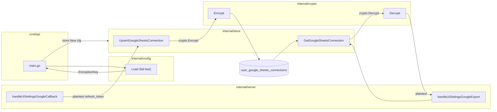
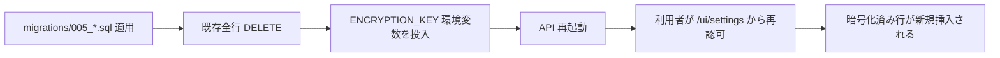

# Design Document

## Overview

**Purpose**: 本機能は Google Sheets エクスポートに用いる `refresh_token` をアプリ層で
AES-256-GCM 暗号化して保存・復号する経路を確立し、DB ダンプ流出時に Google アカウント権限が
そのまま悪用されるリスクを低減することを、altpocket をセルフホスト運用する開発者に提供する。

**Users**: altpocket をセルフホストする運用者（兼利用者）が、Google Sheets 連携の
新規接続・既存接続更新・エクスポート実行という従来通りのワークフローを使う。利用者からは
挙動が変わらず、運用者からは「`ENCRYPTION_KEY` を投入する」「移行時は再認可してもらう」と
いう運用手順が追加される。

**Impact**: 現在 `internal/store.UpsertGoogleSheetsConnection` / `GetGoogleSheetsConnection` が
`refresh_token` を平文のまま読み書きしているのを、`internal/crypto` パッケージを介した
暗号化・復号経路に切り替える。`internal/config` には `ENCRYPTION_KEY` の読み込みと起動時
fail-fast 検証を追加する。既存平文レコードは新マイグレーションで削除し、再認可方式
（Option B）で移行する。鍵ローテーション戦略は運用ドキュメントとして整備する（自動化はしない）。

### Goals
- `refresh_token` を AES-256-GCM で暗号化した状態で DB に永続化する
- 起動時に `ENCRYPTION_KEY` の存在・形式・鍵長を検証し、不整合時は fail-fast する
- 復号失敗を「未接続相当」のエラーに合流させ、利用者が再認可できるようにする
- 既存平文レコードを安全に廃棄するマイグレーションと運用手順を提供する
- 鍵ローテーション手順を文書化する（自動化はしない）
- 単体テストで暗号化・復号往復・改ざん検知・nonce ランダム性・想定外入力を検証する

### Non-Goals
- HSM / クラウド KMS（GCP / AWS / Vault）連携
- 鍵自動ローテーション、鍵バージョニング、ダブルキー再暗号化の自動化
- 既存平文 `refresh_token` の自動バックフィル
- `extension_refresh_tokens.token_hash` の暗号化方式変更（別テーブル・別設計）
- セッション Cookie / JWT / 他秘匿値の暗号化
- DB カラム型・インデックスの大幅な再設計（暗号文を保持できる程度の最小調整に留める）
- 監査ログ / SIEM 連携

## Architecture

### Existing Architecture Analysis

現状の Google Sheets 連携経路は以下のレイヤード構成:

- `internal/server/server.go`（HTTP ハンドラ層）: `handleUISettingsGoogleCallback` で
  OAuth 交換し `s.store.UpsertGoogleSheetsConnection` に `refreshToken` を平文で渡す。
  `handleUISettingsGoogleExport` で `s.store.GetGoogleSheetsConnection` を呼び `conn.RefreshToken`
  をそのまま `oauth2.Token{RefreshToken: ...}` に詰めて Google API クライアントに渡す。
- `internal/store/store.go`（データアクセス層）: `UpsertGoogleSheetsConnection` /
  `GetGoogleSheetsConnection` / `DeleteGoogleSheetsConnection` で `pgxpool` 経由で
  `user_google_sheets_connections.refresh_token` (`TEXT NOT NULL`) を読み書きする。
- `internal/config/config.go`: `mustEnv` による fail-fast パターンが既に確立されている
  （`SESSION_SECRET` / `JWT_SECRET` / `GOOGLE_CLIENT_SECRET` 等）。
- `internal/logger/logger.go`: `slog` JSON ハンドラ。トークン非出力ポリシーは慣習として
  運用される（自動マスキング機構はない）。
- `cmd/api/main.go` のみが Google Sheets 経路を持つ。`cmd/worker/main.go` は本文取得・
  セッション期限切れ削除のみで `refresh_token` を読まない。よって fail-fast 対象は
  **API バイナリのみ**。

尊重すべき制約:
- レイヤ分離（ハンドラは `pgxpool` を直に触らない、DB 操作は `store` に集約）
- `internal/store.GoogleSheetsConnection` 構造体の `RefreshToken string` フィールド名
  （ハンドラ側で参照中）
- 既存マイグレーション `migrations/002_google_sheets_connections.sql` の中身は変更不可
- `extension_contract_test.go` の API 後方互換

解消する technical debt:
- `refresh_token` 平文保存を排除する

### Architecture Pattern & Boundary Map

**採用パターン**:
- **データアクセス層に暗号化／復号を埋め込む**（store 層で encrypt-on-write,
  decrypt-on-read）。ハンドラ層は引き続き平文 `RefreshToken string` を受け渡す
- 暗号アルゴリズムは独立パッケージ `internal/crypto` に切り出す（store / 将来の他用途から
  参照可能、単体テストが容易）
- 鍵は `config.Config.EncryptionKey []byte` として保持し、`store.New` 構築時に渡す
  （store にプロセス全体で 1 つの鍵を持たせる）

**代替案と却下理由**:
- 案 A: ハンドラ層で暗号化／復号する → ハンドラに暗号知識が漏れ、store 経由の他経路
  （将来の MCP / バッチ等）でも個別に呼び出しが必要になる。**却下**
- 案 B: pgcrypto / DB 側暗号化 → DB ダンプに鍵が含まれるため脅威モデルを満たさない。**却下**
- 案 C: KMS / HSM → Out of Scope。**却下**



**ドメイン／機能境界**:
- `internal/crypto`: AES-GCM の純粋ロジック（鍵を引数で受け取る、副作用なし）
- `internal/store`: 鍵を保持し、暗号化・復号を内部で行う。ハンドラには平文を返す
- `internal/config`: `ENCRYPTION_KEY` の取得・base64 デコード・鍵長検証
- `internal/server`: 引き続き平文を扱う（変更なし、ただし復号エラーを「未接続相当」に
  合流させる分岐を追加）

**新規コンポーネントの根拠**:
- `internal/crypto` は再利用性とテスト容易性のため独立パッケージとする。`internal/auth` や
  `internal/urlnorm` と同じ粒度で、純粋ロジックを 1 ファイル + 1 テストファイルにまとめる

### Technology Stack

| Layer | Choice / Version | Role in Feature | Notes |
|-------|------------------|-----------------|-------|
| Frontend / CLI | （変更なし） | — | 既存の `templates/settings.html` に文言調整のみ（任意） |
| Backend / Services | Go 1.25 標準 `crypto/aes` + `crypto/cipher`（GCM） | 対称暗号 | サードパーティ依存追加なし |
| Backend / Services | Go 標準 `crypto/rand` | nonce 生成 | `cipher.NonceSize()` 分の random bytes |
| Backend / Services | Go 標準 `encoding/base64` | 鍵デコード・暗号文エンコード | RFC 4648 standard encoding |
| Data / Storage | PostgreSQL 16 / `TEXT` | 暗号文保管（base64 文字列） | 既存 `refresh_token TEXT NOT NULL` を再利用 |
| Messaging / Events | （変更なし） | — | — |
| Infrastructure / Runtime | Docker Compose（既存）+ `ENCRYPTION_KEY` 環境変数 | 鍵注入 | `deploy/.env.production` で管理（コミット禁止） |

## File Structure Plan

### Directory Structure

```
internal/
├── crypto/                                 # 新規: AES-GCM ヘルパー（純粋ロジック）
│   ├── crypto.go                           # 新規: Encrypt / Decrypt / DecodeKey / 鍵長定数
│   └── crypto_test.go                      # 新規: 往復・改ざん検知・nonce ランダム性・想定外入力
├── config/
│   ├── config.go                           # 変更: EncryptionKey フィールド + 読み込み + fail-fast
│   └── config_test.go                      # 変更: ENCRYPTION_KEY 異常系（未設定/不正/鍵長不一致）
├── store/
│   ├── store.go                            # 変更: Store に encryptionKey を持たせる + Upsert/Get で暗号化・復号
│   └── store_encryption_test.go            # 新規: 暗号化往復・レガシー平文拒否（DB を実際には使わない単体）
└── server/
    └── server.go                           # 変更: handleUISettingsGoogleExport で復号エラー時に "google_not_connected" 相当へ誘導
cmd/
└── api/
    └── main.go                             # 変更: store.New に cfg.EncryptionKey を渡す
migrations/
└── 005_invalidate_legacy_refresh_tokens.sql # 新規: 既存全行 DELETE（forward-only, 再認可方式）
docs/
├── specs/81-google-sheets-refresh-token/    # （本 PR で生成済み）
└── encryption-key-rotation.md               # 新規: 鍵生成例・ローテーション運用手順
README.md                                    # 変更: 必須環境変数節に ENCRYPTION_KEY 追加 + 移行手順 + ローテーション参照
.env.example                                 # 変更: ENCRYPTION_KEY のサンプル行追加
deploy/.env.production.example               # 変更: ENCRYPTION_KEY のサンプル行追加
```

### Modified Files

- `internal/config/config.go` — `Config.EncryptionKey []byte` フィールド追加。`Load()` 内で
  `ENCRYPTION_KEY` を読み、base64 デコード、32 バイト検証。失敗時は `panic("missing env: ENCRYPTION_KEY")` /
  `panic("invalid env: ENCRYPTION_KEY (base64 decode failed)")` /
  `panic("invalid env: ENCRYPTION_KEY (must be 32 bytes after base64 decode)")` のいずれか。
  鍵そのものはメッセージに含めない
- `internal/config/config_test.go` — `setRequiredEnv` に `ENCRYPTION_KEY` を追加。新規テスト
  `TestLoadPanicsWithoutEncryptionKey` / `TestLoadPanicsWithMalformedEncryptionKey` /
  `TestLoadPanicsWithWrongLengthEncryptionKey`
- `internal/store/store.go` — `Store` 構造体に `encryptionKey []byte` 追加。`New` 引数に
  `encryptionKey []byte` を追加（Breaking change だが store 内部 API なので影響範囲は
  `cmd/api/main.go` のみ）。`UpsertGoogleSheetsConnection` 内で `crypto.Encrypt` を呼び、
  base64 文字列を DB に書く。`GetGoogleSheetsConnection` 内で base64 デコード →
  `crypto.Decrypt` → 復号失敗時は `store.ErrRefreshTokenDecryptFailed`（新規 sentinel）を返す。
  平文判別（base64 でデコードできない／nonce+ciphertext 長未満）も同 sentinel に合流
- `cmd/api/main.go` — `store.New(pool, cfg.EncryptionKey)` に変更
- `internal/server/server.go` — `handleUISettingsGoogleExport` と `handleUISettings` で
  `errors.Is(err, store.ErrRefreshTokenDecryptFailed)` を判定し、`pgx.ErrNoRows` と同じく
  「未接続相当 = `status=google_not_connected` または再認可案内」に合流させる。
  `slog.Warn("settings.google_sheets.decrypt_failed", ...)` で構造化ログを残す（鍵・暗号文・
  平文は出力しない、`user_id` のみ）
- `migrations/005_invalidate_legacy_refresh_tokens.sql` — 新規。`DELETE FROM
  user_google_sheets_connections;` の 1 行 + コメント。forward-only。spreadsheet_id も
  ともに失われるが、再認可後にエクスポート実行で再生成される（`exportItemsToGoogleSheets`
  で空 `spreadsheet_id` 時に新規作成するロジックが既にある）
- `README.md` — 必須環境変数節に `ENCRYPTION_KEY` を追加、生成例
  （`openssl rand -base64 32`）、移行手順（migrations/005 を適用 → 利用者は再認可）、
  鍵ローテーション手順書へのリンク
- `.env.example` / `deploy/.env.production.example` — `ENCRYPTION_KEY` のサンプル行追加
  （プロダクション例は `replace_with_base64_32bytes`）
- `docs/encryption-key-rotation.md` — 新規。鍵生成方法・ローテーション戦略（再認可方式）・
  自動化しないことの明示

## Requirements Traceability

| Requirement | Summary | Components | Interfaces | Flows |
|-------------|---------|------------|------------|-------|
| 1.1 | 新規保存時に AES-GCM 暗号化 | `store.UpsertGoogleSheetsConnection`, `crypto.Encrypt` | `crypto.Encrypt(key, plaintext) ([]byte, error)` | OAuth callback → store.Upsert |
| 1.2 | 更新時も暗号化、平文を残さない | `store.UpsertGoogleSheetsConnection` | 同上 | UPSERT クエリは暗号文のみ |
| 1.3 | 暗号化のたびに新 nonce を生成・暗号文と一体保持 | `crypto.Encrypt` | nonce \|\| ciphertext を base64 で返す | — |
| 1.4 | 永続化形式を 1 種類に統一 | `crypto.Encrypt` / `Decrypt` | `[12B nonce][N B ciphertext+tag]` を base64 標準で 1 文字列 | — |
| 1.5 | 鍵・平文・OAuth レスポンスをログに出さない | `internal/logger`, `crypto`, `store`, `server` | エラーは sentinel + 識別名のみ | 自己レビュー観点 |
| 2.1 | 利用時に復号して Google API へ平文を渡す | `store.GetGoogleSheetsConnection`, `crypto.Decrypt` | `crypto.Decrypt(key, blob) ([]byte, error)` | export → store.Get → conn.RefreshToken |
| 2.2 | 復号後の平文を request コンテキスト超えて保持しない | `server.exportItemsToGoogleSheets` | ローカル変数として `oauth2.Token` に渡す。グローバル変数・cache 不使用 | — |
| 2.3 | 復号失敗時は呼び出し元へエラー、「未接続相当」に合流 | `store.ErrRefreshTokenDecryptFailed`, `server.handleUISettingsGoogleExport` | `errors.Is(err, store.ErrRefreshTokenDecryptFailed)` で `status=google_not_connected` | — |
| 2.4 | 復号失敗を構造化ログに記録、暗号文・鍵・平文は出さない | `server.handleUISettings*` | `slog.Warn("settings.google_sheets.decrypt_failed", "user_id", ...)` | — |
| 2.5 | 平文判別可能な値を復号成功として扱わない | `store.GetGoogleSheetsConnection` / `crypto.Decrypt` | base64 デコード失敗・サイズ不足は `ErrRefreshTokenDecryptFailed` | — |
| 3.1 | 起動時に ENCRYPTION_KEY を読む | `config.Load` | `cfg.EncryptionKey []byte` | cmd/api/main.go |
| 3.2 | 未設定／空文字なら fail-fast | `config.Load` | `panic("missing env: ENCRYPTION_KEY")` | — |
| 3.3 | base64 として復号できないなら fail-fast | `config.Load` | `panic("invalid env: ENCRYPTION_KEY (base64 decode failed)")` | — |
| 3.4 | 鍵長 32 バイトでないなら fail-fast | `config.Load` | `panic("invalid env: ENCRYPTION_KEY (must be 32 bytes after base64 decode)")` | — |
| 3.5 | エラーメッセージに鍵そのものを含めない | `config.Load` | メッセージ文字列リテラルに鍵を入れない | 自己レビュー観点 |
| 4.1 | 既存平文行は再認可まで「未接続相当」 | `migrations/005_*.sql` | DELETE で物理削除 → 次回 export で `pgx.ErrNoRows` → `google_not_connected` | — |
| 4.2 | 既存平文と暗号化を自動マージしない | `docs/encryption-key-rotation.md`, `README.md` | ドキュメント記載 | — |
| 4.3 | 移行手順を README または docs に記載 | `README.md`, `docs/encryption-key-rotation.md` | 移行手順節 | — |
| 4.4 | 再認可完了後は Req.1 / Req.2 経路で動く | `server.handleUISettingsGoogleCallback` → `store.Upsert` | 既存フロー（暗号化のみ追加） | — |
| 4.5 | 自動バックフィルを実装しない | （実装しないこと自体） | コードレビュー観点 | — |
| 5.1 | 鍵ローテーション方針をドキュメントに明記 | `docs/encryption-key-rotation.md` | 「再認可方式」を採用と明記 | — |
| 5.2 | 鍵差し替え運用手順 | `docs/encryption-key-rotation.md` | 番号付き手順 | — |
| 5.3 | 自動化しないことを明示 | `docs/encryption-key-rotation.md` | 該当節 | — |
| 5.4 | 鍵生成例（コマンド） | `docs/encryption-key-rotation.md`, `README.md` | `openssl rand -base64 32` | — |
| 6.1 | README 必須環境変数節に追加 | `README.md` | 必須環境変数表 | — |
| 6.2 | `.env.example` / `deploy/.env.production.example` に追加 | `.env.example`, `deploy/.env.production.example` | サンプル行 | — |
| 6.3 | 用途と要求形式（base64 / 32 byte）を明記 | `README.md` | 必須環境変数節の説明文 | — |
| 7.1 | 暗号化／復号の往復 | `internal/crypto` | `crypto_test.go` `TestEncryptDecryptRoundTrip` | — |
| 7.2 | 異なる鍵で復号失敗 | `internal/crypto` | `TestDecryptWithWrongKey` | — |
| 7.3 | 暗号文／タグ 1 バイト改ざんで復号失敗 | `internal/crypto` | `TestDecryptDetectsTampering` | — |
| 7.4 | 同じ平文・鍵で 2 回暗号化すると異なる暗号文 | `internal/crypto` | `TestEncryptProducesUniqueNonce` | — |
| 7.5 | 空文字列入力の挙動を明示 | `internal/crypto` | `TestEncryptEmptyInput`（拒否方針: `ErrEmptyPlaintext`） | — |
| 7.6 | 鍵長不正・base64 不正・nil／空入力の異常系 | `internal/crypto`, `internal/config` | `TestDecodeKeyRejectsMalformedInput` 他 | — |
| NFR 1.1 | AES-GCM 256bit 採用 | `internal/crypto` | `aes.NewCipher` + `cipher.NewGCM` | — |
| NFR 1.2 | 鍵をログ等に出さない | 全コンポーネント | コードレビュー観点 | — |
| NFR 1.3 | 平文を最小スコープで保持 | `server.exportItemsToGoogleSheets` | ローカル変数のみ | — |
| NFR 2.1 | 外部 API・UI 挙動を変えない | `server` | 変更点は内部のみ、HTTP メソッド／ステータス／リダイレクト先は不変 | — |
| NFR 2.2 | 既存テストを壊さない | 全コンポーネント | `extension_contract_test.go` 影響なし | — |
| NFR 2.3 | 既存マイグレーション 002 は変更しない | `migrations/005_*.sql` | 新規追加のみ | — |
| NFR 3.1 | 起動失敗の理由を構造化ログ／stderr に出す | `config.Load` | panic メッセージで `missing env: X` / `invalid env: X (理由)` | — |
| NFR 3.2 | 復号失敗をカウント可能なイベント名で記録 | `server` | `slog.Warn("settings.google_sheets.decrypt_failed", ...)` | — |

## Components and Interfaces

### Cryptography Layer

#### `internal/crypto`

| Field | Detail |
|-------|--------|
| Intent | AES-256-GCM の暗号化／復号と鍵デコードを提供する純粋ロジック |
| Requirements | 1.3, 1.4, 2.5, 7.1–7.6, NFR 1.1 |

**Responsibilities & Constraints**
- AES-256-GCM の `Encrypt` / `Decrypt` を提供する
- 鍵長検証ヘルパー `DecodeKey` を提供する（base64 → 32 byte）
- 永続化フォーマットは `[12 byte nonce][ciphertext + 16 byte GCM tag]` を 1 つの byte 列に
  連結し、呼び出し側で base64 標準エンコードする（store 層の責務分離）
  - **代替案**: base64 化を crypto 側でやる案もあるが、store が DB に書くフォーマット
    （TEXT vs BYTEA）に依存させたくないため byte 列のみ返す
- 鍵・平文・暗号文・nonce を `slog` 等に出さない
- panic しない（ライブラリ層の規約）

**Dependencies**
- Inbound: `internal/store` — 暗号化／復号で利用 (Critical)
- Inbound: `internal/config` — `DecodeKey` で起動時鍵検証 (Critical)
- Outbound: Go 標準 `crypto/aes`, `crypto/cipher`, `crypto/rand`, `encoding/base64` (Critical)
- External: なし

**Contracts**: Service [x] / API [ ] / Event [ ] / Batch [ ] / State [ ]

##### Service Interface

```go
package crypto

// KeySize is the required key length in bytes (AES-256).
const KeySize = 32

// NonceSize is the GCM nonce length in bytes (the standard 12 bytes).
const NonceSize = 12

// Sentinel errors.
var (
    ErrInvalidKeyLength    = errors.New("crypto: invalid key length")
    ErrMalformedKey        = errors.New("crypto: malformed key (base64 decode failed)")
    ErrEmptyPlaintext      = errors.New("crypto: empty plaintext")
    ErrCiphertextTooShort  = errors.New("crypto: ciphertext too short")
    ErrDecryptionFailed    = errors.New("crypto: decryption failed")
)

// DecodeKey decodes a base64-encoded key string into a 32-byte key.
// Returns ErrMalformedKey if base64 decoding fails, ErrInvalidKeyLength
// if the decoded length is not KeySize.
func DecodeKey(encoded string) ([]byte, error)

// Encrypt encrypts plaintext with AES-256-GCM using the given key.
// Returns a byte slice in the layout [nonce(12) || ciphertext+tag].
// Each call generates a fresh random nonce via crypto/rand.
// Returns ErrInvalidKeyLength if len(key) != KeySize.
// Returns ErrEmptyPlaintext if len(plaintext) == 0.
func Encrypt(key, plaintext []byte) ([]byte, error)

// Decrypt decrypts a [nonce || ciphertext+tag] blob with AES-256-GCM.
// Returns ErrInvalidKeyLength if len(key) != KeySize.
// Returns ErrCiphertextTooShort if len(blob) <= NonceSize.
// Returns ErrDecryptionFailed if GCM auth tag verification fails or
// the key/nonce/blob mismatch (used for both wrong-key and tampering cases;
// callers must not distinguish the two).
func Decrypt(key, blob []byte) ([]byte, error)
```

- **Preconditions**: `len(key) == KeySize`（呼び出し側で `DecodeKey` 経由で保証されている前提）。
  `Encrypt` の `plaintext` は非 nil・非空（空の場合は `ErrEmptyPlaintext`）。
- **Postconditions**: `Encrypt` の戻り値は `len == NonceSize + len(plaintext) + 16`。
  `Decrypt` は元の平文を返す、または上記 sentinel error を返す。
- **Invariants**: 同じ平文・同じ鍵での `Encrypt` 連続呼び出しは異なる暗号文を返す
  （nonce が毎回ランダム）。

### Configuration Layer

#### `internal/config.Load` の拡張

| Field | Detail |
|-------|--------|
| Intent | `ENCRYPTION_KEY` を起動時に読み込み、検証し、`Config.EncryptionKey` として提供する |
| Requirements | 3.1, 3.2, 3.3, 3.4, 3.5, 6.1, 6.3, NFR 3.1 |

**Responsibilities & Constraints**
- 既存の `mustEnv` パターンに合流させる
- 鍵デコードは `crypto.DecodeKey` に委譲する（重複ロジックを作らない）
- panic メッセージに鍵そのもの・先頭末尾・ハッシュを含めない
- API バイナリ（`cmd/api`）が `config.Load` を呼ぶため、自動的に fail-fast 対象になる
- worker は現在 `refresh_token` を使わないが、将来再利用しても矛盾しないよう `config.Load`
  共通で読み込む（worker でも同じく未設定なら起動失敗する）

**Dependencies**
- Inbound: `cmd/api/main.go`, `cmd/worker/main.go` (Critical)
- Outbound: `internal/crypto.DecodeKey` (Critical)
- External: 環境変数 `ENCRYPTION_KEY` (Critical)

**Contracts**: Service [x] / API [ ] / Event [ ] / Batch [ ] / State [ ]

##### Service Interface

```go
type Config struct {
    // ...existing fields...
    EncryptionKey []byte // 32 bytes, decoded from base64-encoded ENCRYPTION_KEY env var
}

// Load reads configuration from environment variables.
// Panics with "missing env: <NAME>" if a required variable is unset.
// Panics with "invalid env: ENCRYPTION_KEY (...)" if the key is malformed
// or wrong length. The key value itself is never included in panic messages.
func Load() Config
```

- **Preconditions**: 環境変数 `ENCRYPTION_KEY` に base64 標準エンコードされた 32 バイト鍵が
  設定されている。
- **Postconditions**: `cfg.EncryptionKey` の長さは 32 バイト。
- **Invariants**: `Load` が成功して返れば、`cfg.EncryptionKey` は AES-256 鍵として直接利用可能。

### Data Access Layer

#### `internal/store.Store` の拡張

| Field | Detail |
|-------|--------|
| Intent | `Store` がプロセス全体の鍵を保持し、`refresh_token` の暗号化／復号を内部で透過的に行う |
| Requirements | 1.1, 1.2, 1.3, 1.4, 2.1, 2.5, NFR 2.2 |

**Responsibilities & Constraints**
- `Store` 構造体に `encryptionKey []byte` を追加
- `New` シグネチャを `New(db *pgxpool.Pool, encryptionKey []byte) *Store` に変更
- `UpsertGoogleSheetsConnection` で `crypto.Encrypt` → `base64.StdEncoding.EncodeToString` →
  DB 書き込み
- `GetGoogleSheetsConnection` で DB 読み出し → `base64.StdEncoding.DecodeString` →
  `crypto.Decrypt` → `GoogleSheetsConnection.RefreshToken` に平文を詰める
- 復号失敗（base64 不正・サイズ不足・GCM 認証失敗・鍵不一致・レガシー平文）は全て
  `ErrRefreshTokenDecryptFailed` sentinel error を返す
- `DeleteGoogleSheetsConnection` / `SetGoogleSheetsSpreadsheetID` には影響なし
- `pgx.ErrNoRows` と `ErrRefreshTokenDecryptFailed` を区別できるようにする

**Dependencies**
- Inbound: `cmd/api/main.go` (Critical), `internal/server` (Critical)
- Outbound: `internal/crypto` (Critical), `pgxpool` (Critical)
- External: PostgreSQL 16 (Critical)

**Contracts**: Service [x] / API [ ] / Event [ ] / Batch [ ] / State [x]

##### Service Interface

```go
package store

var ErrRefreshTokenDecryptFailed = errors.New("store: refresh_token decrypt failed")

type Store struct {
    DB            *pgxpool.Pool
    encryptionKey []byte // 32 bytes; never logged
}

// New constructs a Store. encryptionKey must be 32 bytes (AES-256).
func New(db *pgxpool.Pool, encryptionKey []byte) *Store

// UpsertGoogleSheetsConnection encrypts refreshToken with AES-256-GCM
// and stores it (base64-encoded) along with userID. The plaintext
// refresh token is never persisted.
func (s *Store) UpsertGoogleSheetsConnection(ctx context.Context, userID, refreshToken string) error

// GetGoogleSheetsConnection reads the row, decodes and decrypts
// refresh_token. Returns:
//   - pgx.ErrNoRows: no connection record for userID
//   - ErrRefreshTokenDecryptFailed: row exists but ciphertext is malformed,
//     truncated, tampered, or encrypted with a different key (legacy
//     plaintext rows also surface as this error)
//   - other errors: DB-level failures
// On success, GoogleSheetsConnection.RefreshToken contains the plaintext
// refresh token; callers must not log or persist it elsewhere.
func (s *Store) GetGoogleSheetsConnection(ctx context.Context, userID string) (GoogleSheetsConnection, error)
```

- **Preconditions**: `Store.encryptionKey` の長さは 32 バイト（`New` 経由で保証される）。
- **Postconditions**: DB に保存される `refresh_token` カラムは常に「base64(nonce ‖ ciphertext+tag)」
  形式の文字列。
- **Invariants**: 同じ `userID` で `Upsert` を 2 回呼び出すと、DB の `refresh_token` 値は
  ほぼ確実に異なる（nonce が異なるため）。

##### State Management

`user_google_sheets_connections.refresh_token TEXT NOT NULL`:
- 移行前: 平文 `1//abc...` 形式
- 移行後: base64 文字列。`migrations/005_*.sql` で全行 DELETE するため、移行直後は空。
  以降は再認可で暗号化済み行が再生される。

### Server Layer

#### `internal/server.Server` のエラー分岐拡張

| Field | Detail |
|-------|--------|
| Intent | 復号失敗を「未接続相当 / 再認可案内」に合流させ、構造化ログに記録する |
| Requirements | 2.3, 2.4, NFR 2.1, NFR 3.2 |

**Responsibilities & Constraints**
- `handleUISettings` の `s.store.GetGoogleSheetsConnection` 呼び出しで
  `errors.Is(err, store.ErrRefreshTokenDecryptFailed)` を判定し、`pgx.ErrNoRows` と
  同等に `connected = false` 扱いする
- `handleUISettingsGoogleExport` でも同 sentinel を判定し、
  `/ui/settings?status=google_not_connected&message=Reconnect+Google+Sheets` 相当へ
  リダイレクト
- 構造化ログ: `s.logger.Warn("settings.google_sheets.decrypt_failed", "request_id", ..., "user_id", ...)`。
  暗号文・鍵・平文は出さない
- HTTP メソッド・ステータス・リダイレクト先パスは既存と同一のまま（後方互換）

**Dependencies**
- Inbound: HTTP `/ui/settings`, `/ui/settings/google/export`
- Outbound: `internal/store`
- External: なし

**Contracts**: Service [ ] / API [x] / Event [ ] / Batch [ ] / State [ ]

##### API Contract

| Method | Endpoint | Pre-condition | Behavior on decrypt fail | Status |
|--------|----------|---------------|--------------------------|--------|
| GET | /ui/settings | logged in | `GoogleSheetsConnected = false` で settings ページを描画 | 200 |
| POST | /ui/settings/google/export | logged in + CSRF | `Location: /ui/settings?status=google_not_connected` | 302 |

（既存と完全互換。挙動分岐は内部のみ。）

## Data Models

### Domain Model

- **Aggregate**: `GoogleSheetsConnection`（1 user に対し最大 1 行）
- **Entity**: `user_google_sheets_connections` 行
- **Value Object**: 暗号化された `refresh_token` 文字列（不変、毎回 nonce ランダム）
- **Domain Event**: なし（外部公開イベントなし）
- **Trust Boundary**: 平文 `refresh_token` はプロセスメモリ内かつリクエスト寿命内のみ。
  DB・ログ・cookies・OAuth レスポンス全文は信頼境界外として扱う

### Logical / Physical Data Model

DB スキーマ変更: **カラム再利用、型変更なし**。

| Column | Type | Before | After |
|--------|------|--------|-------|
| `user_id` | UUID | （変更なし） | 同左 |
| `refresh_token` | TEXT NOT NULL | 平文 OAuth refresh token | `base64(12B nonce ‖ ciphertext+16B GCM tag)` 文字列 |
| `spreadsheet_id` | TEXT NOT NULL DEFAULT '' | （変更なし） | 同左 |
| `created_at` | TIMESTAMPTZ | （変更なし） | 同左 |
| `updated_at` | TIMESTAMPTZ | （変更なし） | 同左 |

**カラム再利用を選んだ理由**（OQ-1 への解決）:
- 新カラム追加 → 旧カラム廃止という 2 段階移行を取るには、本要件では Option B
  （再認可方式）により旧データを保持しないため、不要な複雑性を生む
- Issue スコープが「DB カラム型・インデックスの大幅な再設計をしない」と明示している
- `migrations/005_*.sql` で旧データを DELETE するため、新旧データ混在の問題が発生しない
- 文字列長は base64 エンコード後でも数百バイト程度に収まり、`TEXT` で十分

**永続化フォーマットの詳細**:
- `nonce`: 12 バイト（GCM 標準、`crypto/rand` で毎回生成）
- `ciphertext + tag`: 平文長 + 16 バイト
- `nonce ‖ ciphertext+tag` を `base64.StdEncoding`（パディングあり）でエンコード
- 例: 平文 100 バイトの refresh_token → 暗号 byte 列 128 バイト → base64 文字列 172 文字

### Migration Strategy



`migrations/005_invalidate_legacy_refresh_tokens.sql`:
```sql
-- Forward-only migration to invalidate legacy plaintext refresh_token rows.
-- After applying, all users must re-authorize Google Sheets via /ui/settings.
-- See docs/encryption-key-rotation.md and README.md for the operator runbook.
DELETE FROM user_google_sheets_connections;
```

migration 番号は次の空き番号 `005`（004 は `mcp_api_keys`）。

## Error Handling

### Error Strategy

- **暗号化／復号エラーは sentinel error で表現**し、呼び出し側で `errors.Is` 判定する
- 既存の `pgx.ErrNoRows` ベースの「未接続」分岐に合流させる（UI 側の条件分岐を最小化）
- panic はライブラリ層／ハンドラ層では使わず、起動時 `config.Load` のみに限定する
  （既存規約に従う）

### Error Categories and Responses

- **Startup Errors（fail-fast）**:
  - `ENCRYPTION_KEY` 未設定 → `panic("missing env: ENCRYPTION_KEY")`（process exit）
  - base64 デコード失敗 → `panic("invalid env: ENCRYPTION_KEY (base64 decode failed)")`
  - 鍵長不一致 → `panic("invalid env: ENCRYPTION_KEY (must be 32 bytes after base64 decode)")`
  - メッセージに鍵そのもの・先頭末尾・ハッシュは含めない（Req 3.5）
- **User Errors (4xx)**: 該当なし。利用者向け UI は「未接続相当」に合流するため、既存の
  302 リダイレクト経路のままで HTTP ステータスは変わらない
- **System Errors**:
  - 復号失敗 → `store.ErrRefreshTokenDecryptFailed` を返し、ハンドラ側で
    `slog.Warn("settings.google_sheets.decrypt_failed", "user_id", ...)` を記録、UI には
    302 で `/ui/settings?status=google_not_connected` へ誘導
  - DB 障害 → 既存の 500 系経路のまま
- **Business Logic Errors**:
  - レガシー平文行（移行漏れ） → 復号失敗として `ErrRefreshTokenDecryptFailed` に合流
    （Req 2.5）。利用者は再認可で復旧する

### Logging Discipline（Req 1.5 / 2.4 / NFR 1.2 への対応）

許可される構造化ログフィールド:
- `request_id`, `user_id`, イベント名（例: `settings.google_sheets.decrypt_failed`）

禁止フィールド（コードレビュー観点）:
- 鍵 / 鍵の一部 / 鍵のハッシュ
- 平文 `refresh_token` / 暗号文 / nonce
- OAuth レスポンス全文（`token.AccessToken` / `token.RefreshToken` 含む）

## Testing Strategy

### Unit Tests

- `internal/crypto/crypto_test.go`:
  - `TestEncryptDecryptRoundTrip` — 同一鍵で `Encrypt` → `Decrypt` が元の平文に一致
    （Req 7.1）
  - `TestDecryptWithWrongKey` — 別の 32 バイト鍵で復号すると `ErrDecryptionFailed`
    （Req 7.2）
  - `TestDecryptDetectsTampering` — 暗号文末尾 1 バイト改ざん／nonce 1 バイト改ざんで
    `ErrDecryptionFailed`（Req 7.3）
  - `TestEncryptProducesUniqueNonce` — 同じ平文・鍵で 100 回呼び出して全て異なる暗号文
    （Req 7.4）
  - `TestEncryptEmptyInput` — 空文字列で `ErrEmptyPlaintext`（Req 7.5、拒否方針を採用）
  - `TestDecodeKeyRejectsMalformedInput` — `""` / 非 base64 / 16 byte 鍵 / 64 byte 鍵 を
    それぞれ `ErrMalformedKey` または `ErrInvalidKeyLength`（Req 7.6）
- `internal/config/config_test.go`:
  - `TestLoadPanicsWithoutEncryptionKey` — `ENCRYPTION_KEY` 未設定 → panic（Req 3.2）
  - `TestLoadPanicsWithMalformedEncryptionKey` — 非 base64 → panic（Req 3.3）
  - `TestLoadPanicsWithWrongLengthEncryptionKey` — 16 byte 鍵 → panic（Req 3.4）

### Integration Tests

- `internal/store/store_encryption_test.go`（実 PostgreSQL を使う想定。CI で DB を起動する
  既存パターンに合流）:
  - `TestUpsertAndGetGoogleSheetsConnection_RoundTrip` — 暗号化往復が DB 越しでも動く
    （Req 1.1, 2.1）
  - `TestGetGoogleSheetsConnection_LegacyPlaintextRejected` — DB に直接平文を INSERT
    した状態で Get すると `ErrRefreshTokenDecryptFailed`（Req 2.5）
  - `TestGetGoogleSheetsConnection_WrongKeyRejected` — `Store` を別鍵で構築した状態で
    既存暗号化行を Get すると `ErrRefreshTokenDecryptFailed`（Req 2.3）

### E2E / Smoke Tests

- 手動 E2E（`docs/smoke-test.md` の手順に追記）:
  - migrations/005 適用 → API 起動 → `/ui/settings` で Google 連携 → 再認可 → エクスポート成功
  - DB を直接覗き、`refresh_token` カラムが平文でないことを目視確認

### Performance / Load

- AES-GCM の暗号化／復号は数十 µs オーダーで、Google Sheets API レイテンシ（数百 ms）に
  対し誤差。性能ベンチマークは不要

## Security Considerations

- 鍵管理:
  - `ENCRYPTION_KEY` は環境変数で渡し、`.env` / `deploy/.env.production` は `.gitignore`
    済み（既存ポリシー）
  - 鍵漏洩時の対応は `docs/encryption-key-rotation.md` の鍵差し替え手順
- メモリ取扱:
  - 平文 `refresh_token` はリクエストハンドラのローカル変数として扱い、グローバル変数・
    キャッシュ・goroutine 間共有 channel に格納しない
  - Go の `[]byte` は GC される（明示的なメモリゼロクリアは現行スコープ外。Out of Scope
    ではないが Goal にも含めない）
- ログ統制:
  - `internal/logger` は `slog` JSON ハンドラのみ。自動マスキング機構はない
  - コードレビューで「鍵 / 暗号文 / 平文 / OAuth レスポンス全文をログに出さない」を確認する
- nonce の扱い:
  - GCM の nonce reuse は鍵漏洩相当の致命的脆弱性。`crypto/rand` でランダム生成し、
    再利用しない設計。`Encrypt` 内で `rand.Read` するので、呼び出し側がミスしようがない
- 攻撃モデル:
  - DB ダンプ流出 → 鍵がなければ復号不可（mitigated by この機能）
  - アプリプロセス侵害 → 鍵もメモリ上にあるため復号可能（本機能の対象外、KMS 連携は Out of Scope）

## Risks / Open Questions

### Risks

- **R1**: 鍵を間違えた状態で起動して新規データを書くと、後で正しい鍵に戻しても復号できない。
  → mitigated by 起動時 fail-fast + 32 byte 検証。鍵のハッシュ値などを別途記録して
  「期待する鍵か」を確認する機構は今回のスコープ外（KMS 連携時に検討）
- **R2**: マイグレーション 005 で全行 DELETE するため、運用者が事前に「全利用者に再認可案内
  を出す」ことを忘れると、利用者から見ると突然連携が切れる。
  → mitigated by `README.md` 移行手順節と `docs/encryption-key-rotation.md` への明記
- **R3**: 同一プロセス内で `internal/store.Store` を複数の鍵で並行構築されるとデータ混在する。
  → mitigated by `cmd/api/main.go` で `store.New` を 1 回しか呼ばない既存設計
- **R4**: テスト用 DB が暗号化対応 store を使うパスと未対応 store を使うパスが混在し、
  テスト全体が崩れる可能性。
  → mitigated by `store.New` シグネチャ変更時に呼び出し元（`cmd/api/main.go` のみ）を
  確実に更新し、テストでは `crypto/rand.Read` で 32 byte 鍵を生成する helper を共有

### Open Questions（要件は変更せず、設計上の妥当なデフォルトを採用）

- **OQ-1（解決）**: 既存カラム再利用を採用。理由は「Data Models」節を参照
- **OQ-2（解決）**: 環境変数名は `ENCRYPTION_KEY` を採用。Issue 本文と requirements.md の
  既定値に従う。将来の用途別命名（例: `GOOGLE_SHEETS_REFRESH_TOKEN_KEY`）は
  本機能では採用しない（YAGNI）。`docs/encryption-key-rotation.md` に「現状は単一用途、
  将来用途追加時は別変数を検討」と注記
- **OQ-3（実装段階で確認）**: 復号失敗時の UI 文言は既存の `google_not_connected`
  ステータス文言（"Connect Google before exporting."）を再利用する。再認可必要を明示する
  別文言を追加するかは Developer 判断（要件は「未接続相当として既存エラーフローに合流」を
  満たせば OK）
- **OQ-4（解決）**: 開発時のフォールバック鍵は採用しない（Req 3.2 に従い `APP_ENV` を問わず
  fail-fast）。`.env.example` にダミー値を記載する。テストでは `t.Setenv` で設定する

## Migration Strategy

運用手順（`README.md` と `docs/encryption-key-rotation.md` に記載）:

1. 鍵生成: `openssl rand -base64 32` でランダム 32 バイトを base64 化した文字列を取得
2. `.env` / `deploy/.env.production` の `ENCRYPTION_KEY` に貼り付ける
3. `migrations/005_invalidate_legacy_refresh_tokens.sql` を `psql` で適用
4. API を再起動（`ENCRYPTION_KEY` が必須化されているので、未設定なら起動失敗で気付く）
5. 利用者は `/ui/settings` から「Google アカウント接続」を再実行（再認可）
6. 以降のエクスポートは暗号化された `refresh_token` を復号して動作する

鍵ローテーション（`docs/encryption-key-rotation.md`）:
- 戦略: **再認可方式**（既存暗号化行を新鍵で読めなくし、利用者に再認可してもらう）
- 二重鍵での自動再暗号化は実装しない
- 手順: 新鍵を生成 → `migrations/005_*.sql` を再適用（ただし新規番号で別ファイルを作る
  ことが必要、既存 005 は再利用しない。運用ドキュメント上は「DELETE クエリを手動実行」と
  記載するに留める）→ 環境変数差し替え → API 再起動 → 利用者再認可
- 自動化はしない（運用判断で実行する）

